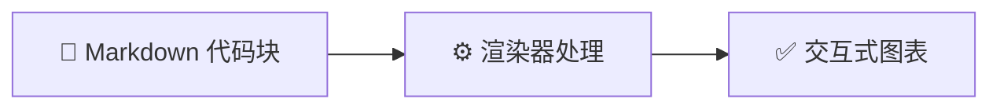

# AGENTS.md

_面向 AI Agent 的仓库交接文档 · 最后更新 2026-10-01_

---

## 📋 仓库定位

个人知识库站点。Markdown 源文件存放在本仓库，经 VitePress 构建为静态站点，由 GitHub Actions 自动发布到 GitHub Pages。

- **在线地址**：<https://darcikes.github.io/>
- **部署方式**：推送到 `main` 分支 → Actions 自动构建 → 发布到 Pages
- **读者**：公开可访问的只读站点，无评论、无交互、无需登录

> ⚠️ **本仓库是公开的。** 任何提交都会进入永久公开的 commit 历史，事后再删除也无法从历史中抹除。写入前务必检查是否含敏感信息。

---

## 🧱 技术栈与依赖

| 依赖 | 版本 | 用途 |
| ------------------------------- | ------- | -------------------------------------- |
| Node.js | ≥ 20 | 构建与本地预览（构建在 CI 侧执行） |
| `vitepress` | ^1.6.4 | 静态站点生成器 |
| `mermaid` | ^12.0.0 | 图表渲染引擎 |
| `vitepress-mermaid-renderer` | ^1.2.2 | 把 `mermaid` 代码块转成交互式图表 |
| `@mermaid-js/mermaid-zenuml` | ^1.0.1 | ZenUML 语法支持（插件 peer 依赖） |

全部为 `devDependencies` —— 站点是纯静态产物，运行时不需要任何依赖。

**添加新依赖前请慎重**：每多一个包就多一处供应链风险和维护成本。优先用 VitePress 原生能力。

---

## 🗂️ 目录结构与职责

```text
.
├── index.md                    首页（layout: home，hero + features）
├── about.md                    关于页
├── README.md                   仓库说明（不进站点）
├── AGENTS.md                   本文件（不进站点）
├── CLAUDE.md                   指向本文件（不进站点）
├── templates/                  新文章模板（不进站点）
│   └── article.md
├── tech/                       【分类】技术
│   ├── deploy/                 【子分类】部署与托管
│   │   └── github-pages.md
│   └── virtualization/         【子分类】虚拟化
│       ├── ubuntu-kvm.md
│       └── omarchy-vm.md
├── public/                     静态资源，原样复制到产物根目录
│   ├── favicon.ico             站点图标（16/32/48/64 多尺寸）
│   ├── apple-touch-icon.png    iOS 主屏图标 180×180
│   └── robots.txt              爬虫规则 + sitemap 指引
└── .vitepress/
    ├── config.mts              ★ 唯一配置入口（标题/导航/侧边栏）
    └── theme/
        ├── index.ts            自定义主题：Mermaid 渲染器 + 主题色板 + 首页动效
        ├── custom.css          Mermaid 外观补丁（节点圆角、非流程图类型的配色）
        └── PixelDust.vue       首页 hero 前的像素尘埃动效
```

### `.vitepress/config.mts` 是核心

改标题、加导航、加分类，全在这一个文件。关键字段：

| 字段 | 作用 |
| --------------- | ------------------------------------------------------------ |
| `title` | 站点标题，显示在浏览器标签与页面右上 |
| `nav` | 顶部导航。新增分类时加一行 |
| `sidebar` | 侧边栏，按 `/分类/` 键分组。**新增文章必须在此登记，否则侧边栏里看不到** |
| `srcExclude` | 排除不进站点的文件（README / AGENTS / CLAUDE / templates） |
| `search` | 本地全文搜索，自带无需第三方服务 |
| `head` | 注入每个页面 `<head>` 的标签（favicon、apple-touch-icon） |
| `sitemap.hostname` | 生成 sitemap.xml 用的域名 —— **必须与最终访问地址一致** |

> ⚠️ **域名写在两个地方**：`config.mts` 的 `sitemap.hostname` 和 `public/robots.txt` 里的 `Sitemap:` 行。将来换自定义域名时**两处都要改**，否则搜索引擎拿到的地图指向旧域名。

---

## ⚙️ 常用命令

```bash
npm install              # 安装依赖
npm run docs:dev         # 开发服务器 → http://localhost:5173/
npm run docs:build       # 构建 → .vitepress/dist/
npm run docs:preview     # 预览构建产物 → http://localhost:4173/
```

**验证构建产物**（比"构建成功"更可靠）：

```bash
# 检查是否有中文路径残留（应为空）
grep -oE 'href="[^"]*"' .vitepress/dist/**/*.html | grep -P '[\x{4e00}-\x{9fff}]'

# 用无头浏览器验证 Mermaid 真的渲染了（构建产物里看不到，因为是客户端渲染）
google-chrome --headless --disable-gpu --no-sandbox \
  --window-size=1440,3000 --virtual-time-budget=45000 \
  --dump-dom "http://localhost:4173/技术/页面路径.html" | grep -c '<svg'
```

> 💡 **验证图表渲染时注意 `IntersectionObserver`。** 渲染器只处理**进入视口**的图表（滚动到哪渲染到哪），所以：
>
> - 必须指定 `--window-size`，否则默认视口太小会误判为"渲染失败"
> - **长文档中靠后的图表无法用这种方式验证** —— 加大视口高度也没用（Chrome 有上限），且 URL 锚点不会触发滚动
> - 正确做法：**建一个临时页面，把所有待验证的图表放在顶部**，验证完删除。示例：
>
> ```bash
> # 1) 提取所有图表到临时页面 tech/_verify.md（放在最前）
> # 2) 用开发服务器验证
> google-chrome --headless --disable-gpu --no-sandbox --window-size=1440,4000 \
>   --virtual-time-budget=60000 --dump-dom "http://localhost:5173/tech/_verify.html" \
>   > /tmp/dom.html
> # 3) rm tech/_verify.md
> ```
>
> ⚠️ **判定要两步，只数 `mermaid-wrapper` 会漏判** —— 渲染失败时 wrapper 依然存在，错误 UI（炸弹图标 + `Failed to render diagram`）在 wrapper **内部**。
>
> ```bash
> # 数量对不对（每张图一个 wrapper，应等于图表总数）
> grep -c 'class="mermaid-wrapper"' /tmp/dom.html
>
> # 有没有渲染失败（决定性判据，应为 0）
> grep -c 'Syntax error in text\|Failed to render diagram' /tmp/dom.html
> ```
>
> 仍然**不要**用宽泛的 `grep 'error'` —— 注入的 CSS 里有大量 `--mermaid-error-bg`、`.error-message` 之类的样式规则文本，会假阳性。上面两条是精确字符串，不受影响。
>
> 📌 **没有 wrapper、也没有错误文案 = 图在视口外没被处理**（`IntersectionObserver` 没触发），既不算成功也不算失败。Chrome 视口高度有上限，临时页图多时**每批放 2–3 张**分次验证，批次过大会让靠后的图永远不进视口。

---

## ✍️ 内容约定

### 命名标准

| 对象 | 规则 | 示例 |
| ---------- | -------------------------------------- | ---------------------------------- |
| **目录** | 英文、小写、kebab-case | `tech/virtualization/` |
| **文章文件** | 英文、小写、kebab-case | `ubuntu-kvm.md` |
| **静态资源** | 英文、小写、下划线分隔 | `public/kvm_arch.png` |

**文件名就是 URL**（VitePress 直接映射，无中间层）。所以文件名一旦发布就**不要改** —— 改了等于旧链接全部失效。

> 为什么不建议中文文件名：中文名做 URL 需要额外的 `rewrites` 映射，而该机制**不作用于文内相对链接**，会引入一整类 404 问题。英文文件名让「文件名 = URL」，消除这层间接。

### 写作规范

- **一个文件一个 H1**，作为页面标题。VitePress 自动提取
- **无需 frontmatter**，`title` 自动取第一个 H1
- **不要写手写目录**（`## 目录`）—— VitePress 自动生成右侧大纲，手写的那份是重复的，且锚点规则不兼容（见下方陷阱）
- **引用其他文章用相对 `.md` 链接**（`[另一篇](./other.md)`）—— GitHub 和站点两边都能跳
- 界面文字已中文化，深色模式自动适配

### 新增文章的标准流程

1. **复制模板**：`cp templates/article.md tech/分类/my-article.md`
2. 替换模板中的 `<尖括号>` 占位内容，定稿后删掉顶部注释块
3. **在 `config.mts` 的 `sidebar` 登记**该文章，否则侧边栏找不到入口：
   ```ts
   { text: '文章标题', link: '/tech/分类/my-article' }
   ```
4. 本地 `npm run docs:dev` 确认排版，`npm run docs:build` 确认无误后推送

模板 `templates/article.md` 里已包含文档头、TL;DR、踩坑记录、Mermaid 图表等的标准写法。

### 新增分类

目录即分类。两步：

1. 建目录：`mkdir -p tech/新分类`
2. 在 `config.mts` 的 `nav` 加一行、`sidebar` 加一段（文件里已留注释位置）

一级分类保持在 3–5 个且足够宽泛，细节下沉到二级子目录 —— 这样内容增长时不必重排结构。

### 图表

用 ```` ```mermaid ```` 代码块。渲染器会自动识别并生成带工具栏（缩放 / 拖动 / 下载 / 全屏 / 复制源码）的交互式图表。



**约定**：每张图都写 `accTitle` + `accDescr`（无障碍与屏幕阅读器需要），节点 ID 用 `snake_case`，不要用内联 `style`（会破坏深色模式），配色用 `classDef`。

> ⚠️ **例外：`mindmap` 不支持 `accTitle`/`accDescr`。** 加上任一行都会导致 `Syntax error in text`、整张图渲染失败（mermaid 12.0.0 实测）。用 mindmap 时省略这两行，无障碍描述写进图前后的正文。

### 站点图标

图标是**位图**（ICO + PNG），不是 SVG —— 刻意如此。SVG 图标若用 `<text>` 引用汉字，会依赖**读者机器上恰好有中文字体**，否则显示成豆腐块。位图没有这个风险。

重新生成（换了字或颜色时）：

```bash
FONT=$(fc-match -f '%{file}' 'Noto Sans CJK SC:style=Medium')

convert -size 256x256 xc:'#2563eb' -fill white -gravity center \
        -font "$FONT" -pointsize 176 -annotate +0+6 "知" /tmp/base.png
convert -size 256x256 xc:none -fill white \
        -draw "roundrectangle 0,0 255,255 52,52" /tmp/mask.png
convert /tmp/base.png /tmp/mask.png -alpha off -compose CopyOpacity -composite /tmp/round.png

convert /tmp/round.png -define icon:auto-resize=64,48,32,16 public/favicon.ico
convert -size 180x180 xc:'#2563eb' -fill white -gravity center \
        -font "$FONT" -pointsize 124 -annotate +0+4 "知" public/apple-touch-icon.png
```

> 📌 中间产物不要放进 `public/` —— 该目录下所有文件都会**原样复制进站点产物**并被部署。

### 图表主题

Mermaid 的外观**全部集中在 `.vitepress/theme/` 里**，改一次全站所有图表生效，**不需要逐篇文档调整**：

| 想改什么 | 改哪里 |
| ------------------ | ------------------------------------------------------ |
| 配色（浅色 / 深色） | `theme/index.ts` 的 `lightConfig` / `darkConfig` |
| 字体 | 同上的 `FONT` 常量（必须含中文字体，见下） |
| 节点圆角 | `theme/custom.css` 的 `rx: 7px` |
| 疏密、换行宽度 | `theme/index.ts` 的 `flowchart` 对象 |
| 坐标轴/工具栏样式 | `.mermaid-container` 上的 `--mermaid-control-*` CSS 变量 |

> ⚠️ **换配色时注意两点：**
> 1. **深浅两套的 key 集合必须完全一致。** 切换主题时是**深合并**，缺 key 会残留另一套的旧值。
> 2. **只能填 hex 颜色**，`red` 这类颜色名无效。

**为什么需要这套配置**：插件 `vitepress-mermaid-renderer` 初始化时会硬塞 `theme:"default"`，把 Mermaid 12 的新外观整个盖掉；且它的默认字体 `"trebuchet ms"` **不含任何中文字形**，中文只能靠系统兜底，导致图表字体与正文不一致、换行点也算错。现在通过给 `createMermaidRenderer()` 传 `MermaidConfig` 覆盖，并用 `useData().isDark` 的 `watch` 跟随深浅色切换（渲染器是单例，重复调用会深合并并重渲染）。

**已知残留问题**：Mermaid 对中日韩字符的**宽度测量偏小**，中英混排的长标签最后一个字符会贴到边框上。这是 Mermaid 自身问题，改配置无法解决 —— 在源文件里手动加 `<br/>` 断行即可。

### 写图表时必须遵守

**外观由主题统一控制。文章里不要自己指定全局样式** —— 否则那张图会和其余四十多张割裂。

| ✅ 应该 | ❌ 不要 | 为什么 |
| ------------------------ | ------------------------------- | -------------------------------------------------------- |
| 不写颜色，交给主题 | **`%%{init}%%` 指令** | 它会**逐图覆盖站点主题**，那张图立刻和全站不一致 |
| 需要语义配色时用 `classDef` | **内联 `style="fill:#xxx"`** | 内联样式优先级最高，且无法跟随深色模式 |
| 颜色从下表取 | 随手写十六进制值 | 配色漂移，越写越乱 |
| 语义名用 `snake_case` | `A`、`node1`、`box2` | 图源码要能被读懂和检索 |

**标准语义色板**（全站在用，只准这五组）：

| 语义 | `classDef` |
| ---------- | ---------------------------------------------------------------------------- |
| 成功 / 正向 | `fill:#dcfce7,stroke:#16a34a,stroke-width:2px,color:#14532d` |
| 信息 / 强调 | `fill:#dbeafe,stroke:#2563eb,stroke-width:2px,color:#1e3a5f` |
| 警示 / 待定 | `fill:#fef9c3,stroke:#ca8a04,stroke-width:2px,color:#713f12` |
| 突出 / 次要 | `fill:#ede9fe,stroke:#7c3aed,stroke-width:2px,color:#3b0764` |
| 失败 / 危险 | `fill:#fee2e2,stroke:#dc2626,stroke-width:2px,color:#7f1d1d` |

> 📌 **mindmap / timeline / radar 的配色由 `custom.css` 统一接管。** Mermaid 给这三种硬编码了一套色相环配色（`hsl(H, 24%, 71%)`），**不受 `themeVariables` 控制**，只能靠 CSS `!important` 覆盖。
>
> 如果你看到这三种图颜色不对，**那是 `custom.css` 的职责，不要去改文章**；同理，也不要因为"颜色看起来是硬编码的"就删掉 `custom.css` 里那段 —— 那些规则是必要的。

---

## ⚠️ 已知陷阱

这些都是实际踩过并解决的，改动内容时容易再次触发。

### 1. 新增的仓库级文件会被当成文章渲染

VitePress 把源目录下**所有 `.md` 都当成页面**。所以新增 `CONTRIBUTING.md`、`CHANGELOG.md`、`.github/` 文档这类**面向仓库而非站点**的文件时，必须同步加进 `config.mts` 的 `srcExclude`：

```ts
srcExclude: ['README.md', 'AGENTS.md', 'CLAUDE.md', 'templates/**', 'CONTRIBUTING.md'],
```

否则站点上会凭空多出一个页面 —— 而且它往往还是空的或不完整的。

### 2. 手写锚点与 VitePress 生成规则不兼容

Markdown 里手写的 GitHub 风格锚点（`#坑-1virt-manager-不认识-omarchy`）在 VitePress 上跳不过去。典型差异：

| 手写（GitHub 规则） | VitePress 实际生成 |
| ---------------------------------- | -------------------------------------- |
| `#0-快速开始tldr` | `#_0-快速开始-tl-dr` |
| `#坑-1virt-manager-不认识-omarchy` | `#坑-1-virt-manager-不认识-omarchy` |

主要差别：**以数字开头的标题会加 `_` 前缀**，空格转连字符的时机也不同。

**需要内页锚点时**，先构建再查真实值：

```bash
grep -oE 'id="[^"]+"' .vitepress/dist/路径/页面.html | sed 's/id="//;s/"$//' | sort -u
```

### 3. VitePress 的 `code` 标签不带语言 class

VitePress 输出的代码块是 `<div class="language-mermaid"><pre class="shiki"><code>`，内层 `code` **没有任何 class**。Mermaid 渲染器靠外层 `div.language-mermaid` 的兜底路径识别，这是正常工作的。不要"顺手修复"这个结构。

### 4. `esbuild` 的 postinstall 可能被 npm 安全策略拦截

出现 `install scripts blocked` 警告时**先验证是否真的有问题**：

```bash
./node_modules/.bin/esbuild --version
```

能正常输出版本号就说明 npm 已直接安装平台包（`@esbuild/linux-x64`），**无需放行脚本** —— 强行放行反而降低安全性。

### 5. 不要用同步盘同步本仓库目录

Syncthing / iCloud / OneDrive / 坚果云等工具会把 `.git/refs`、`.git/index`、`HEAD` 当普通文件双向同步，导致**假提交记录、丢提交、索引损坏**。跨设备同步请用 `git pull --rebase` + `git push`。

`.gitattributes` 里的 `*.md merge=union` 是为了让多设备并发编辑不同段落时不产生冲突。

---

## 📚 文档索引

| 需要查什么 | 去哪里 |
| -------------------- | --------------------------------------------------------------------------------- |
| **本仓库搭建全流程** | [`tech/deploy/github-pages.md`](tech/deploy/github-pages.md) —— 含排错与多机同步 |
| VitePress 配置项 | <https://vitepress.dev/reference/site-config> |
| VitePress 默认主题 | <https://vitepress.dev/reference/default-theme-config> |
| Markdown 扩展语法 | <https://vitepress.dev/guide/markdown> |
| Mermaid 图表语法 | <https://mermaid.js.org/intro/syntax-reference.html> |
| Mermaid 渲染器插件 | <https://vitepress-mermaid-renderer.vercel.app/> |
| GitHub Pages 限制 | <https://docs.github.com/en/pages/getting-started-with-github-pages/github-pages-limits> |

---

## 🚫 禁止事项

| 禁止 | 原因 |
| -------------------------- | -------------------------------------------------------- |
| 提交 `node_modules/`、`.vitepress/dist/` | 已在 `.gitignore` 中排除，体积巨大且可重建 |
| 写入密钥、token、密码 | 仓库公开，且 commit 历史无法清理 |
| 写入主机名、内网 IP、连接手册 | 等于公开基础设施地图，属侦察材料 |
| 删除 `.gitattributes` 的合并规则 | 多机同步会开始产生冲突 |
| 直接改动 `~/code/config/` 等原稿目录 | 本站内容是副本；原稿归原处，避免双向不同步 |
