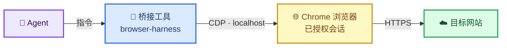
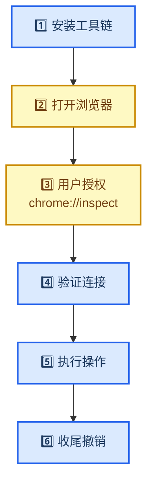
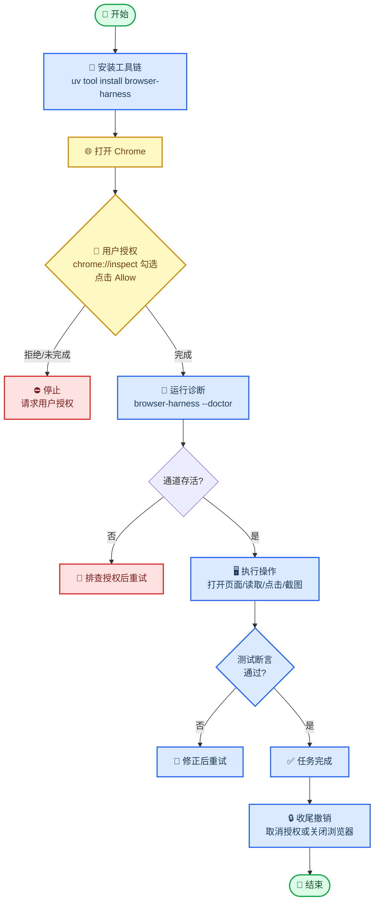

# 用 Agent 操作浏览器 — CDP 授权与实操

_AI Agent 怎么驱动一台真实浏览器：前置授权、跨浏览器差异、安全边界与测试用例 · 难度：入门 · 最后验证：2026-08-10（工具版本 0.1.8，Chrome on macOS）_

---

## 📋 概述

### 这是什么

本篇解决一个问题：**AI Agent 如何操作一台真实浏览器**（打开网页、读取内容、点击、输入、截图），并回答三个关键问题：

1. 操作浏览器**需要哪些前置步骤**（尤其是用户的授权动作）
2. 不同浏览器（Chrome / Edge / Firefox / Safari）的**操作方式和依赖是否一致**
3. 有哪些**安全注意事项**和**容易忽略的补充点**

### 核心概念：两条技术路线

| 路线 | 协议 | 适用浏览器 | 特点 |
| ---- | ---- | ---------- | ---- |
| **CDP** | Chrome DevTools Protocol | Chromium 系（Chrome / Edge / Brave / Arc） | 浏览器原生调试协议，能力最强（读 DOM、执行 JS、拦截网络、截图） |
| **WebDriver** | W3C 标准 | Firefox / Safari / 跨浏览器 | 行业标准，各浏览器驱动实现，能力相对受控 |

> **一句话版**：Chromium 系用 CDP（需用户授权 `chrome://inspect`），Firefox 用 geckodriver，Safari 用 safaridriver。本篇以 CDP + browser-harness 为例展开。

### 连接架构



关键点：整条链路发生在**用户电脑本机**（localhost 回环），不经过任何第三方服务器中转；登录态由浏览器 Cookie 天然携带，Agent 不持有任何账号凭证。

---

## 🔧 前置条件与操作步骤

Agent 要操作浏览器，必须完成以下 6 步。**第 2、3 步必须由用户手动完成，Agent 无法代替。**

### 步骤总览



### 第 1 步：安装工具链（Agent 执行）

以 browser-harness（即 browser-use CLI）为例，基于 macOS + uv 包管理器：

```bash
uv tool install --python 3.12 --upgrade --force browser-harness
browser-harness --version   # 验证安装，应输出版本号
```

其他可选工具链：Playwright / Puppeteer / Selenium，能力与依赖各不相同（见下一章）。

### 第 2 步：打开浏览器（用户执行）

用户打开日常使用的 Chrome 并保持登录态。**浏览器需处于运行状态**，Agent 才能连接。

### 第 3 步：用户授权（用户执行，关键）

在 Chrome 地址栏打开：

```text
chrome://inspect/#remote-debugging
```

1. 勾选 **Allow remote debugging for this browser instance**
2. 若弹出权限确认框，点击 **Allow**
3. 之后 Agent 每次发起连接时，Chrome 可能再次弹出 **Allow remote debugging?** 提示，需再次点击 Allow

> **为什么必须用户手动授权**：Chrome 出于安全默认拒绝外部程序调试。授权是「本机级 + 实例级」开关，不是「某个特定应用」的授权——开启期间，本机任何能访问调试端口的进程都可连接。因此应遵循**临时开启、用完关闭**原则。

### 第 4 步：验证连接（Agent 执行）

```bash
browser-harness --doctor   # 诊断：工具版本、Chrome 状态、daemon 存活
```

关键检查项：

| 检查项 | 含义 | 失败处理 |
| ------ | ---- | -------- |
| `chrome running` | 浏览器进程在运行 | 请用户打开 Chrome |
| `daemon alive` | 调试通道存活 | 检查授权是否完成，重试第 3 步 |

再执行连接验证（能打印当前页面信息即通道打通）：

```bash
browser-harness <<'PY'
print(page_info())
PY
# 预期输出：{'url': 'https://...', 'title': '...', 'w': 1904, 'h': 918}
```

### 第 5 步：执行操作（Agent 执行）

| 操作 | 命令/API | 说明 |
| ---- | -------- | ---- |
| 打开新标签页 | `new_tab(url)` | 首个导航必须用 `new_tab`，而非 `goto_url` |
| 等待加载 | `wait_for_load()` | 导航后必须调用 |
| 读取页面信息 | `page_info()` | 返回 URL / 标题 / 视口 |
| 读取页面文本 | `js("document.body.innerText")` | DOM 提取 |
| 执行任意 JS | `js("...")` | 页面内脚本 |
| 获取无障碍树 | `cdp("Accessibility.getFullAXTree")` | 优先于截图，可读性最好 |
| 模拟点击 | `click_at_xy(x, y)` | 基于坐标点击 |
| 截图 | `cdp("Page.captureScreenshot")` | base64 需解码后保存 |

### 第 6 步：收尾撤销（用户执行）

| 方式 | 操作 | 效果 |
| ---- | ---- | ---- |
| 临时断开 | 关闭 Chrome | 通道即断，重启后需重新授权 |
| 彻底撤销 | `chrome://inspect` 取消勾选 | 授权立即失效 |
| 移除工具 | `uv tool uninstall browser-harness` | 本地无调试工具可用（可选） |

---

## 🌐 不同浏览器的支持情况与差异

### 对比总表

| 浏览器 | 技术路线 | 授权/启动方式 | 额外依赖 | 与 Chrome 一致性 |
| ------ | -------- | ------------- | -------- | ---------------- |
| **Chrome** | CDP | `chrome://inspect` 勾选授权 | 无 | —（基准） |
| **Edge** | CDP | `edge://inspect` 同机制 | 无 | ✅ 完全一致 |
| **Brave / Arc** | CDP | 同 Chromium 机制 | 无 | ✅ 完全一致 |
| **Firefox** | WebDriver（Marionette） | `geckodriver` 启动，约 `marionette.port` | geckodriver 二进制 | ❌ 不一致，API 受控 |
| **Safari** | WebDriver（safaridriver） | 系统设置 → 开发者 → 允许远程自动化；需先开启 Safari 开发者菜单 | 内建 safaridriver | ❌ 不一致，macOS 专属 |
| **无头浏览器** | CDP | 启动参数 `--headless=new --remote-debugging-port=9222` | 无 | ✅ 一致（无 UI） |

### 关键差异说明

1. **Chromium 系（Chrome/Edge/Brave/Arc）完全一致**：同一套 CDP 协议、同一套 `chrome://inspect` 授权机制，工具链无需任何改动，这是最常见的 Agent 浏览器场景。

2. **Firefox 走 WebDriver 标准**：需要额外安装 `geckodriver`（驱动二进制），命令与 CDP 风格不同；Firefox 对 CDP 的**实验性支持不完整**，能力受限，不建议作为 Agent 首选。

3. **Safari 依赖系统设置**：需先在 Safari 的「设置 → 高级」中勾选「显示开发者菜单」，再到系统级开发者选项中启用「允许远程自动化」。macOS 专属，且首次运行 `safaridriver` 可能需要系统授权。

4. **无头（headless）模式**：适合 CI/服务端场景，无窗口；但无法复用用户登录态，需要自行注入 Cookie 或使用登录凭据。

5. **驱动依赖归纳**：CDP 路线**无需额外驱动**（协议内置于浏览器）；WebDriver 路线**每种浏览器一个驱动**（chromedriver / geckodriver / safaridriver），且需与浏览器版本匹配。

---

## ⚠️ 注意事项

### 安全类（最重要）

1. **授权是「本机共享」而非「应用专属」**：勾选授权后，本机任何进程都能连调试端点，不限于发起请求的那个 Agent。**用完即撤**。
2. **登录态复用不等于凭证泄露**：Agent 复用浏览器 Cookie 访问已登录站点，但**不持有账号密码**；不过 CDP 理论上可读取 Cookie（含会话令牌），对敏感站点操作应谨慎。
3. **操作全程可见**：浏览器在用户眼前，标签页、URL、点击都可观察，不存在「隐身操作」。
4. **敏感操作停下确认**：涉及发送消息、下单、支付、删除等外部行为，Agent 必须先征得用户同意。
5. **默认绑定 localhost**：调试端口默认只监听本机回环，局域网其他设备无法访问（除非显式配置）。

### 操作类

6. **首个导航用 `new_tab` 而非 `goto_url`**：直接复用当前标签页可能干扰用户正在进行的操作。
7. **导航后必须 `wait_for_load()`**：SPA 页面可能动态渲染，需等待网络与渲染完成。
8. **canvas 渲染的页面 DOM 拿不到内容**：如设计稿平台用 canvas 绘制画板，`innerText` 只能读到侧栏等 DOM 元素，画板内容需截图或走平台导出接口。
9. **优先用无障碍树（AX Tree）而非截图**：AX 树对无视觉能力的模型最友好；截图体积大且需要视觉理解能力。
10. **多 Agent 勿共用同一浏览器实例**：标签页焦点会互相竞争，复杂场景用独立实例或云端浏览器。

### 环境类

11. **沙箱环境限制**：受限环境下 `ps` 等系统命令可能被拒绝，诊断以工具自带的 `--doctor` 为准。
12. **版本兼容**：浏览器升级可能改变授权行为或协议细节，定期 `browser-harness --update -y` 并复查 `--doctor`。
13. **授权不持久**：重启 Chrome 后需重新勾选授权——这是 Chrome 的设计，恰好是天然的保护机制。

---

## 💡 补充要点（易忽略）

1. **云端浏览器**：需要并发隔离、干净 IP、或规避反爬（验证码/风控）时，可使用托管浏览器。每个任务独立实例，互不干扰，但按运行时长计费，用完需主动关闭。

2. **无头模式 + 网络拦截**：CDP 的 Network 域可拦截请求、mock API 响应，是前端测试的利器——这是纯读取操作做不到的。

3. **iframe / Shadow DOM / 跨域**：复杂页面的元素藏在 iframe 或 Shadow DOM 中，AX 树坐标点击可穿透（合成器层），但 DOM 查询需先定位到对应 frame。

4. **录制与回溯**：工具可记录截图与操作轨迹，便于事后「演示刚才做了什么」或生成视频；默认不开启，涉及敏感页面内容时应征得用户同意。

5. **多用户 profile 隔离**：`--user-data-dir` 指定独立配置目录，可避免污染用户主 profile；多个测试环境互不串号。

6. **下载/上传能力**：CDP 支持文件上传（输入框注入路径）与下载（需处理浏览器下载确认），是表单类任务的关键能力。

7. **Cookie 管理**：可读取、注入、删除 Cookie——适合「无头模式 + 手动注入登录态」的自动化场景，但也是安全敏感区。

8. **每个操作都有开销**：一次 CDP 往返 + 页面加载可能数百毫秒到数秒，批量操作需合理设计等待策略，避免盲目轮询。

9. **主密码保护**：若浏览器设置了主密码，读取已保存密码会被拦截——这对 Agent 是「做不到」，对用户是「保护生效」。

10. **诊断第一入口是 `--doctor`**：连接异常时先跑诊断，输出会明确指向问题环节（浏览器未开 / 授权缺失 / 版本过期）。

---

## 🧪 测试用例（通用验证）

> 以下用例验证「Agent 能打开浏览器并读取页面」这条链路是否畅通，任何站点都适用。前置条件：工具已安装、浏览器已授权（见第 1-4 步）。

### 用例 1：GitHub 打开

| 项 | 内容 |
| --- | ---- |
| 目的 | 验证打开新标签页 + 读取标题 + 检测登录态复用 |
| 前置 | browser-harness 已装，Chrome 已授权 |

**步骤**

```bash
browser-harness <<'PY'
new_tab("https://github.com")
wait_for_load()
import time; time.sleep(3)
print(page_info())
PY
```

**验证（读取登录态）**

```bash
browser-harness <<'PY'
txt = js("document.title + ' || ' + (document.querySelector('h1, .mb-4')?.innerText || '')")
print(txt)
PY
```

| 断言 | 预期 |
| ---- | ---- |
| `page_info().url` | `https://github.com` |
| `page_info().title` | 包含 `GitHub` |
| 页面文本 | 已登录显示「仪表板」，未登录显示 Sign in 按钮（登录态复用验证） |

**通过标准**：URL 正确 + 标题正确 + 登录态元素出现，即可判定链路畅通。

### 用例 2：百度打开

| 项 | 内容 |
| --- | ---- |
| 目的 | 验证非登录型站点 + 中文页面 + 搜索框元素定位 |
| 前置 | 同用例 1 |

**步骤**

```bash
browser-harness <<'PY'
new_tab("https://www.baidu.com")
wait_for_load()
import time; time.sleep(2)
print(page_info())
print(js("document.title"))
print(js("!!document.querySelector('#kw')"))   # 搜索框是否存在
PY
```

| 断言 | 预期 |
| ---- | ---- |
| `page_info().title` | `百度一下，你就知道` |
| `#kw` 元素 | 存在（`True`） |

**通过标准**：标题正确 + 搜索框元素定位成功。

### 用例 3（进阶）：打开后写入文本

| 项 | 内容 |
| --- | ---- |
| 目的 | 验证模拟输入能力（百度搜索框填入关键词） |
| 前置 | 用例 2 通过 |

```bash
browser-harness <<'PY'
js("document.querySelector('#kw').value = 'AI Agent'")
print(js("document.querySelector('#kw').value"))
PY
```

**通过标准**：读取到的输入框 value 为 `AI Agent`。

---

## 🤖 附录 A：Agent 可读操作流程

面向 Agent 的标准操作序列（可直接照抄执行）：

```text
1. 安装:    uv tool install --python 3.12 --upgrade --force browser-harness
2. 诊断:    browser-harness --doctor        → 确认 chrome running + daemon alive
3. 若 FAIL: 停止并请求用户完成 chrome://inspect 授权，授权后重试
4. 验证:    browser-harness <<'PY' print(page_info()) PY   → 能打印即通道打通
5. 操作:    new_tab(url) → wait_for_load() → page_info()/js()/cdp()...
6. 收尾:    提示用户取消授权或关闭浏览器
```

操作伪代码：

```python
def operate_browser(url, assertions):
    # 前置：工具已装、浏览器已授权（用户动作，Agent 不可代替）
    new_tab(url)
    wait_for_load()
    info = page_info()
    assert info["url"] == url, "URL 不匹配"
    for expr, expected in assertions:           # 例：("document.title", "GitHub")
        actual = js(expr)
        assert actual == expected, f"断言失败: {expr}"
    return info
```

**Agent 行为准则**：授权未完成前**禁止**尝试绕过（如模拟登录）；敏感操作（发送/支付/删除）执行前必须获得用户明确确认；操作全程可追溯。

---

## 🧭 附录 B：完整流程图



### 一句话记忆

> **装工具 → 开浏览器 → 用户授权（`chrome://inspect`）→ 诊断验证 → 干活 → 撤权限**。授权是「本机共享」的钥匙，用完即关。

---

## 🔗 相关

- [opencli 与 Orca：三条浏览器自动化链路怎么选](../tech/tools/opencli-vs-orca-browser-automation.md) —— 换一个视角看「该用哪条链路」

---

_最后验证：2026-08-10 · 基于 browser-harness 0.1.8 + Chrome（macOS）实战验证；Firefox/Safari 部分为官方文档归纳，使用前以各自官方文档为准_
