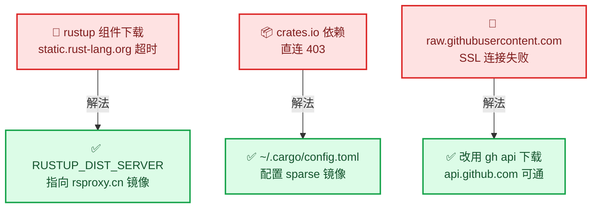
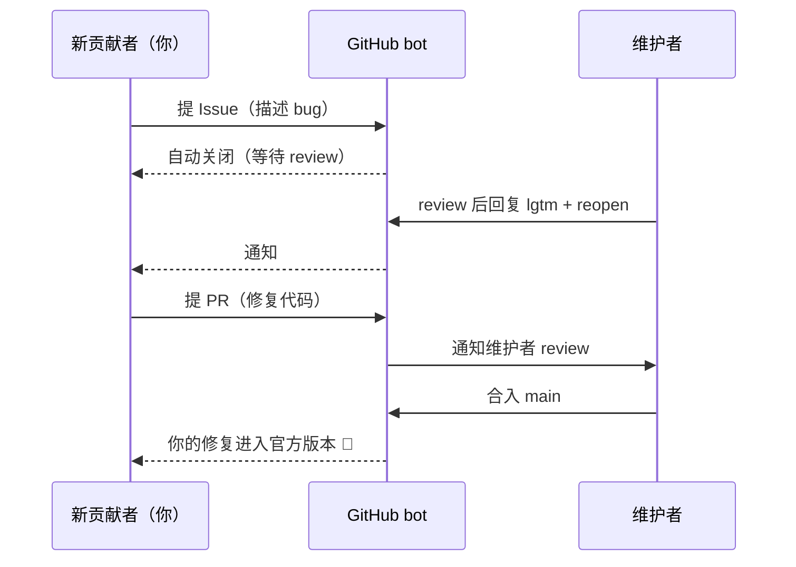

# GitHub Bug 修复全流程实战 — 从现象到 PR

_一次真实开源 bug 修复的完整复盘：复现 → 定位 → 改代码 → 验证 → 提 Issue/PR · 难度：中等 · 最后验证：2026-08-10_

---

## 🧭 这篇讲什么

本文记录一次真实 bug 的**完整修复流程**，不只是「我修了什么」，而是**每一步为什么这么做、遇到了什么坑、怎么解决**。跟着走一遍，你就掌握了在 GitHub 上从发现问题到提交修复（Issue + PR）的全套动作。

**本次案例**：ccusage（Claude Code 用量统计工具）的 `statusline` 命令在第三方 API 场景下费用永远显示 $0.00。


---

## 🐛 阶段一：发现现象

### 问题描述

用户给 Claude Code 配置了状态栏（statusLine），期望显示费用/用量。**现象**：

| 命令 | 结果 |
| ---- | ---- |
| `ccusage daily` | ✅ 有费用（$0.05/天） |
| `ccusage statusline` | ❌ 费用全 0（`$0.00 session / $0.00 today`） |

**关键疑点**：同一个工具、同一个配置文件、同一份数据，一个命令能算费用，另一个不能。

### 先学会描述问题

| 要素 | 本次案例 |
| ---- | -------- |
| 现象 | statusline 费用为 0 |
| 触发条件 | 三方 API 模型 |
| 正常行为 | daily 命令费用正常 |
| 已排除项 | 配置格式、模型名、数据缺失 |

> 📌 **复盘**：先列「正常 vs 异常」的对比表，是定位问题的第一步——它直接把搜索范围缩小了一大半。

---

## 🔬 阶段二：复现与排除

### 构造复现环境

把「真实场景」变成「可重复测试」——给 statusline 命令手工构造一份输入数据（它从 stdin 读 JSON）：

```bash
# 从真实的 Claude Code 会话文件取数据，构造 payload
cat real-payload.json | ccusage statusline --cost-source ccusage
```

### 排除法排查过程

| # | 假设 | 测试方法 | 结果 |
| ---- | ---- | ---- | ---- |
| 1 | 模型名带 `[1m]` 后缀导致查不到价格 | 改成不带后缀的模型名 | ❌ 还是 0，排除 |
| 2 | payload 的 cost 字段影响 | 把 cost 改成 5.0 | ❌ 还是 0，排除 |
| 3 | 模型不在价格表里 | 换成 claude-sonnet-4（内置价格表里有） | ❌ 还是 0 |
| 4 | **对照实验** | 跑官方测试 payload（自带 cost 0.056） | ✅ **显示 $0.06** |

**第 4 步是关键转折**：官方测试数据能出费用，我的数据不行——差异在哪？逐个字段对比后锁定：**官方 payload 的 `cost.total_cost_usd` 有值**。

### 复现的科学方法

- **一次只验证一个变量**：改模型名就别同时改 cost
- **对照实验**：有一个「能工作的样例」（官方测试 payload）比什么都值钱
- **记录每一步**：假设 → 测试 → 结论，不记录等于白测

---

## 📖 阶段三：源码定位

### 拿到源码

```bash
# 方式一：直接 clone（网络好时）
git clone --depth 1 https://github.com/ccusage/ccusage

# 方式二：zip 下载解压（clone 卡住时，本案例走的这条路）
# https://github.com/ccusage/ccusage/archive/refs/heads/main.zip
```

### 从现象倒推代码路径

费用显示在状态栏 → 找 statusline 的渲染函数 → 找费用计算函数 → 找数据来源：

```bash
# 在源码里搜关键词
grep -rn "total_cost_usd" rust/ --include="*.rs"
```

**找到根因**（`run_statusline` 函数）：

```rust
let shared = SharedArgs {
    offline: args.offline && !args.no_offline,
    ..SharedArgs::default()   // ← 问题在这：其他配置全被重置为默认值！
};
```

对照其他命令（daily）的写法，它们在 CLI 解析层就应用了配置文件，只有 statusline 重建了一个**全默认**的配置对象——配置文件里的 `pricingOverrides`（自定义价格）被丢弃了。

### 读源码的路径

| 顺序 | 做什么 |
| ---- | ------ |
| 1 | 从**功能名**找函数：statusline → `run_statusline` |
| 2 | 从函数看**数据流**：费用从哪来 → `load_entries` → `SharedArgs` |
| 3 | **对比同类实现**：daily 怎么做的 vs statusline 怎么做的——差异即根因 |

---

## 🧮 阶段四：方案制定

修 bug 前先想清楚路线，三条路对比：

| 方案 | 做法 | 成本 | 风险 |
| ---- | ---- | ---- | ---- |
| A. 等上游 | 提 issue 描述问题，等官方修 | 零 | 可能等几周/被忽略 |
| B. fork 自修 | 复制一份代码自己改、自己编译用 | 中（要编译环境） | 升级要重编 |
| C. B + 提交上游 | 自修 + 提 Issue/PR 让官方合入 | 高（流程多） | PR 可能被拒 |

**本案例选择 C**——修复本身小、上游问题真实、本地也需要修复版，一鱼两吃。

> 📌 **复盘**：方案选择 = 修复量 × 等待成本 × 维护成本。修复 < 50 行 + 问题真实 → 值得走 C 全流程。

---

## 🛠️ 阶段五：环境准备

本案例最大的环境坑不是代码，是**网络**。三个域名、三个解法：



| 障碍 | 报错 | 解法 | 配置 |
| ---- | ---- | ---- | ---- |
| rustup 组件 | `operation timed out`（llvm-tools） | 换 rustup 镜像 | `RUSTUP_DIST_SERVER=https://rsproxy.cn` |
| crates.io | HTTP 403 | 配 cargo 镜像 | `~/.cargo/config.toml` 写 rsproxy-sparse |
| GitHub raw 文件 | SSL error 35 | 走 gh api | `gh api .../git/blobs/<sha>` 转 base64 |
| GitHub clone/push | 卡住/连接失败 | 本机代理 | `HTTPS_PROXY` 指向本地代理端口 |

> 📌 **复盘**：遇到「卡住不动」先判断**网络阶段**——是工具链同步、依赖下载、还是源码获取，每个阶段都有对应的镜像方案。另外：**后台任务日志要落盘**（`> build.log 2>&1`），否则 `| tail -5` 会吞掉中间进度，看起来像卡死。

---

## 🔧 阶段六：修复执行

### 建立本地仓库（zip 方案的补课）

zip 解压的源码**没有 git 历史**，提 PR 前必须补上：

```bash
git init -b main                       # 初始化仓库
git add -A && git commit -m "导入源码快照"
git remote add origin <你的 fork 地址>   # 关联 fork
git checkout -b fix/statusline-pricing  # 建修复分支（永远不要在 main 上改）
```

### 修改代码（5 个文件，共 +63/-2）

| 文件 | 改动 | 作用 |
| ---- | ---- | ---- |
| `types.rs` | StatuslineArgs 加 `pricing_overrides` 字段 | 让配置能传到 statusline |
| `config_schema.rs` | 配置结构加 `pricingOverrides` 支持 | 解析配置文件 |
| `config.rs` | 合并逻辑加一行 | 把配置值填进去 |
| `commands/mod.rs` | shared 构造时带上 overrides | **根因修复点**（一行） |
| 快照文件 | insta 快照更新 | 新配置键的期望输出 |

> 📌 **复盘**：修复要**顺着代码本身的模式走**（本案例完全复刻既有配置项的写法），而不是发明新结构——这样 reviewer 最容易接受。

### 编译

```bash
# 注意：ccusage 的 Rust workspace 在 rust/ 子目录，别在根目录编译！
cd rust
CCUSAGE_PRICING_JSON_PATH=/tmp/价格文件.json cargo build --release
```

> ⚠️ 编译还缺内置价格快照（构建时从 GitHub 下载）：用 `gh api` 的 blobs 接口下载好放到本地路径即可（见上一节网络坑表）。

---

## ✅ 阶段七：验证闭环

修复不验证等于没修。四层验证：

| 层 | 验证内容 | 结果 |
| ---- | ---- | ---- |
| 1. 复现对照 | 修复前同一数据 $0.00 → 修复后 | ✅ `$0.18 session / $0.18 today` |
| 2. 边界 | `--config` 显式指定 | ✅ 生效 |
| 3. 回归 | 官方测试 payload（Claude 模型） | ✅ 行为不变 |
| 4. 全量测试 | `cargo test` + `cargo fmt --check` | ✅ 48 套件全绿 |

> 📌 **复盘**：**先复现再修**（TDD 思想：先看到失败，再让它变绿）。测试失败的 2 个是预期内的（加了新配置键 → 更新键列表测试和快照，`INSTA_UPDATE=always` 一键更新）。

---

## 🚀 阶段八：GitHub 提交流程

### 推送到自己的 fork

```bash
# 推送分支（第一次要 -u 建立跟踪）
git push -u origin fix/statusline-pricing

# 坑：https 推送要认证 → 用 gh 配置凭据
gh auth setup-git    # 把 gh 的 token 配成 git 凭据，一次性解决

# 坑：zip 方案的本地历史与上游不连通，PR 会被拒
# 解法：rebase 到上游 main 之上，再强推
git fetch upstream main
git rebase --onto upstream/main <自己快照commit> fix/statusline-pricing
git push -f origin fix/statusline-pricing    # -f 强推（只对自己的分支安全）
```

### 提 Issue（先描述问题）

```bash
gh issue create -R owner/repo --title "标题" --body-file issue.md
```

**Issue 质量要求**（决定维护者会不会 reopen）：

| 要求 | 本案例写法 |
| ---- | ---------- |
| 简洁具体 | 现象一句话 + 复现步骤 + 根因分析 |
| 说明为什么重要 | 三方 API 用户全中招 |
| 想自己实现就说 | 「工作实现和测试在 PR #xxx」 |

### 提 PR（提交修复）

```bash
gh pr create -R owner/repo --title "fix: ..." --body-file pr.md --head <你的账号>:<分支>
```

PR 正文包含：修了什么、根因、验证证据（测试结果贴出来）。

### 新贡献者门槛（本案例的意外一课）

```text
PR #1592 → 自动关闭："Only contributors approved with lgtm can open PRs."
Issue #1591 → 自动关闭："Issues from new contributors are auto-closed by default."
```

**这是仓库的防垃圾机制**（不是针对你）：新贡献者的 issue/PR 一律自动关闭，维护者**按自己节奏** review，值得的会 reopen 并回复 `lgtm`（之后你的 issue/PR 不再自动关闭）。

**正确姿势**：

| 动作 | 对/错 |
| ---- | ----- |
| 先提 issue 等 `lgtm`，再提 PR | ✅ 正确顺序（本案例顺序反了） |
| 在关闭的 issue 上补充信息 | ✅ 有价值 |
| @ 维护者催 | ❌ 减分 |
| 放弃 | ❌ 本地修复版照样能用，不亏 |



---

## 🏠 阶段九：本地收尾（不等上游也能用）

```bash
# settings.json 里 statusLine 指向本地编译版（绝对路径）
"command": "/path/to/target/release/ccusage statusline --cost-source ccusage"

# 上游合入发版后：
brew upgrade ccusage            # 恢复官方版
# settings.json 改回 "command": "ccusage statusline --cost-source ccusage"
# 删除本地 fork 目录，任务完成
```

---

## 📋 复盘清单（下次直接抄）

### 排查类

- [ ] 先做「正常 vs 异常」对比表，缩小范围
- [ ] 一次只验证一个变量，保留对照实验
- [ ] 从功能名 → 函数 → 数据流找代码路径
- [ ] 同类实现对比，差异即根因

### 环境类

- [ ] 卡住先分阶段：工具链同步 / 依赖下载 / 源码获取
- [ ] 三个镜像位：`RUSTUP_DIST_SERVER`、`~/.cargo/config.toml`、gh api 替代 raw
- [ ] 后台任务输出落盘，别用 `| tail` 管道吞进度

### 修复类

- [ ] 先复现（TDD：先失败后变绿）
- [ ] 顺着代码既有模式改，别发明新结构
- [ ] 改了配置结构 → 记得更新键列表测试和快照
- [ ] 改了配置结构 → 记得重新生成发布物 schema，否则上游 schema drift 检查会挂

### GitHub 协作类

- [ ] 永远在独立分支上改，别动 main
- [ ] 先提 Issue 等 `lgtm`，再提 PR（新仓库都有门槛）
- [ ] Issue 质量：简洁、可复现、说明重要性、声明想自己实现
- [ ] zip 方案必须 rebase 到上游历史再 PR
- [ ] `gh auth setup-git` 解决 https push 认证

---

## 🔗 参考链接

- [ccusage 官方仓库](https://github.com/ccusage/ccusage)
- [本次 Issue #1591](https://github.com/ccusage/ccusage/issues/1591) · [本次 PR #1592](https://github.com/ccusage/ccusage/pull/1592)
- [CONTRIBUTING.md（贡献门槛规则）](https://github.com/ccusage/ccusage/blob/main/CONTRIBUTING.md)
- [rsproxy 镜像文档](https://rsproxy.cn/) · [Rust 官方安装](https://www.rust-lang.org/zh-CN/tools/install)

---

## 🔗 相关

- [Claude CLI 美化配置 —— ccusage + ccstatusline 状态栏](../picks/claude-cli-statusline.md) —— 本文修的那个工具，就是这篇里配的

---

_最后验证：2026-08-10 · 基于 ccusage 源码快照（2026-08）实战记录_
