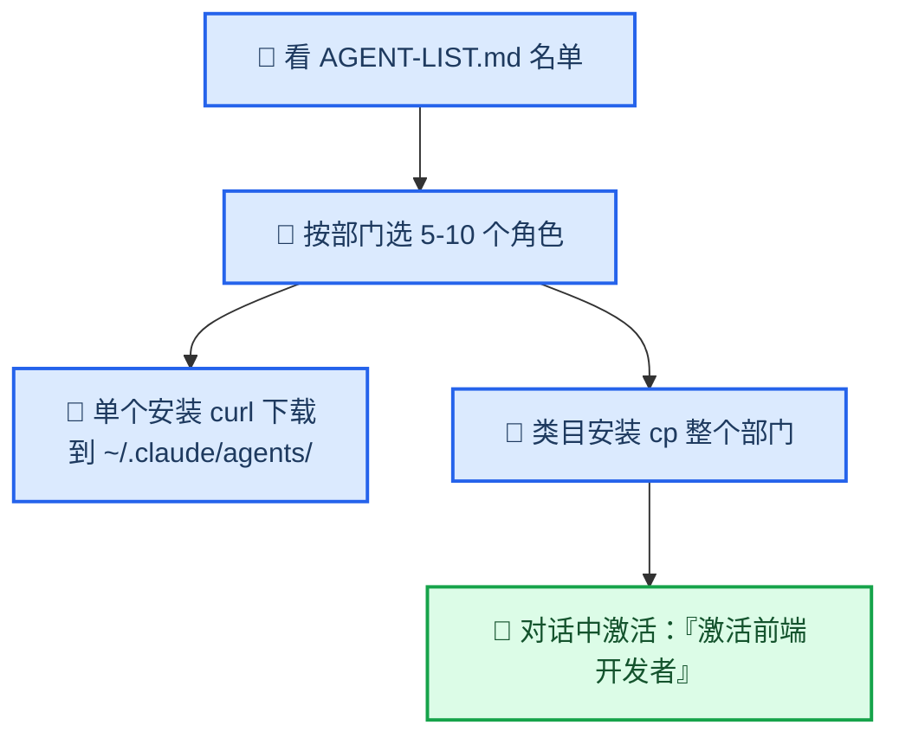

# Agency Agents 中文版 — 268 个 AI 智能体专家团队

_即插即用的 AI 专家角色集（中文版），含 53 个中国市场原创智能体，Claude Code 原生兼容 · 最后验证：2026-08-03_

---

## 📋 这个仓库是什么

[agency-agents-zh](https://github.com/jnMetaCode/agency-agents-zh) 是英文上游 [agency-agents](./agency-agents.md) 的中文社区版。**268 个 AI 专家角色**，按 19 个部门分类，每个角色是一个独立的 `.md` 文件（中文名 + 一句话描述 + 人格设定 + 专业流程 + 交付标准），不是通用提示词模板。

- **工程部 42 个**、营销部 42 个、游戏开发部 20 个、GIS 部 13 个、安全部 10 个……
- **53 个中国市场原创**：小红书/抖音/微信/B站/飞书/钉钉运营、跨境电商、政务 ToG、医疗合规、Qt 工业上位机等垂直领域

## 🎯 核心作用

| 作用 | 说明 |
| ---- | ---- |
| 专职 AI 角色 | 对话中一句话激活，角色带人设、专业流程、可交付成果 |
| Claude Code 原生 | 格式即 Claude Code 的 agent 格式（YAML frontmatter），复制即用 |
| 多工具支持 | 同上游，支持 Claude Code/Cursor/Copilot 等 18 种工具 |
| 团队编排 | 搭配 agency-orchestrator 桌面端，多专家按 DAG 自动协作 |

## ⚙️ 安装与使用

### 方法一：安装单个 agent（推荐）

```bash
# 示例：装「前端开发者」到 Claude Code 目录
curl -fsSL https://raw.githubusercontent.com/jnMetaCode/agency-agents-zh/main/engineering/engineering-frontend-developer.md \
  -o ~/.claude/agents/engineering-frontend-developer.md
```

装完在对话里说「激活前端开发者」即可调用。

### 方法二：按类目安装

```bash
git clone --depth 1 https://github.com/jnMetaCode/agency-agents-zh /tmp/agency-agents
cp /tmp/agency-agents/engineering/*.md ~/.claude/agents/   # 整个工程部
```

### 方法三：一键全装（268 个）

```bash
/tmp/agency-agents/scripts/install.sh --tool claude-code
```

### 如何选择 agent



1. 看仓库根目录 `AGENT-LIST.md`——268 个完整名单，按部门分类
2. 按部门进目录浏览：`engineering/`、`marketing/`、`security/` 等
3. 打开文件看开头 `name`（中文名）+ `description`（一句话说明）

> ⚠️ **注意**：agent 的名字+描述会注入每次对话的上下文，装太多会挤占上下文窗口、降低模型选 agent 的准确率。**按需装 5-10 个即可，不建议 268 个全装。**

## 🔗 参考链接

- [中文版仓库](https://github.com/jnMetaCode/agency-agents-zh)
- [英文上游](./agency-agents.md)
- [Claude Code 集成说明](https://github.com/jnMetaCode/agency-agents-zh/tree/main/integrations/claude-code)

---

_最后验证：2026-08-03 · 角色数量以仓库 `AGENT-LIST.md` 为准_
