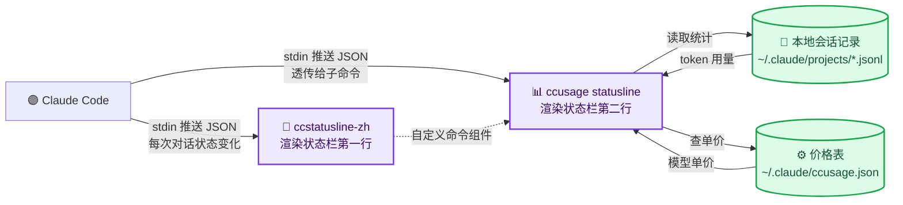

# Claude CLI 美化配置 — ccusage + ccstatusline 状态栏与用量统计

_小白向教程：给 Claude Code 配一个好看的状态栏，并让三方 API（中转站）接入的用户也能看到真实费用和用量 · 最后验证：2026-08-10_

---

## 🧭 先搞懂几个概念

| 名词 | 解释 |
| ---- | ---- |
| **状态栏（statusLine）** | Claude Code 终端底部的**一行实时信息**：当前模型、Git 分支、Token 用量、费用等，随对话刷新 |
| **三方 API 接入** | 不用官方账号，把请求转发到第三方中转站（或直接用 DeepSeek/GLM 等厂商的 Anthropic 兼容接口）。特征：`ANTHROPIC_BASE_URL` 指向非官方地址、模型名是 `deepseek-v4-flash` 这类第三方模型 |
| **jsonl 会话记录** | Claude Code 把每次对话自动存成 JSON 文件，位置 `~/.claude/projects/<项目>/<会话id>.jsonl`，里面**每条消息的 token 用量都有记录**——这就是三方 API 用户也能算费用的关键 |
| **为什么官方工具算不出三方费用** | ccstatusline 的用量组件用钥匙串里的官方 OAuth token 直连 `api.anthropic.com` 查账单。三方 API 没有这个 token，所以这些组件全部失效、显示 0 |


**一句话结论**：三方 API 用户想让状态栏显示费用，需要两个工具配合——`ccstatusline-zh`（渲染状态栏）+ `ccusage`（本地统计费用），价格自己填。

## 📦 两个工具是什么

| 工具 | 仓库 | 定位 | 语言 |
| ---- | ---- | ---- | ---- |
| **ccusage** | [ccusage/ccusage](https://github.com/ccusage/ccusage) | 用量/费用**统计报表**：按天/周/月/会话统计 token 和钱；支持 15 种 AI 编程 CLI；**纯本地读取 jsonl，不依赖官方账号** | Rust |
| **ccstatusline** | [sirmalloc/ccstatusline](https://github.com/sirmalloc/ccstatusline) | **状态栏渲染器**：87 种组件（模型、Git、Token、上下文进度条、Powerline 主题），实时显示 | TypeScript |
| **ccstatusline-zh** | [huangguang1999/ccstatusline-zh](https://github.com/huangguang1999/ccstatusline-zh) | ccstatusline 的**中文汉化版**，功能完全一致，界面全中文，共用同一份配置文件 | TypeScript |

> 💡 **Tip**：英文没问题就用原版 ccstatusline，中文用户推荐 -zh 汉化版，两者配置互不冲突。

## 🔧 整体数据流



## ⚙️ 安装步骤（三步）

### 1. 安装两个工具

```bash
npm install -g ccusage
npm install -g ccstatusline-zh
```

### 2. 配置 Claude Code 状态栏

编辑 `~/.claude/settings.json`，加入（或替换已有的 `statusLine` 块）：

```json
{
  "statusLine": {
    "type": "command",
    "command": "ccstatusline-zh",
    "padding": 0,
    "refreshInterval": 10
  }
}
```

| 字段 | 作用 |
| ---- | ---- |
| `command` | 每次刷新时执行的命令，`ccstatusline-zh` 是我们装的状态栏程序 |
| `refreshInterval` | 每 **10 秒**自动刷新一次（范围 1~60；Claude Code ≥ 2.1.97 才支持，低版本自动忽略） |
| `padding` | 状态栏左右留白，0 = 不留 |

> ⚠️ 动手前先备份：`cp ~/.claude/settings.json ~/.claude/settings.json.bak`。statusLine 同一时间**只能有一个**，会覆盖掉之前的。

### 3. 配置状态栏样式（TUI 图形界面）

```bash
ccstatusline-zh setup
```

会打开交互式界面，按提示添加组件即可：

| 操作 | 按键 |
| ---- | ---- |
| 添加组件 | `a`，然后 `/` 搜索组件名 |
| 编辑命令 | 选中后按 `e` |
| 删除/移动 | `d` / 方向键 + 回车 |

**推荐组件组合**（第二行负责费用显示）：

| 组件 | 配置 | 显示效果 |
| ---- | ---- | -------- |
| Git 变更 / Git 分支 | 直接加 | 红黄绿的文件变更 + 当前分支 |
| 模型 | 直接加 | `模型: deepseek-v4-flash[1m]` |
| 上下文长度 | 直接加 | `上下文: 100.9k` |
| **自定义命令**（关键） | 命令填 `ccusage statusline --cost-source ccusage`，按 `t` 把 timeout 调到 `5000`，按 `p` 打开保留颜色 | 费用、烧钱率、上下文占比 |
| 缓存命中率 | 直接加 | `缓存命中: 100.0%` |

## 💰 价格配置（三方 API 用户必做）

**不配置的话，费用永远显示 $0.00**——因为 ccusage 内置的 LiteLLM 价格表只有 Claude 官方模型。

编辑 `~/.claude/ccusage.json`（没有就新建）：

```json
{
  "$schema": "https://ccusage.com/config-schema.json",
  "defaults": {
    "pricingOverrides": {
      "deepseek-v4-flash": {
        "inputCostPerToken": 0.00000014,
        "outputCostPerToken": 0.00000028,
        "cacheReadInputTokenCost": 0.0000000028
      },
      "glm-5.2": {
        "inputCostPerToken": 0.00000141,
        "outputCostPerToken": 0.00000141,
        "cacheReadInputTokenCost": 0.0000007
      }
    }
  }
}
```

**三个新手最容易踩的坑**：

1. **`pricingOverrides` 必须放在 `defaults` 里面**（写顶层读不到，费用照样是 0）
2. **价格单位是「每 token 美元」**，不是「每百万 token」！换算公式：`厂商价(元/百万) ÷ 汇率(约 7.1) ÷ 100万`
3. **模型名必须和 jsonl 里 `message.model` 完全一致**（查法：`jq '.message.model' ~/.claude/projects/*/*.jsonl | sort -u`）

### 各厂商价格参考（记录时的配置）

| 模型 | 输入(元/百万) | 输出(元/百万) | 缓存命中 | 备注 |
| ---- | ---- | ---- | ---- | ---- |
| deepseek-v4-flash | ¥1 | ¥2 | ¥0.02 | 便宜到费用常显示 $0.00x |
| deepseek-v4-pro | ¥3 | ¥6 | ¥0.025 | 同上 |
| glm-5.2 | ¥10 | ¥10 | ¥5 | 缓存命中半价 |
| MiniMax-M3 | ¥4.2（五折后 ¥2.1） | ¥33.6（五折后 ¥8.4） | ¥0.84（五折后 ¥0.42） | 512K 以上输入还有第二档价格 |

支持的分档字段：`inputCostPerTokenAbove200kTokens` / `outputCostPerTokenAbove200kTokens` / `cacheReadInputTokenCostAbove200kTokens` / `maxInputTokens`（长上下文档位阈值），模型有分档计费就一起填上。

> 📌 价格为记录时的快照，**以各厂商定价页为准**。

## 📊 怎么查看报表

```bash
ccusage daily --last 1      # 今天（--last 1 = 只看最近 1 天）
ccusage daily               # 最近 7 天
ccusage weekly / monthly    # 本周 / 本月
ccusage session             # 按会话查看
ccusage blocks              # 5 小时计费块
ccusage daily --json        # JSON 格式导出
```

## ⚠️ 注意事项

- **中转站加价**：价格表填的是厂商官方价。如果你的中转站在官方价上加价（常见 10%~50%），显示的金额会偏低——按中转后台实际扣费调整价格即可
- **汇率波动**：按 ¥7.1/$ 换算，实际以当日汇率为准，误差只影响显示精度
- **费用小到看不见**：deepseek 这类低价模型一天可能只花 $0.05（约 ¥0.35），状态栏显示 $0.00 不一定是坏了，用 `ccusage daily --json` 看原始数字
- **配置位置汇总**：Claude 设置 `~/.claude/settings.json`、ccstatusline 样式 `~/.config/ccstatusline/settings.json`、ccusage 价格 `~/.claude/ccusage.json`
- **非 Git 目录显示「无 Git」**：状态栏 Git 组件需要仓库根目录（`.git` 存在），测试目录会显示 `无 Git`，属正常
- **隐私**：`自定义命令`组件会执行任意 shell 命令，别放密钥类内容进状态栏

## 🔗 参考链接

- [ccusage 官方仓库](https://github.com/ccusage/ccusage)（原 `ryoppippi/ccusage`，已迁至组织名下，旧地址自动跳转）
- [ccstatusline 上游仓库](https://github.com/sirmalloc/ccstatusline)
- [ccstatusline-zh 中文汉化版](https://github.com/huangguang1999/ccstatusline-zh)
- [ccusage 官方文档](https://ccusage.com/)
- [DeepSeek 官方定价页](https://api-docs.deepseek.com/zh-cn/quick_start/pricing)
- [Claude Code 状态栏官方文档](https://code.claude.com/docs/en/statusline)

---

_最后验证：2026-08-10 · 价格为记录时快照，以各厂商定价页为准_
