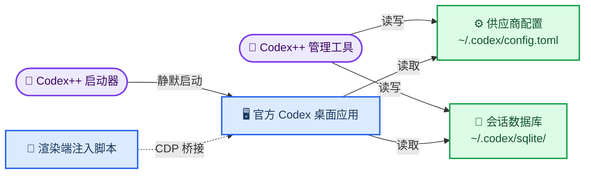

# Codex++ (CodexPlusPlus) — Codex 桌面版增强工具

_Codex/ChatGPT 桌面应用的外部启动器与管理工具：供应商切换、协议转换、会话管理与界面增强，Rust + Tauri 2.x 实现 · 最后验证：2026-08-06_

---

## 📋 这个仓库是什么

[BigPizzaV3/CodexPlusPlus](https://github.com/BigPizzaV3/CodexPlusPlus) 是面向 OpenAI Codex / ChatGPT 桌面应用的外部启动器与管理工具。核心卖点：

- **不碰官方安装目录**——不修改 `app.asar`、不写补丁文件，通过 Chromium DevTools Protocol（CDP）注入增强脚本
- **双入口**——`Codex++`（静默启动官方应用并加载增强）+ `Codex++ 管理工具`（Tauri 管理面板）
- **技术栈**——Rust 1.85+ / Tauri 2.x；Windows 用 NSIS 安装包，macOS 出 Intel x64 与 Apple Silicon arm64 双 DMG
- **开源协议**——AGPL-3.0-only，修改分发或网络提供服务需开源对应源码

## 🎯 核心功能

| 模块 | 功能 |
| ---- | ---- |
| 供应商配置 | 官方登录 / 官方登录混入 API / 纯 API / 聚合供应商 4 种模式；Responses 与 Chat Completions 协议互转；模型测试、模型列表、Provider Doctor、cc-switch 与链接导入 |
| 模型与上下文 | 每模型上下文窗口（`1M`/`200K`/纯数字）、自动压缩阈值、生成独立 `model_catalog_json`、按供应商选择 MCP / Skill / Plugin |
| 会话管理 | 扫描本地会话、批量删除、Markdown 导出、Token 用量历史、Provider 同步与备份 |
| 界面增强 | 插件市场解锁、模型白名单、中文界面、富文本粘贴转纯文本、启动加速、会话宽度与滚动恢复、服务层级切换、Goals、Stepwise 建议、图片覆盖层 |
| 开发工作流 | 项目移动、Upstream worktree、线程 ID、Zed Remote 识别与打开 |
| 脚本与维护 | 用户脚本安装与启停、应用检测、快捷方式、Watcher、环境冲突、日志诊断、健康检查、GitHub Release 自动更新 |

> 💡 **Tip**：所有界面增强均可单独关闭。关闭「Codex 增强」总开关后，Codex++ 仍可作为供应商和启动管理工具使用。

## 🔧 实现原理



关键设计点：

| 设计 | 说明 |
| ---- | ---- |
| 注入方式 | 通过 CDP 挂载渲染端脚本，不修改官方安装目录，官方更新后无需重装 |
| 认证边界 | 官方登录 / 混入 API / 纯 API 分开保存切换：纯 API 独立 `config.toml`，混入模式把 Key 写入 provider bearer token，互不污染 |
| 协议转换 | Chat Completions 经本地代理转换为 Codex 使用的 Responses 协议 |
| 上下文窗口 | 按模型生成独立 `model_catalog_json`，Codex 按当前模型使用对应窗口 |
| 数据位置 | Codex 配置 `~/.codex/config.toml`、登录状态 `~/.codex/auth.json`、SQLite 会话库、Codex++ 状态 `~/.codex-session-delete/` |

## ⚙️ 安装与使用

从 [GitHub Releases](https://github.com/BigPizzaV3/CodexPlusPlus/releases) 下载对应平台安装包：

- Windows：`CodexPlusPlus-*-windows-x64-setup.exe`
- macOS Intel：`*-macos-x64.dmg`；macOS Apple Silicon：`*-macos-arm64.dmg`

### 首次使用流程

1. 打开 `Codex++ 管理工具`，确认应用路径与运行状态
2. 配置供应商、模型与增强功能
3. 从 `Codex++` 入口启动（直接开官方应用不会有增强菜单）

### 供应商模式

| 模式 | 用途 | 认证边界 |
| ---- | ---- | -------- |
| 官方登录 | 只用 ChatGPT / Codex 官方账号 | 清理自定义 provider 与 API Key，保留官方登录 |
| 官方登录 + API | 保留官方账号与插件入口，请求走兼容 API | Key 写入 provider bearer token，不进纯 API 的 `auth.json` |
| 纯 API | 完全使用自定义 Base URL / Key | 独立保存 `config.toml` 与 Key |
| 聚合供应商 | 多 API 供应商间路由 | 故障转移、按会话 / 按请求 / 权重轮转 |

### macOS Gatekeeper 处理

未签名 / 未公证包会被拦截提示「已损坏」，执行后重新打开即可：

```bash
sudo xattr -rd com.apple.quarantine "/Applications/Codex++ 管理工具.app"
sudo xattr -rd com.apple.quarantine "/Applications/Codex++.app"
```

## ⚠️ 注意事项

- **官方更新后功能可能失效**——Codex++ 依赖官方应用的页面结构、CDP 与本地数据格式，官方更新后部分注入功能需跟随适配；修改供应商配置或会话数据前先备份
- **API Key 只存本机**——请勿放入日志、截图或 issue
- **两种模式认证位置不同**——纯 API 与官方混入使用不同 `auth.json`，不要手工互相复制
- **注入改动需重启**——依赖注入脚本的设置通常保存后要重启 Codex++ 才生效
- **切换供应商自动保存**——切换时会先保存当前配置再写入目标配置

## 🔗 参考链接

- [Codex++ 官方仓库](https://github.com/BigPizzaV3/CodexPlusPlus)
- [GitHub Releases](https://github.com/BigPizzaV3/CodexPlusPlus/releases)
- [AGPL-3.0 许可证](https://github.com/BigPizzaV3/CodexPlusPlus/blob/main/LICENSE)

---

_最后验证：2026-08-06 · 功能与安装包命名以 Releases 页面为准_
