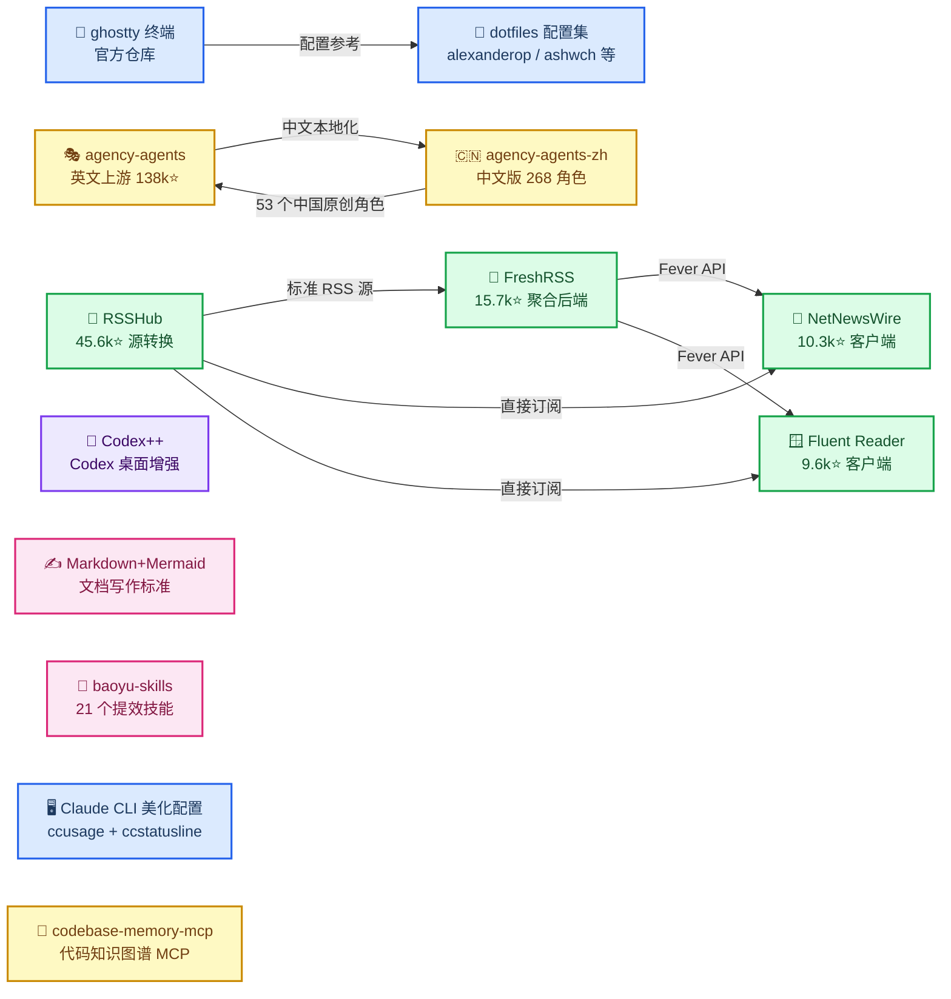

# GitHub 精选集

_精选高质量 GitHub 仓库：每个条目记录一个仓库（或一组工具链）的用途、核心作用与安装使用方式 · 最后验证：2026-08-20_

---

## 📋 收录清单

| 仓库 / 主题 | 一句话定位 | 条目 |
| ----------- | ---------- | ---- |
| [ghostty-org/ghostty](https://github.com/ghostty-org/ghostty) | GPU 加速、跨平台、原生 UI 的现代终端 | [ghostty](./ghostty.md) |
| [msitarzewski/agency-agents](https://github.com/msitarzewski/agency-agents) | 200+ 个即插即用的 AI 专家角色（英文上游，138k ⭐） | [agency-agents](./agency-agents.md) |
| [jnMetaCode/agency-agents-zh](https://github.com/jnMetaCode/agency-agents-zh) | 中文版 AI 智能体团队，268 个角色，含 53 个中国原创 | [agency-agents-zh](./agency-agents-zh.md) |
| RSS 生态系统 | 开源 RSS 工具链：RSSHub + FreshRSS + NetNewsWire + Fluent Reader | [rss-ecosystem](./rss-ecosystem.md) |
| GitHub 搜索 | 搜索语法、限定符、判断项目质量，小白向 | [github-search](./github-search.md) |
| [BigPizzaV3/CodexPlusPlus](https://github.com/BigPizzaV3/CodexPlusPlus) | Codex 桌面版增强工具：供应商切换、协议转换、会话管理与界面增强 | [codex-plus-plus](./codex-plus-plus.md) |
| [SuperiorByteWorks-LLC/agent-project](https://github.com/SuperiorByteWorks-LLC/agent-project) | Markdown + Mermaid 写作标准：科学文档文本化图表，24 图型 + 9 模板 | [markdown-mermaid-writing](./markdown-mermaid-writing.md) |
| [JimLiu/baoyu-skills](https://github.com/JimLiu/baoyu-skills) | 宝玉的 21 个 AI agent 提效技能：小红书/公众号发布、AI 图片、翻译抓取（24.7k ⭐） | [baoyu-skills](./baoyu-skills.md) |
| [ccusage/ccusage](https://github.com/ccusage/ccusage) + [huangguang1999/ccstatusline-zh](https://github.com/huangguang1999/ccstatusline-zh) | Claude CLI 美化配置：状态栏渲染 + 本地用量/费用统计，三方 API 也能算钱 | [claude-cli-statusline](./claude-cli-statusline.md) |
| [DeusData/codebase-memory-mcp](https://github.com/DeusData/codebase-memory-mcp) | 代码知识图谱 MCP：结构查询/调用链/影响分析替代 grep，159 语言，45.6k ⭐ | [codebase-memory-mcp](./codebase-memory-mcp.md) |

## 🔄 关系一览

> 📌 图中只画了**彼此有关联**的条目。单点工具（GitHub 搜索、codebase-memory-mcp）没有上下游关系，故不在图内。

## ✍️ 维护说明

- 每个条目固定结构：**仓库是什么 → 核心作用 → 安装与使用 → 参考链接**
- 条目内的星级、版本、价格为记录时的快照，会随时间变动，以各仓库当前页面为准
- 新增收录时，在清单表格加一行，并写对应 `.md` 文件

---

_最后验证：2026-08-20 · 各条目以其自身页面标注的验证日期为准_
