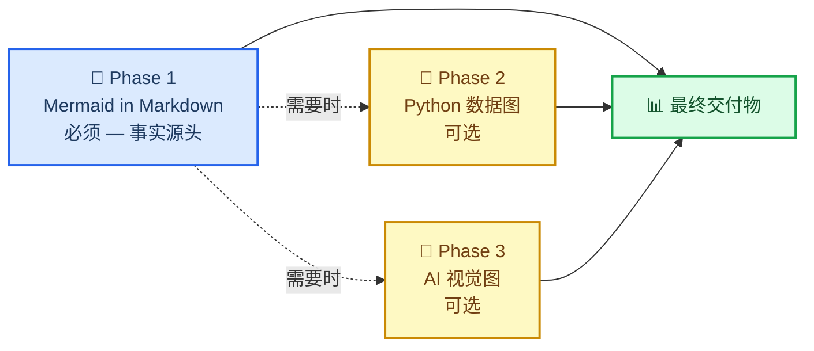

# Markdown + Mermaid 写作技能 — 科学文档的文本化图表标准

_Claude Code 写作技能：用「Markdown 内嵌 Mermaid」作为科学文档的默认格式，让图表保持为可 diff、可编辑、随处渲染的文本 · 最后验证：2026-08-07_

---

## 📋 这个技能是什么

[SuperiorByteWorks-LLC/agent-project](https://github.com/SuperiorByteWorks-LLC/agent-project) 出品的 `markdown-mermaid-writing` 技能，核心赌注：

> **用 Mermaid 表达的「关系」比任何图片都值钱**——它是文本，git diff 干净；无需构建步骤；GitHub / GitLab / Notion / VS Code 原生渲染；比同样关系的长文描述省 token；随时可转成精美图片，但文本版本永远是事实源头。

| 特性 | Mermaid 内嵌 Markdown | Python / AI 图片 |
| ---- | :-------------------: | :--------------: |
| git diff 可读 | ✅ | ❌ 二进制 |
| 免重新生成即可编辑 | ✅ | ❌ |
| 相对文字更省 token | ✅ | ❌ 更多 |
| 免构建步骤渲染 | ✅ | ❌ 需托管 |
| AI 免视觉解析 | ✅ | ❌ |
| GitHub / GitLab / Notion 可用 | ✅ | ⚠️ 需托管 |

## 🎯 核心工作流：三阶段

| 阶段 | 内容 | 何时用 |
| ---- | ---- | ------ |
| **Phase 1** 📄 | Mermaid in Markdown | **必须**，事实源头，永远提交 |
| **Phase 2** 🐍 | Python 生成（数据图表） | 可选，真实数据散点图等 |
| **Phase 3** 🎨 | AI 生成图片 | 可选，精美视觉 / 写实图 |

## 🧩 内置资源

### 24 种图型参考（按用途分类）

| 用途 | 推荐图型 |
| ---- | -------- |
| 工作流 / 决策逻辑 | Flowchart |
| 服务交互 / API 调用 | Sequence |
| 数据模型 / 表结构 | ER diagram |
| 状态机 / 生命周期 | State |
| 时间线 / 路线图 | Gantt / Timeline |
| 系统架构（多缩放级） | C4 |
| 概念层级 / 头脑风暴 | Mindmap |
| 类层级 / 类型关系 | Class |
| 二维对比 / 优先级 | Quadrant |
| 流量规模 / 资源分布 | Sankey |
| 数值趋势 | XY Chart（`xychart-beta`） |
| Git 分支 / 合并策略 | Git Graph |
| 云基础设施拓扑 | Architecture |

> 💡 **选对类型，别偷懒**——时序事件用 Timeline 而非 Flowchart，服务交互用 Sequence；先扫全表再选。

### 9 种文档模板

Pull Request 记录、Issue / Bug、Sprint 看板、架构决策记录（ADR）、演示文稿、研究论文、项目文档、How-to 教程、状态报告——每种模板开写前可复用。

## ⚠️ 常见坑

| 坑 | 说明 |
| ---- | ---- |
| `radar` 关键字不存在 | 用 **`radar-beta`**：`axis id["标签"]` 定义维度，`curve id["标签"]{数据}` 定义系列 |
| **`mindmap` 不支持 `accTitle`/`accDescr`** | 加上任一行都会导致 `Syntax error in text`、整张图渲染失败（mermaid 12 实测）。无障碍描述写进图前后的正文 |
| `%%{init}` 指令 | ❌ 禁用，会破坏 GitHub 暗色模式 |
| 内联 `style` | ❌ 禁用，只准用 `classDef` |
| 漏掉无障碍标注 | 支持 `accTitle`/`accDescr` 的图型必须带上（前者 3-8 词，后者一两句） |
| 节点 ID | `snake_case`，与标签对应；每节点最多 1 个 emoji 且在开头 |

## 🔗 参考链接

- [agent-project 上游仓库（Apache-2.0）](https://github.com/SuperiorByteWorks-LLC/agent-project)
- [Mermaid 官方文档](https://mermaid.js.org/)
- [GitHub Blog：Mermaid 渲染支持](https://github.blog/2022-02-14-include-diagrams-markdown-files-mermaid/)

---

_最后验证：2026-08-07（`mindmap` 一行于 2026-10-01 补充实测） · 引用自 Clayton Young (@borealBytes) 在 K-Dense Discord 的分享，2026-02-19_
