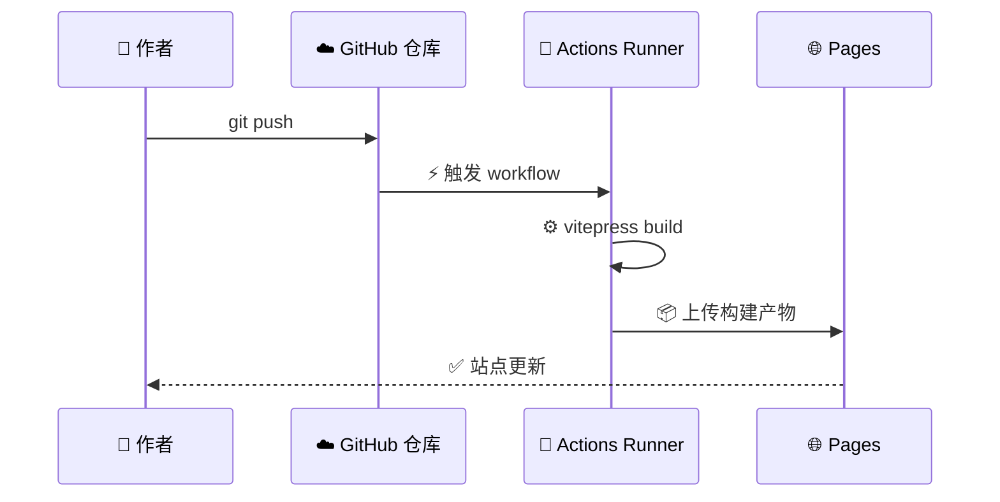
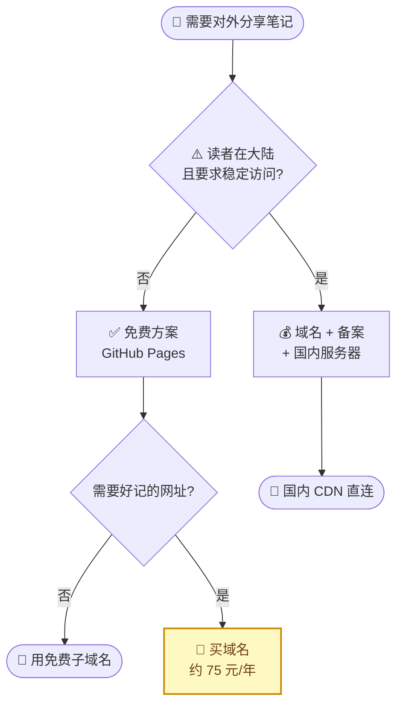

# 用 GitHub Pages 搭建静态知识库

_预计耗时 40 分钟 · 难度：入门 · 最后验证：2026-09-30_

---

## 📋 Overview

### 你将完成什么

把散落在多台电脑上的 Markdown 笔记，聚合成一个**只读的静态站点**，托管在 GitHub Pages 上免费对外访问。最终你会得到一个 `https://<用户名>.github.io/` 的网址，任何拿到链接的人都能打开阅读，不需要账号、不需要评论系统、不需要服务器。

本站就是用这套流程搭起来的。

### 你将学到

- GitHub Pages 的免费额度边界，以及它在中国大陆的真实访问表现
- VitePress 如何**零改造**吃下已有的 Markdown 文件
- 让 `git push` 自动触发构建与发布的 GitHub Actions 配置
- 多台电脑同时往一个仓库写文档，且不产生冲突的工作流

### 整体链路

内容从本地 Markdown 出发，经过仓库、自动构建、静态托管，最终到达读者浏览器。


`git push` 之后到站点更新之间的完整时序：



---

## 📋 Prerequisites

| 依赖 | 版本 | 验证命令 | 说明 |
| ------------------ | ------- | ---------------------- | ------------------------------------------ |
| Git | ≥ 2.30 | `git --version` | 版本控制 |
| Node.js | ≥ 20 | `node --version` | 仅本地预览需要；纯写文档可以不装 |
| GitHub 账号 | — | `gh auth status` | 用于托管仓库 |
| SSH 密钥 | ed25519 | `ls ~/.ssh/*.pub` | 推送身份认证 |

**一次性验证全部前置条件：**

```bash
# 三条都应有输出，才算就绪
git --version
node --version
gh auth status
```

> ⚠️ **先配好 git 全局身份再动手。** 提交一旦推到公开仓库，作者邮箱就进了永久历史里，事后无法干净地删除。用 GitHub 的 noreply 邮箱可以避免暴露真实邮箱：

```bash
git config --global user.name  "你的名字"
git config --global user.email "<用户ID>+<用户名>@users.noreply.github.com"
```

用户 ID 是数字，可在 `https://api.github.com/users/<用户名>` 的 `id` 字段查到。

---

## 🔧 Steps

### Step 1: 配置 SSH 走 443 端口

中国大陆网络环境下 `github.com:22` 通常不可达，SSH 连接会被直接重置。GitHub 在 `ssh.github.com` 的 443 端口提供了备用入口。

先确认症状——如果出现下面这类报错，就是端口问题：

```
Connection closed by <IP> port 22
```

创建或编辑 `~/.ssh/config`：

```text
Host github.com
  HostName ssh.github.com
  Port 443
  User git
  IdentityFile ~/.ssh/id_ed25519_<机器名>
  IdentitiesOnly yes
```

**验证：**

```bash
ssh -T git@github.com
```

**预期输出：**

```
Hi <用户名>! You've successfully authenticated, but GitHub does not provide shell access.
```

> 💡 **一台机器多个 GitHub 身份怎么办？**
> 追加一个 Host 别名即可，两份配置互不干扰：
>
> ```text
> Host github-work
>   HostName ssh.github.com
>   Port 443
>   User git
>   IdentityFile ~/.ssh/id_ed25519_work
>   IdentitiesOnly yes
> ```
>
> 访问对应仓库时用 `git@github-work:公司/仓库.git` 克隆即可。**每台机器生成各自独立的密钥**，不要复制私钥——某台设备丢失时，你可以只吊销那一把。

---

### Step 2: 建立站点目录

把要发布的笔记**复制**（不要移动）到一个独立目录。保留原件，等于天然备份。

```bash
mkdir -p ~/code/notes/{tech,public,.vitepress}
cd ~/code/notes
```

> 📌 **只放你确定要公开的内容。** 尤其注意排查：主机清单、连接手册、含 IP／账号／密钥的运维文档。这些一旦推送，**即使事后删除，commit 历史里依然存在**。

初始化版本控制，并写入两个关键配置文件：

```bash
git init
```

`.gitignore` —— 排除不该进仓库的产物：

```text
node_modules/
.vitepress/dist/
.vitepress/cache/
.DS_Store
```

`.gitattributes` —— 这两行是多机同步不打架的基础：

```text
* text=auto
*.md merge=union
```

`text=auto` 统一换行符，避免 Windows／macOS／Linux 混用时出现满屏假 diff。`merge=union` 让 Markdown 按行合并——两台机器改了不同段落时**不会产生冲突**。

---

### Step 3: 安装并初始化 VitePress

```bash
cd ~/code/notes
npm init -y
npm install -D vitepress
```

在 `package.json` 中补上三个脚本：

```json
{
  "type": "module",
  "scripts": {
    "docs:dev": "vitepress dev",
    "docs:build": "vitepress build",
    "docs:preview": "vitepress preview"
  }
}
```

> 💡 **VitePress 不强制 frontmatter。** 页面标题自动取正文的第一个 H1，所以**已有的 Markdown 文件一个字都不用改**就能上线。这是它相比 Astro Starlight、Hexo、Docusaurus 的最大优势——后三者都要求重排目录或补齐 `title` 字段。

---

### Step 4: 写站点配置

`.vitepress/config.mts` 是唯一的配置入口。最小可用版本：

```ts
import { defineConfig } from 'vitepress'

export default defineConfig({
  lang: 'zh-CN',
  title: '站点标题',
  description: '一句话描述',

  themeConfig: {
    nav: [
      { text: '技术', link: '/tech/', activeMatch: '/tech/' },
      { text: '关于', link: '/about' },
    ],
    sidebar: {
      '/tech/': [
        {
          text: '分组名',
          items: [
            { text: '文章标题', link: '/tech/子目录/文件' },
          ],
        },
      ],
    },
    search: { provider: 'local' },
  },
})
```

左侧导航由 `sidebar` 决定，顶部导航由 `nav` 决定。

> 📌 **扩展分类只需两步**：新建一个目录，然后在 `nav` 和 `sidebar` 各加一段。一级分类保持在 3–5 个且足够宽泛，细节下沉到二级子目录——这样内容长到几百篇也不需要重排结构。

**中文文件名映射成英文 URL**（可选但推荐）。文件在磁盘上保持中文名便于识别，URL 输出英文便于分享：

```ts
rewrites: {
  'tech/虚拟化/安装流程.md': 'tech/virtualization/install.md',
}
```

> ⚠️ **配置了 `rewrites` 之后，文内的相对链接必须改成绝对路径。** 详见[排错](#文内链接跳转-404)。

---

### Step 5: 建仓库并推送

用户主页仓库**必须命名为 `<用户名>.github.io`**，这样站点才挂在域名根目录下，省掉子路径的 `base` 配置。

```bash
# 在 GitHub 上创建空仓库（不要勾选 README，避免首次推送冲突）
gh repo create <用户名>.github.io --public
```

然后关联并推送：

```bash
git add -A
git commit -m "初始化站点"
git branch -M main
git remote add origin git@github.com:<用户名>/<用户名>.github.io.git
git push -u origin main
```

> ⚠️ **免费账号下，Pages 只能从公开仓库发布。** 私有仓库发布 Pages 需要 Pro 及以上套餐，且所谓"私有"仅指源码不可见——**站点 URL 本身依然全网公开**。笔记内容本来就要公开，通常不是问题；但要清楚私有的是草稿，不是网站。

---

### Step 6: 配置自动构建

在仓库里新建 `.github/workflows/deploy.yml`：

```yaml
name: Deploy site to Pages

on:
  push:
    branches: [main]
  workflow_dispatch:

permissions:
  contents: read
  pages: write
  id-token: write

concurrency:
  group: pages
  cancel-in-progress: false

jobs:
  build:
    runs-on: ubuntu-latest
    steps:
      - uses: actions/checkout@v4
        with:
          fetch-depth: 0
      - uses: actions/setup-node@v4
        with:
          node-version: 20
          cache: npm
      - run: npm ci
      - run: npm run docs:build
      - uses: actions/configure-pages@v5
      - uses: actions/upload-pages-artifact@v3
        with:
          path: .vitepress/dist

  deploy:
    needs: build
    runs-on: ubuntu-latest
    environment:
      name: github-pages
      url: ${{ steps.deployment.outputs.page_url }}
    steps:
      - id: deployment
        uses: actions/deploy-pages@v4
```

> 📌 `npm ci` 需要 `package-lock.json` 存在并已提交。如果本地跑过 `npm install`，这个文件会自动生成——记得 `git add` 它。

---

### Step 7: 开启 Pages

进入仓库的 **Settings → Pages**，把 **Source** 设为 **GitHub Actions**（不是 "Deploy from a branch"）。

这一步是必须的。不设置的话 workflow 会正常跑完、显示绿色成功，但站点始终是 404。

---

## ✅ Verify it works

| 检查项 | 命令 | 预期结果 |
| ---------------------- | ---------------------------------- | ---------------------------------------- |
| SSH 身份正确 | `ssh -T git@github.com` | `Hi <用户名>!` |
| 本地构建通过 | `npm run docs:build` | `build complete in ...` |
| 产物路径正确 | `ls .vitepress/dist` | 出现 `index.html` 和分类目录 |
| Workflow 成功 | `gh run list --limit 1` | 状态为 `completed  success` |
| 站点可访问 | `curl -I https://<用户名>.github.io/` | `HTTP/2 200` |

**全部通过就上线了。** 有问题看下面的排错部分。

---

## 🔄 多机同步

### 核心原则：只用 Git，不要用同步盘

> 🚫 **绝不要用 Syncthing、iCloud Drive、OneDrive、Dropbox、坚果云直接同步 Git 仓库目录。**
>
> 这类工具不认识 `.git` 的元数据，会把 `.git/refs`、`.git/index`、`HEAD` 当普通文件双向同步，导致**假提交记录、丢提交、索引损坏**——这是数据丢失级别的故障。冲突时它们还会生成 `HEAD.sync-conflict-20260930-120000-ABCDEF` 这类垃圾文件，并继续传播到所有设备。
>
> 笔记**内容**可以用同步盘，`.git` 不行。

### 每台机器的配置

```bash
git clone git@github.com:<用户名>/<用户名>.github.io.git ~/code/notes
cd ~/code/notes
git config pull.rebase true
git config merge.conflictstyle zdiff3
```

顺手加个别名，把四步压成一条命令：

```bash
git config --global alias.sync '!git pull --rebase && git add -A && git commit -m "更新笔记" && git push'
```

之后的工作流就是：**写文档 → `git sync`**。

### 降低冲突的三个要点

- **小步频繁提交**——这才是真正有效的降冲突手段，与工具无关。别攒一整天再 push
- **push 前先 `pull --rebase`**——别名里已经包含，手动操作时别忘
- **被拒时不要用 `pull --no-rebase`**——硬生成的 merge commit 会让历史变乱

> 💡 临时设备（手机、别人的电脑）上写文档，把 URL 里的 `github.com` 改成 `github.dev`，会打开一个网页版 VS Code，支持 Markdown 预览和直接提交，无需配置任何环境。

---

## 🔧 Troubleshooting

### "Connection closed by ... port 22"

**原因：** 中国大陆网络环境下 22 端口被拦截，SSH 无法建立连接。

**修复：** 按 [Step 1](#step-1-配置-ssh-走-443-端口) 配置 `~/.ssh/config`，改用 `ssh.github.com:443`。

**验证修复：**

```bash
ssh -T git@github.com
```

---

### 文内链接跳转 404

**原因：** 配置了 `rewrites` 把中文文件名映射成英文 URL 之后，**文内的相对链接不会自动套用映射**。`[另一篇](./某文档.md)` 会被渲染成 `./某文档.html`——而产物里只有映射后的英文名，链接必然失效。

**修复：** 把相对链接改成映射后的**绝对路径**：

```markdown
❌ [另一篇](./某文档.md)
✅ [另一篇](/tech/分类/english-slug)
```

**验证修复：**

```bash
npm run docs:build
grep -o 'href="[^"]*"' .vitepress/dist/**/*.html | grep -P '[\x{4e00}-\x{9fff}]'
```

如果还有输出，说明仍有未映射的中文路径残留。

---

### 手写目录点击无反应

**原因：** Markdown 里手写的目录（`## 目录`）用的是 **GitHub 风格的锚点**，而 VitePress 生成的锚点规则不同。典型差异：

| 手写（GitHub 规则） | VitePress 实际生成 |
| ---------------------------------------- | ---------------------------------------------- |
| `#0-快速开始tldr` | `#_0-快速开始-tl-dr` |
| `#坑-1virt-manager-不认识-omarchy` | `#坑-1-virt-manager-不认识-omarchy` |

主要差别：以数字开头的标题会加 `_` 前缀，空格转连字符的时机也不同。

**修复：** **直接删掉手写目录**。VitePress 右侧会自动生成「本页目录」大纲，手写的那份是重复的，而且维护成本随文档变长而上升。

**如果确实需要保留内页锚点链接**，用实际生成的锚点：

```bash
# 构建后查真实锚点
grep -oE 'id="[^"]+"' .vitepress/dist/路径/文件.html | sort -u
```

---

### `npm run docs:dev` 报 esbuild 相关错误

**原因：** 部分环境的安全策略会拦截 `esbuild` 的 `postinstall` 脚本（用于链接平台专用二进制）。

**先确认是否真的有问题：**

```bash
./node_modules/.bin/esbuild --version
```

**如果能正常输出版本号**，说明 npm 已直接安装平台包（如 `@esbuild/linux-x64`），**无需放行脚本**——这是更安全的结果。

**如果确实报错**，再手动放行：

```bash
npm install-scripts approve esbuild
```

---

### 大陆读者访问慢或打不开

**原因：** `*.github.io` 由 Fastly 承载，**中国大陆境内没有节点**，通常被路由到东京或香港。这是网络层面的问题，不是配置错误。

**这是免费方案的固有限制，没有解。** 免费 + 免备案 + 大陆稳定访问，三者最多取其二。



> 📌 **"GitHub + 备案"这条路本身是矛盾的。**

备案绑定的是「域名 + 中国大陆服务器 IP」这个组合。GitHub Pages 没有大陆节点，备了也没有服务器可用。要走通，前提是先买大陆云服务器（包年包月至少 3 个月）+ 走 10–25 个工作日流程。

**常见的无效缓解手段：**

| 手段 | 为什么没用 |
| ------------------- | -------------------------------------------------------- |
| 改 hosts / 用 DoH | 只对**你自己**本机有效。你要让读者能看，就得让每个读者都去改 |
| Cloudflare 免费反代 | 免费版没有大陆节点，流量常被调度到美西，可能"加速变减速" |
| jsDelivr 等文件 CDN | 只能加速图片／JS／CSS 等文件，**不能当整站入口**，且国内节点已关停 |

**能接受这个限制**是最省事的选择——对个人笔记站来说，读者通常是熟人，偶尔打不开可以容忍。

---

## 🚀 What's next

站点跑起来之后：

- **持续补充内容**——内容以 Markdown 文件形式堆进去即可，`git push` 就上线
- **扩展分类**——按 [Step 4](#step-4-写站点配置) 的两步操作加新领域
- **需要图表时**——Mermaid 图表在 VitePress 中需要额外插件才能渲染；GitHub 网页端则原生支持
- **需要更好记的网址时**——买一个 `.com` 域名绑定，改成 4 条 A 记录或 1 条 CNAME，HTTPS 由 Let's Encrypt 自动签发

<details>
<summary><strong>📋 常用命令速查</strong></summary>

| 操作 | 命令 |
| -------------- | ------------------------------------ |
| 本地预览 | `npm run docs:dev` |
| 构建产物 | `npm run docs:build` |
| 预览构建结果 | `npm run docs:preview` |
| 查看部署状态 | `gh run list --limit 5` |
| 看某次部署日志 | `gh run view <run-id> --log` |
| 同步笔记 | `git sync` |
| 验证 SSH 身份 | `ssh -T git@github.com` |

</details>

---

## 🔗 References

- [GitHub Pages limits](https://docs.github.com/en/pages/getting-started-with-github-pages/github-pages-limits) — 免费额度与用途限制
- [Configuring a publishing source](https://docs.github.com/en/pages/getting-started-with-github-pages/configuring-a-publishing-source-for-your-github-pages-site) — 两种发布方式的区别
- [VitePress 官方文档](https://vitepress.dev/) — 配置项与主题定制
- [Include diagrams in your Markdown files with Mermaid](https://github.blog/2022-02-14-include-diagrams-markdown-files-mermaid/) — GitHub 原生 Mermaid 支持公告
- [Gitee Pages 停服记录](https://www.landian.news/archives/103754.html) — 选型时注意排除已下线服务

---

_最后验证：2026-09-30 · 基于 Ubuntu 24.04 / Git 2.43 / Node 22 / VitePress 1.6.4_
