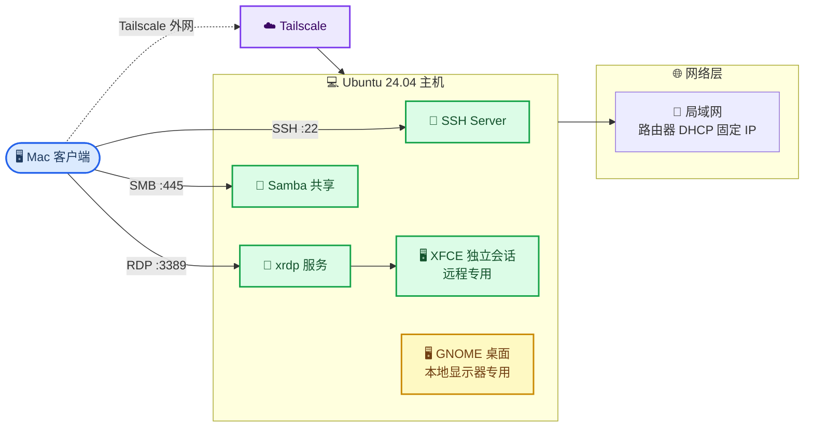
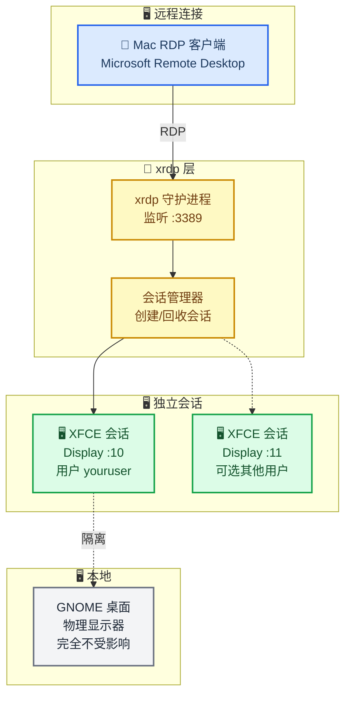
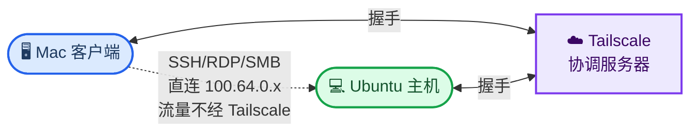
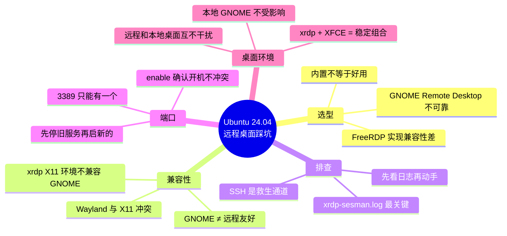

# Ubuntu 24.04 远程访问配置指南：Mac 作为客户端

_预计耗时 60 分钟 · 难度：中等 · 最后验证：2026-07-17_

---

## 📋 概述

### 目标

将一台安装 Ubuntu 24.04 桌面版的主机配置为可通过 Mac 远程访问的开发服务器，最终拔掉显示器，纯远程运行。

> 📌 下文示例中的内网 IP `192.168.1.100`、用户名 `youruser`、共享目录 `/home/youruser/share` 均为占位符，替换成你自己的值。

### 最终架构

经过踩坑后确定的最佳方案：**SSH 负责命令行，xrdp + XFCE 负责远程桌面，Samba 负责文件共享，Tailscale 负责外网访问。**



### 四种连接方式

| 方式 | 协议/端口 | 工具 | 适用场景 |
|------|-----------|------|----------|
| 命令行 | SSH :22 | Mac 终端 / VS Code Remote-SSH | 开发、运维、包管理 |
| 远程桌面 | RDP :3389 (xrdp + XFCE) | Microsoft Remote Desktop | 图形界面操作 |
| 文件共享 | SMB :445 (Samba) | Mac Finder Cmd+K | 文件拖拽、传输 |
| 外网访问 | WireGuard (Tailscale) | Tailscale 客户端 | 出差、外网连接 |

---

## 📋 前置条件

| 条件 | 说明 |
|------|------|
| Ubuntu 24.04 桌面版 | 已安装在主机上 |
| Mac 电脑 | 与 Ubuntu 在同一局域网 |
| 路由器管理权限 | 用于绑定固定 IP |
| HDMI 欺骗器（推荐） | 无显示器时让显卡正常工作，约 5-10 元 |

---

## 🔧 第一步：SSH 远程连接（基础）

SSH 是一切远程操作的基础。远程桌面出问题时，SSH 是唯一的救生通道。

### 安装并启动 SSH 服务

```bash
# Ubuntu 端执行
sudo apt update && sudo apt install openssh-server -y
sudo systemctl enable --now ssh
```

### 验证 SSH 运行状态

```bash
sudo systemctl status ssh
# 应显示 active (running)

ss -tlnp | grep 22
# 应显示 0.0.0.0:22 在监听
```

### 查看 Ubuntu 信息

```bash
whoami          # 获取用户名
hostname -I     # 获取 IP 地址
```

### Mac 端连接

```bash
ssh 用户名@IP地址
# 示例：ssh youruser@192.168.1.100
```

---

## 🔐 第二步：配置 SSH 密钥登录（免密码）

### Mac 端生成密钥

```bash
# 如果已有密钥可跳过
ssh-keygen -t ed25519
# 三个提示均直接回车（使用默认路径、不设密码短语）
```

### 将公钥拷贝到 Ubuntu

```bash
ssh-copy-id 用户名@IP地址
# 示例：ssh-copy-id youruser@192.168.1.100
# 输入一次 Ubuntu 密码后，之后连接不再需要密码
```

### 验证免密登录

```bash
ssh 用户名@IP地址
# 直接登录成功即配置完毕
```

### 查看密钥分发记录

```bash
# Mac 端：查看执行过的 ssh-copy-id
history | grep ssh-copy-id

# Mac 端：查看连过的机器
cat ~/.ssh/known_hosts

# Ubuntu 端：查看已授权的公钥
cat ~/.ssh/authorized_keys
```

---

## 🌐 第三步：路由器固定 IP 绑定

> 💡 **为什么需要：** Ubuntu 无显示器后 IP 乱变会导致无法连接。通过路由器 DHCP 地址保留，每次都给同一台机器分配相同的 IP。

### 获取 Ubuntu 的 MAC 地址

```bash
ip link show
# 找到正在使用的网卡（enp 开头或 eth0），记下 link/ether 后面的地址
# 示例：11:22:33:44:55:66
```

### 查看路由器网关地址

```bash
ip route | grep default
# 输出类似：default via 192.168.1.1 dev enp3s0
# 网关即路由器后台地址
```

### 在路由器后台绑定

不同品牌路由器功能名称对照：

| 品牌 | 菜单位置 |
|------|----------|
| TP-Link | DHCP 服务器 → 地址保留 |
| 小米/红米 | 高级设置 → DHCP 静态 IP 分配 |
| 华硕 ASUS | LAN → DHCP 服务器 → 手动指定 |
| 华为 | 更多功能 → DHCP 静态 IP 分配 |
| OpenWrt | 网络 → DHCP/DNS → 静态地址分配 |

填入 Ubuntu 的 MAC 地址和指定的 IP，保存并重启路由器使设置生效。

---

## 🖥️ 第四步：远程桌面配置（重头戏）

这是整个过程踩坑最多的一步。先看结论再看过程。

### 最终方案：xrdp + XFCE



#### 为什么是 xrdp + XFCE

| 方案 | 结果 | 根因 |
|------|------|------|
| GNOME Remote Desktop（内置） | ❌ 0x207 认证失败 | FreeRDP NTLM 认证与微软客户端不兼容 |
| xrdp + GNOME | ❌ 连上即闪退 | Ubuntu 24.04 GNOME 不兼容 xrdp X11 环境 |
| **xrdp + XFCE** | ✅ 正常使用 | XFCE 完美兼容 xrdp，轻量稳定 |

#### 安装步骤

```bash
# 1. 安装 xrdp 和 XFCE
sudo apt install xrdp xfce4 xfce4-goodies -y

# 2. 指定 xrdp 使用 XFCE
echo "xfce4-session" > ~/.xsession

# 3. 禁用 GNOME Remote Desktop（避免端口冲突）
systemctl --user stop gnome-remote-desktop.service
systemctl --user disable gnome-remote-desktop.service

# 4. 启动 xrdp
sudo systemctl enable --now xrdp

# 5. 确认端口监听
ss -tlnp | grep 3389
# 应显示 xrdp 在 3389 监听
```

#### 连接方式

Microsoft Remote Desktop 中：

- **PC name：** `192.168.1.100`
- **Username：** 系统用户名
- **Password：** 系统登录密码（与 GNOME Remote Desktop 的独立凭据不同）

#### 若需两个服务共存（换端口）

```bash
# 改 xrdp 端口为 3390
sudo sed -i 's/^port=3389/port=3390/' /etc/xrdp/xrdp.ini
sudo systemctl restart xrdp
```

连接时地址填 `192.168.1.100:3390`。

### 踩坑过程回顾（供参考）

```mermaid
flowchart TB
    accTitle: 远程桌面踩坑全流程
    accDescr: 从 GNOME 内置远程桌面到最终 xrdp XFCE 方案的完整排查路径，包括五个关键故障点和对应解决方案

    start([🏁 需求：Mac 远程连接<br/>Ubuntu 桌面]) --> try1[尝试 GNOME 内置远程桌面]

    try1 --> err1{❌ 坑1：<br/>无法连接<br/>无提示}
    err1 --> fix1[🔧 设置自动登录<br/>关闭锁屏/休眠]
    fix1 --> try1b[重试 GNOME 远程桌面]

    try1b --> err2{❌ 坑2：<br/>错误 0x207<br/>无法连接到远程电脑}
    err2 --> diag1[🔍 日志显示 NTLM<br/>认证失败]
    diag1 --> root1[根因：GNOME RDP<br/>与微软客户端不兼容]
    root1 --> try2[改试 xrdp]

    try2 --> err3{❌ 坑3：<br/>xrdp 启动失败<br/>port 3389 冲突}
    err3 --> fix3[🔧 禁用 GNOME RDP<br/>或换端口]
    fix3 --> try2b[重试 xrdp]

    try2b --> err4{❌ 坑4：<br/>xrdp 连上即闪退<br/>无桌面显示}
    err4 --> diag2[🔍 xrdp-sesman.log：<br/>window manager exited<br/>with non-zero exit code 1]
    diag2 --> root2[根因：Ubuntu 24.04<br/>GNOME 不兼容<br/>xrdp X11 环境]
    root2 --> try3[改试 xrdp + XFCE]

    try3 --> success([✅ 成功<br/>xrdp + XFCE<br/>完美运行])

    classDef start_style fill:#ede9fe,stroke:#7c3aed,stroke-width:2px,color:#3b0764
    classDef err_style fill:#fee2e2,stroke:#dc2626,stroke-width:2px,color:#7f1d1d
    classDef diag_style fill:#fef9c3,stroke:#ca8a04,stroke-width:2px,color:#713f12
    classDef fix_style fill:#dbeafe,stroke:#2563eb,stroke-width:2px,color:#1e3a5f
    classDef success_style fill:#dcfce7,stroke:#16a34a,stroke-width:2px,color:#14532d

    class start,try1,try1b,try2,try2b,try3 start_style
    class err1,err2,err3,err4 err_style
    class diag1,diag2 diag_style
    class fix1,fix3 fix_style
    class root1,root2 err_style
    class success success_style
```



五个坑按时间顺序：

| 序号 | 现象 | 排查手段 | 根因 | 解决 |
|------|------|----------|------|------|
| 1 | 远程桌面无任何反应 | `loginctl list-sessions` 发现无桌面会话 | 锁屏/休眠/未自动登录 | 设置自动登录 + 禁用休眠 |
| 2 | 错误 0x207 "无法连接到远程电脑" | `systemctl --user status gnome-remote-desktop` 日志显示 NTLM 认证失败 | GNOME RDP 的 FreeRDP 实现与微软客户端不兼容 | 放弃 GNOME RDP，改用 xrdp |
| 3 | xrdp 启动失败 | `systemctl status xrdp` 显示端口被占用 | GNOME RDP 占着 3389 | 禁用 GNOME RDP 或给 xrdp 换端口 |
| 4 | xrdp 连上即闪退，无桌面 | `tail -50 /var/log/xrdp-sesman.log` 显示 `window manager exited with non-zero exit code 1` | Ubuntu 24.04 GNOME 不兼容 xrdp X11 环境 | 装 XFCE 给 xrdp 用 |
| 5 | — | — | — | **最终方案：xrdp + XFCE** |

### 无显示器相关配置

以下配置确保主机拔掉显示器后仍能正常工作：

**禁止系统休眠（必须）：**

```bash
sudo systemctl mask sleep.target suspend.target hibernate.target hybrid-sleep.target
systemctl status sleep.target
# 应显示 Loaded: masked
```

**其实不需要自动登录了：**

因为你用的是 xrdp + XFCE——xrdp 创建独立会话，不依赖本地桌面是否登录。自动登录（`/etc/gdm3/custom.conf`）只在用 GNOME Remote Desktop 时才需要。现在这一步可以跳过。

**HDMI 欺骗器：**

虽然 xrdp 不依赖物理显示器，但如果主机有 NVIDIA 显卡，拔掉显示器后某些机器无法正常启动图形加速。买个 HDMI 欺骗器（淘宝搜"HDMI 假负载"，5-10 元）插显卡上即可。

---

## 📁 第五步：Samba 文件共享（Mac Finder 直连）

让 Mac 像访问网络硬盘一样访问 Ubuntu 文件夹，Finder Cmd+K 即连。

### Ubuntu 端配置

```bash
# 安装 Samba
sudo apt update && sudo apt install samba -y

# 创建共享文件夹
mkdir -p ~/share
chmod 755 ~/share

# 设置 Samba 密码（独立于系统密码，可以和系统密码一样）
sudo smbpasswd -a youruser
```

编辑配置文件：

```bash
sudo nano /etc/samba/smb.conf
```

拉到文件末尾，添加：

```ini
[share]
   comment = Ubuntu Shared Folder
   path = /home/youruser/share
   browseable = yes
   read only = no
   valid users = youruser
   create mask = 0644
   directory mask = 0755
```

重启服务：

```bash
sudo systemctl restart smbd
sudo systemctl enable smbd
sudo ufw allow samba
```

### 如果想共享整个 Home 目录

Samba 默认内置 `[homes]` 共享（配置文件里有），连接时选 `homes` 卷即可直接访问用户主目录，无需额外配置。

### Mac 端连接

1. Finder → 菜单栏 **前往 → 连接服务器**（`Cmd + K`）
2. 输入地址：`smb://192.168.1.100`
3. 选择 **注册用户**，填 Ubuntu 用户名和 Samba 密码
4. 选择 `share`（或 `homes`）挂载

### 开机自动挂载

挂载后，打开 **系统设置 → 通用 → 登录项与扩展**，把 `share` 网络卷拖进去，每次开机自动连接。

### 外网访问

配合 Tailscale（见下一步），外网时 Finder 里用 Tailscale IP 即可：`smb://100.64.0.x`

---

## 🚀 第六步：Tailscale 异地组网

当需要从外网访问家里的 Ubuntu 时使用。

### 工作原理



> 📌 **关键：** Tailscale 只负责帮助两端建立 **WireGuard 点对点直连隧道**。建立后流量直接传输，不经过 Tailscale 服务器。

### 方案对比

| 方案 | 难度 | 费用 | 速度 | 推荐度 |
|------|------|------|------|--------|
| Tailscale | ⭐ 极低 | 免费（100 设备） | 快（点对点直连） | ⭐⭐⭐⭐⭐ |
| ZeroTier | ⭐ 极低 | 免费（25 设备） | 快（点对点直连） | ⭐⭐⭐⭐ |
| Cloudflare Tunnel | ⭐⭐ 低 | 免费（需域名） | 中（经 Cloudflare） | ⭐⭐⭐⭐ |
| frp 内网穿透 | ⭐⭐⭐ 中 | 需公网 VPS | 取决于 VPS | ⭐⭐⭐ |
| 端口转发 + DDNS | ⭐⭐ 低 | 需公网 IP | 快 | ⭐⭐ |

### 安装配置

**注册：** [tailscale.com](https://tailscale.com) 用 Google/GitHub/Microsoft 账户登录，个人版免费。

**Ubuntu 端：**

```bash
curl -fsSL https://tailscale.com/install.sh | sh
sudo tailscale up
# 浏览器打开输出的 URL 完成授权
sudo systemctl enable --now tailscaled
```

**Mac 端：**

```bash
brew install --cask tailscale
# 或从 tailscale.com/download 下载安装包
```

安装后菜单栏出现图标，用同一账号登录。

### 验证

```bash
# 两台设备分别执行
tailscale ip -4
# 输出类似 100.64.0.x，固定不变

tailscale status
# 查看所有设备状态
```

之后 Mac 用 `100.64.0.x` 替代局域网 IP，SSH、RDP、Samba 全部照用。

### 子网路由（可选）

让 Mac 在外网也能直接用局域网 IP 访问 Ubuntu：

```bash
# Ubuntu 端
sudo tailscale up --advertise-routes=192.168.1.0/24
```

然后在 [Tailscale 管理后台](https://login.tailscale.com/admin/machines) → Ubuntu 设备 → `...` → Edit route settings → 勾选启用。

---

## 🛠️ 第七步：开发工具安装

```bash
sudo apt update && sudo apt upgrade -y

# 常用开发工具
sudo apt install -y \
  vim neovim \
  git curl wget \
  build-essential \
  python3 python3-pip python3-venv \
  ripgrep fd-find fzf bat zoxide eza \
  tmux htop btop \
  jq net-tools \
  fish
```

安装 .deb 包：

```bash
sudo apt install ./包名.deb
# 优先用 apt 而非 dpkg（apt 自动处理依赖）
```

> 📌 `bat` 命令名为 `batcat`，`fd` 为 `fdfind`，建议 `alias bat=batcat`，`alias fd=fdfind`。

---

## ✅ 验证清单

重启 Ubuntu 后依次验证：

| 序号 | 验证项 | 命令/操作 | 预期结果 |
|------|--------|-----------|----------|
| 1 | SSH 连接 | `ssh youruser@固定IP` | 免密直接登录 |
| 2 | 休眠已禁用 | `systemctl status sleep.target` | 显示 masked |
| 3 | xrdp 运行 | `sudo systemctl status xrdp` | active (running) |
| 4 | xrdp 端口 | `ss -tlnp \| grep 3389` | xrdp 在 3389 监听 |
| 5 | 远程桌面 | Microsoft Remote Desktop 连接 | 显示 XFCE 桌面 |
| 6 | Samba | Mac Finder Cmd+K `smb://IP` | 挂载 share 文件夹 |
| 7 | Tailscale | `tailscale status` | 两台设备均在线 |

---

## 🔧 故障排查

### "Connection refused" (SSH 端口 22)

**根因：** SSH 服务未安装或未启动。

```bash
sudo apt install openssh-server -y
sudo systemctl enable --now ssh
sudo ufw allow ssh
```

### 离开一段时间后 SSH 也无法连接

**根因：** 系统进入了休眠/挂起状态。

```bash
sudo systemctl mask sleep.target suspend.target hibernate.target hybrid-sleep.target
```

### 远程桌面：错误代码 0x207

**现象：** Microsoft Remote Desktop 提示"无法连接到远程电脑。这可能是由于密码过期所致。"日志显示 NTLM 认证失败。

**根因：** GNOME Remote Desktop（FreeRDP 实现）的 NTLM 认证与微软 RDP 客户端不兼容。

**解决：** 放弃 GNOME Remote Desktop，改用 xrdp + XFCE（见第四步）。

### xrdp 启动失败

**现象：** `Job for xrdp.service failed`。

**根因：** GNOME Remote Desktop 占着 3389 端口。

**解决：**

```bash
systemctl --user stop gnome-remote-desktop.service
systemctl --user disable gnome-remote-desktop.service
sudo systemctl start xrdp
```

或给 xrdp 换端口：

```bash
sudo sed -i 's/^port=3389/port=3390/' /etc/xrdp/xrdp.ini
sudo systemctl restart xrdp
```

### xrdp 连上即闪退，无桌面

**现象：** 客户端连上后黑屏或闪退，服务端日志显示：

```text
Window manager (pid xxx, display 10) exited with non-zero exit code 1
Window manager exited quickly (1 secs)
```

**根因：** Ubuntu 24.04 的 GNOME 在 xrdp 的 X11 环境下不兼容，窗口管理器启动后秒退。

**解决：**

```bash
sudo apt install xfce4 xfce4-goodies -y
echo "xfce4-session" > ~/.xsession
sudo systemctl restart xrdp
```

> 💡 **本质原因：** xrdp 通过 X11 协议创建虚拟桌面，而 Ubuntu 24.04 的 GNOME 强依赖 Wayland 和 GPU 加速。在 xrdp 的虚拟 X11 环境下 GNOME 无法正常启动。XFCE 对 X11 有完整支持，不受此影响。

---

## 📋 踩坑总结

### 五个关键教训



### 排查远程桌面问题的标准流程

1. **SSH 能不能连？** 不能 → 网络/休眠问题。能 → 继续。
2. **端口在不在监听？** `ss -tlnp | grep 3389`。没有 → 服务没启或被冲突。
3. **服务在不在跑？** `sudo systemctl status xrdp`（或 `systemctl --user status gnome-remote-desktop`）。
4. **日志说什么？** `sudo tail -50 /var/log/xrdp-sesman.log` 和 `sudo tail -50 /var/log/xrdp.log`。这步最关键。
5. **窗口管理器挂了？** 日志搜 `window manager` 和 `exited`。这是 GNOME 不兼容的标志。

### 核心信念

> **SSH 不倒，一切可救。** 只要 SSH 能连上，远程桌面怎么折腾都能恢复。所以 SSH 必须最先配置、最先验证、最先确保可靠。

---

<details>
<summary><strong>📋 快速参考卡</strong></summary>

| 类别 | 操作 | 命令 |
|------|------|------|
| 系统 | 查看用户名 | `whoami` |
| 系统 | 查看 IP | `hostname -I` |
| 系统 | 查看 MAC 地址 | `ip link show` |
| 系统 | 查看网关 | `ip route \| grep default` |
| 系统 | 安装 .deb | `sudo apt install ./包名.deb` |
| SSH | 连接 | `ssh 用户名@IP` |
| SSH | 免密登录 | `ssh-copy-id 用户名@IP` |
| SSH | 查看已连机器 | `cat ~/.ssh/known_hosts` |
| SSH | 查看已授权公钥 | `cat ~/.ssh/authorized_keys` |
| 休眠 | 禁用休眠 | `sudo systemctl mask sleep.target suspend.target hibernate.target hybrid-sleep.target` |
| 休眠 | 查看状态 | `systemctl status sleep.target` |
| 远程桌面 | 安装 xrdp+XFCE | `sudo apt install xrdp xfce4 xfce4-goodies -y` |
| 远程桌面 | 指定桌面环境 | `echo "xfce4-session" > ~/.xsession` |
| 远程桌面 | xrdp 状态 | `sudo systemctl status xrdp` |
| 远程桌面 | 查看 RDP 端口 | `ss -tlnp \| grep 3389` |
| 远程桌面 | 查看关键日志 | `sudo tail -50 /var/log/xrdp-sesman.log` |
| 远程桌面 | 停 GNOME RDP | `systemctl --user stop gnome-remote-desktop.service` |
| Samba | 安装 | `sudo apt install samba -y` |
| Samba | 设密码 | `sudo smbpasswd -a 用户名` |
| Samba | 重启 | `sudo systemctl restart smbd` |
| Samba | Mac 连接 | Cmd+K → `smb://IP地址` |
| Tailscale | 查看 IP | `tailscale ip -4` |
| Tailscale | 查看状态 | `tailscale status` |
| Tailscale | 子网路由 | `sudo tailscale up --advertise-routes=网段/掩码` |
| Tailscale | 开机自启 | `sudo systemctl enable --now tailscaled` |

</details>

---

## 🔗 参考工具

| 工具 | 用途 | 获取 |
|------|------|------|
| Microsoft Remote Desktop | Mac RDP 客户端（免费） | Mac App Store |
| Jump Desktop | Mac RDP/VNC 客户端 | Mac App Store |
| VS Code + Remote-SSH | 远程开发 | code.visualstudio.com |
| Tailscale | 异地组网 | tailscale.com |
| HDMI 欺骗器 | 无显示器显卡兼容 | 淘宝搜"HDMI 假负载" |

---

_最后验证：2026-07-17 · 基于 Ubuntu 24.04 桌面版_
