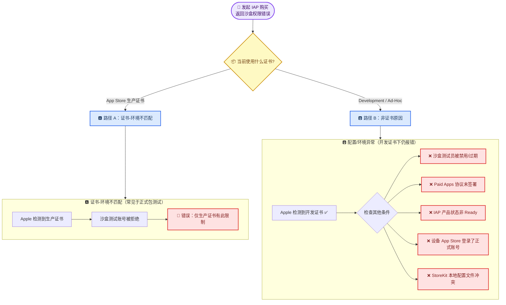
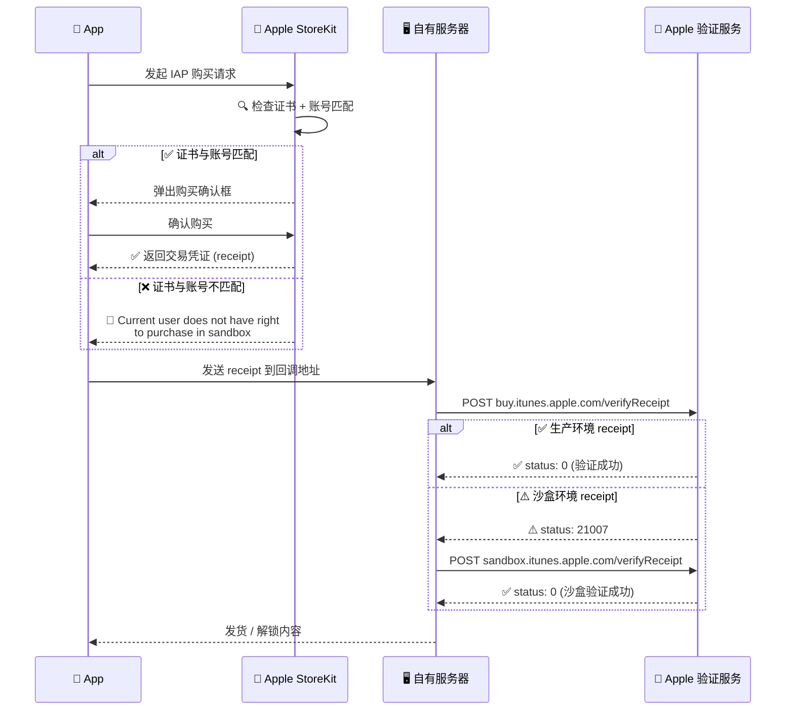
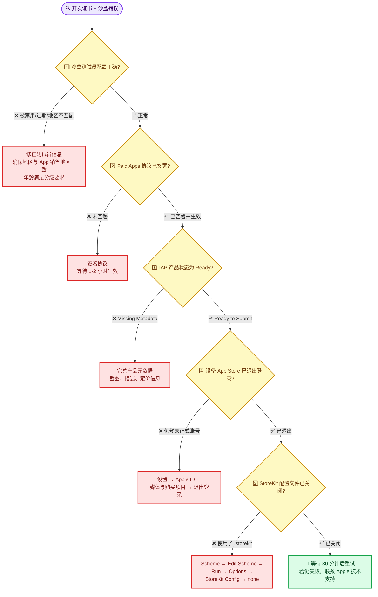
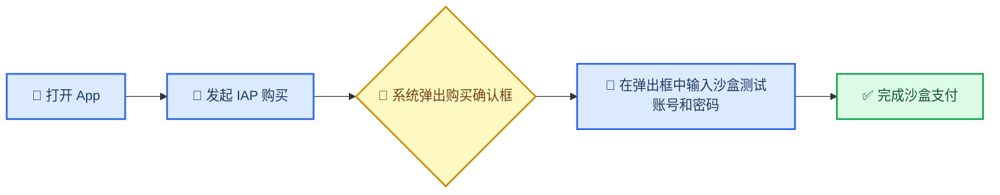
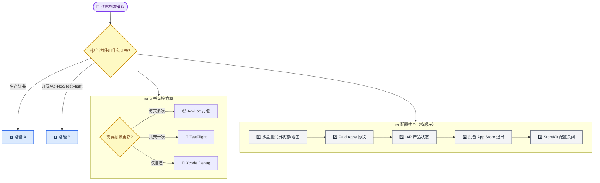

# Apple IAP 沙盒环境支付错误排查与修复指南

_适用场景：iOS 内购沙盒测试 · 难度：中等 · 最后验证：2026-07-17_

---

## 📋 概述

### 问题现象

在 App Store Connect 沙盒环境中测试应用内购买（IAP）时，支付流程返回以下错误：

> `Current user does not have right to purchase in the sandbox environment`

### 你会学到什么

- 理解此错误在不同证书类型下的两类根因路径
- 掌握开发证书下沙盒支付失败的专项排查方法
- 针对不同场景选择正确的测试方案

### 错误触发链路（双路径）

此错误有**两条互不重叠的触发路径**——排查时先确认属于哪一条，再沿对应路径深入：

> 📌 **核心结论**：
> - **路径 A**（生产证书）：Apple 安全策略不允许生产证书签名的包使用沙盒账号，需换证书或改用 TestFlight。
> - **路径 B**（开发证书）：证书本身没问题，错误来自测试环境配置缺失——沙盒测试员状态、协议签署、设备登录状态等。**开发遇到此错误优先排查路径 B。**

---

## 🔍 根因分析

先确认你处于哪条路径，再对号排查。

### 路径 A：证书-环境绑定（生产证书才触发）

Apple 为不同证书类型划定了不同的 IAP 测试边界：

| 证书类型 | 分发方式 | 允许的 IAP 环境 | 沙盒测试账号能否购买 |
| -------- | -------- | :-------------: | :------------------: |
| App Store 生产证书 | 正式包 / 企业分发 | 生产环境 | ❌ |
| Development 证书 | Xcode Debug | 沙盒环境 | ✅ |
| Ad-Hoc 证书 | OTA / 手动安装 | 沙盒环境 | ✅ |
| TestFlight | TestFlight 分发 | 沙盒环境 | ✅ |

**路径 A 的设计逻辑**：

1. **生产证书**签名的 App 被视为"已发布给终端用户的产品"
2. 终端用户使用**正式 Apple ID**，走生产环境 IAP
3. 沙盒环境仅用于**开发阶段**，因此只允许开发证书或 Ad-Hoc 证书签名的包接入
4. 生产证书签名的包 + 沙盒测试账号 → Apple 判定为"异常行为"并拒绝

> 💡 **排查提示**：如果你确认当前使用的是**开发证书或 Ad-Hoc 证书**，路径 A 与你的情况无关，跳到下方路径 B 继续排查。

### 路径 B：开发证书下的配置缺失（按概率从高到低）

如果你已经使用开发证书（或 Ad-Hoc / TestFlight），Apple 端已允许沙盒环境接入，但仍有其他环节阻断。以下原因按实际遇到频率排列：

#### B1. 沙盒测试员状态异常

| 排查点 | 检查位置 | 常见问题 |
| ------ | -------- | -------- |
| 账号状态 | App Store Connect → 用户和访问 → 沙箱测试员 | 状态为"活跃"？未过期？ |
| **地区/国家不匹配** | 测试员的地区 vs App 的销售地区 | **最高发**——测试员选了美国但 App 仅在中国大陆上架 |
| **年龄分级限制** | App 年龄分级 vs 测试员出生日期 | App 是 17+ 但测试员年龄不满 17 岁 |

> ⚠️ **地区不匹配是路径 B 中最高发的原因**。沙盒测试员的 Apple ID 国家/地区必须与 App 在 App Store Connect 中配置的销售地区重叠。

#### B2. Paid Applications 协议未签署

这是**最容易遗漏**的配置项：

- 位置：App Store Connect → 协议、税务和银行业务
- 检查：**Paid Applications** 协议是否显示为"已生效"（Active）
- 影响：未签署或未生效时，IAP 在任何环境（包括沙盒）都不可用
- 注意：签署后可能需要 **1-2 小时**才能在全球 Apple 服务器上生效

#### B3. IAP 产品元数据不完整

- 位置：App Store Connect → App → 内购项目
- 检查：每个 IAP 产品的状态是否为 **"Ready to Submit"** 或 **"已批准"**
- 常见问题：缺少截图、描述文本未填写、定价信息缺失
- 状态为 "Missing Metadata" 时沙盒支付也会失败

#### B4. 设备端 App Store 登录了正式 Apple ID

- 问题：设备「设置 → Apple ID → 媒体与购买项目」中登录了正式 Apple ID
- 现象：发起沙盒购买时，系统优先使用已登录的正式账号，导致账号类型与沙盒环境冲突
- 修正：退出 App Store 登录，**不要在此处重新登录任何账号**，直接在 App 内弹出的购买对话框中使用沙盒测试员登录

#### B5. StoreKit 本地配置文件冲突（Xcode 12+）

- 位置：Xcode → Scheme → Edit Scheme → Run → Options → StoreKit Configuration
- 问题：如果指定了一个本地 `.storekit` 配置文件，沙盒环境的交易会被本地 StoreKit 接管
- 修正：将 StoreKit Configuration 设为 **none**，恢复 Apple 远程沙盒服务器验证

#### B6. 新创建的沙盒测试员延迟生效

- 刚在 App Store Connect 创建的沙盒测试员，有时需要 **10–30 分钟**才能在所有 Apple 服务器上同步
- 如果创建后立刻测试，可能会遇到此错误
- 建议：创建测试员后等待 30 分钟再开始测试

### 完整的 IAP 验证流程

以下时序图展示了 App、Apple 服务端和你自己服务端的交互全貌，帮助确认回调地址一致不是问题所在：

> 💡 **关键信息**：回调地址生产/沙盒一致 + 先调生产验证再 fallback 沙盒验证，这是 Apple 官方推荐的正确做法。本错误发生在 **StoreKit 层**（证书-账号匹配阶段），还没走到服务端验证步骤。

---

## 🔧 开发证书下的排查流程（路径 B）

如果你确认使用的是开发证书或 Ad-Hoc 证书，按以下流程图依次排查。每一步都列了**验证方法**和**修复操作**，确认无误后再进入下一步。

### B1：检查沙盒测试员状态

登录 [App Store Connect](https://appstoreconnect.apple.com) → 用户和访问 → 沙箱测试员。

| 检查项 | 确认方法 | 正确状态 |
| ------ | -------- | -------- |
| 账号状态 | 查看测试员列表中的状态标签 | **活跃**（Active） |
| 过期时间 | 查看创建日期和有效期 | 未超过创建后 1 年 |
| **地区/国家** | 对比 App 的销售地区和测试员的 Apple ID 国家 | **必须一致或有重叠** |
| 年龄分级 | 对比 App 的年龄分级和测试员的出生日期 | 测试员年龄 ≥ App 分级要求 |

> ⚠️ **地区不匹配**是本路径最高发的原因，优先确认此项。

### B2：确认 Paid Applications 协议

1. 进入 App Store Connect → **协议、税务和银行业务**（Agreements, Tax and Banking）
2. 找到 **Paid Applications** 协议
3. 确认状态为 **"Active"**（已生效），而非 "Pending" 或 "Expired"
4. 如未签署，点击进入完成签署流程（需要团队代理权限）
5. 签署后通常需要 **1–2 小时**在全球服务器生效

> ⚠️ **注意**：即使只是测试沙盒支付、App 本身是免费的，此协议也必须签署。因为 IAP 属于付费功能，依赖 Paid Applications 协议。

### B3：验证 IAP 产品状态

1. 进入 App Store Connect → 你的 App → **内购项目**（In-App Purchases）
2. 逐一检查每个产品：
   - 状态是否为 **"Ready to Submit"** 或 **"已批准"**
   - 参考名称、产品 ID、定价是否配置完整
   - 是否有至少一个显示名称、一段描述
   - 审核截图是否已上传（即使是沙盒测试，建议也上传占位图）

### B4：清理设备 App Store 登录状态

这是**最容易操作**的一项，建议优先排除：

1. 打开 iOS 设备 → **设置**
2. 点击顶部的 **Apple ID**
3. 选择 **媒体与购买项目**
4. 点击 **退出登录**
5. **不要在此处重新登录**任何账号
6. 重新打开 App，发起购买
7. 系统会**自动弹出登录对话框**
8. 在弹出的对话框中输入沙盒测试员的 Apple ID 和密码

### B5：关闭 StoreKit 本地配置

1. 在 Xcode 中打开项目
2. 顶部菜单 → Product → Scheme → **Edit Scheme**（或 `Cmd + Shift + ,`）
3. 左侧选择 **Run**
4. 切换到 **Options** 标签页
5. 找到 **StoreKit Configuration**
6. 将其设置为 **none**（清空选择）
7. 重新 Build & Run

### B6：等待沙盒测试员生效

- 如果是**新创建的**沙盒测试员，等待 **30 分钟**后再测试
- 如果是**修改了**已有测试员的信息（如地区），重新保存后等待 **10–15 分钟**

---

## 🔧 证书切换方案（路径 A）

> 以下三个方案仅适用于**路径 A**（生产证书导致的错误）。如果你已确认是路径 B 中的某个配置问题，修复对应配置后即可测试，无需切换证书。

### 方案一：TestFlight 分发测试（推荐）

**适用场景**：最接近生产环境，需要测试完整的审核和分发流程。

**操作步骤：**

1. **上传 App 到 App Store Connect**
   - 使用 Xcode → Product → Archive
   - 选择 App Store Connect → Distribute App
   - 上传构建版本

2. **配置 TestFlight 测试**
   - 登录 [App Store Connect](https://appstoreconnect.apple.com)
   - 进入 App → TestFlight
   - 选择构建版本，添加测试员（内部测试员或外部测试员）

3. **测试设备安装**
   - 测试员通过 TestFlight 邀请链接安装 App
   - 设备上会安装一个**由 Apple 重新签名的版本**，支持沙盒 IAP

4. **执行 IAP 测试**
   - 打开 TestFlight 安装的 App
   - 发起购买时在弹出的系统对话框中输入沙盒测试账号

**优点：**

- 包体和签名最接近生产环境
- 不需要更换证书配置
- Apple 自动处理沙盒兼容性

**缺点：**

- 每次更新需要重新上传构建（通常需要 15-60 分钟处理时间）
- 迭代速度较慢

---

### 方案二：Ad-Hoc 证书打包测试

**适用场景**：需要频繁迭代测试，希望绕过 App Store Connect 上传等待。

**操作步骤：**

1. **创建 Ad-Hoc Provisioning Profile**
   - 登录 [Apple Developer](https://developer.apple.com/account/)
   - 进入 Certificates, Identifiers & Profiles
   - 创建新的 Provisioning Profile，类型选择 **Ad Hoc**
   - 关联 App ID 和测试设备 UDID

2. **配置 Xcode 签名**
   - Xcode → Signing & Capabilities
   - 勾选 Release 配置
   - Provisioning Profile 选择上一步创建的 Ad-Hoc profile

3. **导出 Ad-Hoc 包**
   - Xcode → Product → Archive
   - Distribute App → Ad Hoc
   - 导出 `.ipa` 文件

4. **分发到测试设备**
   - 通过 OTA 链接、Apple Configurator 2、或第三方分发平台安装
   - 确保测试设备 UDID 已注册在 Provisioning Profile 中

5. **执行 IAP 测试**
   - 安装 Ad-Hoc 包后发起购买
   - 使用沙盒测试账号完成支付

**优点：**

- 不需要上传 App Store Connect，迭代快
- 适合开发阶段的密集测试

**缺点：**

- 需要维护测试设备 UDID 列表（每年最多 100 台 iPhone）
- Provisioning Profile 每年需续期

---

### 方案三：Debug 直连 Xcode 测试

**适用场景**：开发阶段快速验证，单台设备测试。

**操作步骤：**

1. **使用 Debug 配置**
   - Xcode → Scheme → Edit Scheme
   - Run → Build Configuration 选择 **Debug**
   - Debug 配置默认使用 Development 证书签名

2. **连接真机运行**
   - USB 或 Wi-Fi 连接 iOS 设备
   - Xcode → 选择目标设备 → Run (`Cmd + R`)

3. **执行 IAP 测试**
   - 直接在设备上测试购买流程
   - 使用沙盒测试账号登录

**优点：**

- 最方便，零配置
- 即时编译运行

**缺点：**

- 必须连接 Mac，不适合分发给团队成员
- Debug 构建性能与 Release 不同，无法完全模拟生产环境

---

## 📱 沙盒测试账号的正确使用方式

无论选择哪个方案，设备端使用沙盒测试账号的正确姿势如下：

**关键要点：**

- **不要**在「设置 → App Store」中预先登录沙盒账号
- **不要**在「设置 → iCloud」中登录沙盒账号
- 发起购买时，系统会**自动弹出登录对话框**，在这里输入沙盒测试账号即可
- 如果已登录正式 Apple ID，系统会提示切换账号

> ⚠️ **注意**：如果之前在设备上用正式 Apple ID 购买了同一个 App 的真实 IAP，可能需要先在「设置 → App Store → 沙盒账号」中管理登录状态。

---

## ✅ 验证清单

### 路径 A 检查项（证书相关）

| 检查项 | 验证方法 | 预期结果 |
| ------ | -------- | -------- |
| 证书类型正确 | Xcode Signing 配置 或 `.ipa` 签名检查 | Ad-Hoc / Development / TestFlight |

### 路径 B 检查项（配置相关，开发证书下优先逐项确认）

| 检查项 | 验证方法 | 预期结果 |
| ------ | -------- | -------- |
| 沙盒测试员状态 | App Store Connect → 用户和访问 → 沙箱测试员 | 状态为"活跃"，未过期 |
| 测试员地区匹配 | 对比测试员 Apple ID 国家 vs App 销售地区 | 两者一致或有重叠 |
| 年龄分级合规 | 对比 App 分级 vs 测试员出生日期 | 年龄 ≥ 分级要求 |
| Paid Apps 协议 | App Store Connect → 协议、税务和银行业务 | Paid Applications 协议为"Active" |
| IAP 产品状态 | App Store Connect → App → 内购项目 | 每个产品为 "Ready to Submit" |
| 设备 App Store 已退出 | 设置 → Apple ID → 媒体与购买项目 | 未登录任何正式 Apple ID |
| StoreKit 配置关闭 | Xcode → Scheme → Run → Options | StoreKit Configuration 为 none |
| 沙盒测试员已生效 | 创建后等待时间 | ≥ 30 分钟（新创建） |

### 通用检查项

| 检查项 | 验证方法 | 预期结果 |
| ------ | -------- | -------- |
| 购买时弹出登录框 | 打开 App → 发起购买 | 弹出系统登录对话框 |
| 沙盒支付成功 | 在弹出框中输入沙盒测试账号 | 支付成功，内容解锁 |
| 服务端验证通过 | 查看服务端日志 | receipt 验证成功（status: 0） |

---

## 🔧 常见问题排查

### "我在设置中登录了沙盒账号，还是报错"

**原因**：沙盒账号不需要也不能在「设置」中预登录。正确方式是让 App 内购买流程触发系统弹出登录框。

**修复**：

1. 设置 → Apple ID → 媒体与购买项目 → 退出登录
2. 重新打开 App，发起购买，在弹出的对话框中输入沙盒账号

---

### "确认是开发证书，仍然报沙盒权限错误"

**原因**：问题不在证书层面，而在 App Store Connect 的配置或设备登录状态。参见上方**路径 B 排查流程**。

**最常见的三个原因**：

1. 沙盒测试员的**地区**与 App 销售地区不匹配（最高发）
2. **Paid Applications 协议**未签署
3. 设备 App Store 仍登录着正式 Apple ID

---

### "沙盒测试员地区改了之后还是不行"

**原因**：修改测试员信息后需要等待 Apple 服务器同步。

**修复**：修改后等待 10–15 分钟再尝试；新创建的测试员等待 30 分钟。

---

### "所有路径 B 检查项都通过了，还是报错"

**建议操作**（按顺序尝试）：

1. 完全卸载 App → 重启设备 → 重新安装 → 再次测试
2. 在 App Store Connect 中**创建一个全新的沙盒测试员**（不同的 Apple ID 邮件），等待 30 分钟后再试
3. 换一台测试设备验证，排除设备端缓存问题
4. 联系 [Apple 开发者技术支持](https://developer.apple.com/contact/)，提供错误截图和沙盒测试员 Apple ID

---

### "换了 Ad-Hoc 证书后仍然报错"

**原因**：可能是设备上已缓存的 receipt 或 Keychain 残留了之前生产包的信息。

**修复**：

1. 完全卸载 App
2. 重启设备
3. 重新安装 Ad-Hoc 包
4. 再次发起购买

---

### "TestFlight 版本中沙盒支付正常，但正式上线后扣款失败"

**原因**：TestFlight 自动走沙盒环境；正式上线后走生产环境，需要确保服务端验证逻辑正确。

**修复**：确认服务端实现了"先调生产验证 → 收到 21007 → fallback 沙盒验证"的逻辑。正式上线后不再需要沙盒测试账号。

---

### "回调地址生产/沙盒一致，需要分开配置吗"

**不需要。** Apple 的 NOTIFICATION 回调格式在生产环境和沙盒环境完全一致。服务端收款后通过 receipt 的验证返回码（21007）自动判断环境并切换验证 URL，这是 Apple 官方推荐的标准做法。

---

## 📊 总览

### 排查路线速查

### 路径 A 方案对比（生产证书切换）

| 维度 | TestFlight | Ad-Hoc | Debug 直连 |
| ---- | :--------: | :----: | :--------: |
| 最接近生产 | ✅ 最佳 | ⚠️ 较接近 | ❌ 不接近 |
| 迭代速度 | ❌ 慢（需上传） | ✅ 快 | ✅ 最快 |
| 多人分发 | ✅ 简单 | ⚠️ 需注册 UDID | ❌ 需连 Mac |
| 配置复杂度 | ⚠️ 中等 | ⚠️ 中等 | ✅ 无 |

### 路径 B 排查优先级（配置修复）

| 优先级 | 排查项 | 影响范围 | 常见度 |
| :----: | ------ | -------- | :----: |
| 1 | 沙盒测试员地区与 App 销售地区一致 | 单个测试员 | ⭐⭐⭐⭐⭐ |
| 2 | Paid Applications 协议已签署 | 所有 IAP | ⭐⭐⭐⭐ |
| 3 | IAP 产品状态为 Ready to Submit | 单个产品 | ⭐⭐⭐ |
| 4 | 设备 App Store 已退出正式账号 | 单台设备 | ⭐⭐⭐⭐ |
| 5 | StoreKit 配置文件已关闭 | 本地开发 | ⭐⭐ |
| 6 | 沙盒测试员创建后等待 30 分钟 | 新测试员 | ⭐⭐⭐ |

---

## 🔗 参考资源

- [Apple Developer — Testing in-app purchases with sandbox](https://developer.apple.com/documentation/storekit/in-app_purchase/testing_in-app_purchase_with_sandbox)
- [Apple Developer — Validating receipts with the App Store](https://developer.apple.com/documentation/storekit/in-app_purchase/validating_receipts_with_the_app_store)
- [App Store Connect — 沙箱测试员管理](https://appstoreconnect.apple.com/access/users)

---

_最后验证：2026-07-17 · 基于 iOS 17+ / App Store Connect_
