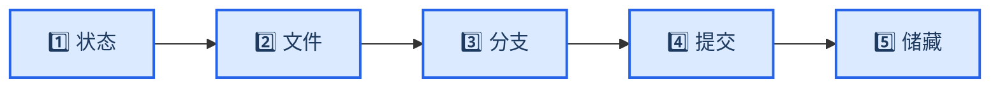
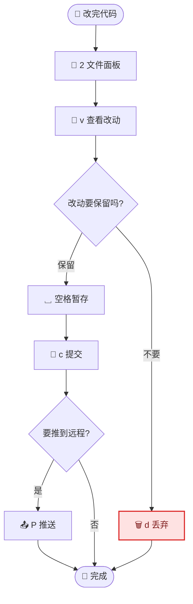

# lazygit 操作手册

_面向新手的 lazygit 查询文档：查操作、查注意事项，照着做就行 · 难度：入门 · 最后验证：2026-08-06（版本 0.64.0）_

---

## 📋 概述

### 这是什么

**lazygit** 是一个跑在终端里的 Git 图形化工具。不用记 `git add` / `git commit` / `git push` 这些命令，用键盘方向键 + 几个字母键就能完成所有 Git 操作，还能可视化看到分支和提交历史。

适合人群：想摆脱命令行 Git 命令、又不想装大型 GUI（如 Sourcetree、Fork）的开发者。

### 核心概念：一句话版

> **工作区**（你改的文件）→ **暂存区**（准备提交的文件）→ **仓库**（已提交的历史）→ **远程**（GitHub/GitLab）

lazygit 把这几层变成五个面板，方向键切换。

### 界面布局



| 数字键 | 面板 | 用途 |
| ------ | ---- | ---- |
| `1` | 状态 | 本地/远程领先落后、stash 数、当前分支 |
| `2` | **文件** | 查看和暂存改动（**最常用**） |
| `3` | 分支 | 新建/切换/合并/推送分支 |
| `4` | 提交 | 提交历史，查看/修改/重置提交 |
| `5` | 储藏 | 临时保存不想提交的改动 |

---

## 📋 准备工作

### 安装与启动

| 操作 | 命令 |
| ---- | ---- |
| 安装 | `brew install lazygit` |
| 在某个项目里启动 | 进入项目目录，执行 `lazygit` |
| 退出 | `q` |
| 查看帮助（全快捷键表） | `?` |

**启动前确认：**

```bash
lazygit --version      # 应显示 0.64.0 或更高
git config user.name   # 必须已配置，否则提交会失败
git config user.email
```

### 汉化（可选）

编辑 `~/.config/lazygit/config.yml`：

```yaml
gui:
  language: zh-CN
```

重启 lazygit 生效。

> 💡 **Tip**：汉化后快捷键不变，界面上按键帮助也是中文，新手友好。

---

## 🎯 界面认识

### 选文件面板的三种方法

1. 按 `2` 数字键直达
2. 按 `→` 方向键右移
3. 按 `Tab` 循环切换

### 面板内选中目标

| 键 | 操作 |
| ------ | ---------- |
| `j` / `k` | 下移 / 上移（等于 `↓` / `↑`） |
| `[` / `]` | 上一个 / 下一个提交（提交面板） |
| `/` | 搜索 |
| `x` | 打开该对象的更多操作菜单 |

---

## 📚 核心操作

> 以下按键均为**汉化后**的 lazygit 标准键位，在对应面板内按。记不住就按 `?`，界面里会显示当前面板的全部按键。

### 文件面板（改完代码后第一步）

| 键 | 操作 | 新手提醒 |
| ---- | ---- | -------- |
| `␣` 空格 | 暂存 / 取消暂存 | 暂存 = 告诉 Git「这个改动我要提交」 |
| `a` | 全部暂存 | 懒人键，一次全选 |
| `c` | **提交** | 会打开编辑器写提交信息 |
| `d` | 丢弃更改 | ⚠️ **危险**，不可恢复，见注意事项 |
| `v` | 查看该文件的改动详情 | 提交前必看，确认没改错东西 |
| `回车` | 展开/收起文件内的具体行改动 | 比 `v` 更细粒度 |
| `e` | 用编辑器打开文件 | 快速回到代码 |
| `r` | 刷新 | 外部改了文件后按这个 |
| `z` | 撤销上一次操作 | 🆘 **救命键**，误操作先按它 |

**新手标准提交流程：**

1. 改完代码 → 按 `2` 进文件面板
2. 按 `v` 逐个看改动，确认无误
3. 按 `␣` 空格暂存（或 `a` 全选）
4. 按 `c` 提交 → 写提交信息 → 保存退出编辑器
5. 完成，提交进了历史

### 分支面板

| 键 | 操作 | 新手提醒 |
| ---- | ---- | -------- |
| `␣` 空格 | 检出（切换到该分支） | 切换前确保改动已提交或暂存 |
| `n` | 新建分支 | 新功能/新任务先开新分支，别在 main 上直接改 |
| `d` | 删除分支 | 已合并的分支才能安全删除 |
| `M` | 合并 | 把选中的分支合进当前分支 |
| `P` | 推送（push） | 上传到远程，见注意事项 |
| `p` | 拉取（pull） | 同步远程最新代码 |

### 提交面板

| 键 | 操作 | 新手提醒 |
| ---- | ---- | -------- |
| `回车` | 查看该提交的改动 | 不放心别人提交了什么，回车看 |
| `g` | 重置（reset） | ⚠️ 有 soft/mixed/hard，hard 会丢提交 |
| `s` | 压扁（squash） | 把多个提交合并成一个 |
| `f` | 修复（fixup） | 给上一个提交打补丁 |
| `d` | 删除该提交 | ⚠️ 危险，会改写历史 |
| `c` | 复制（cherry-pick） | 把别的分支的提交搬过来 |
| `[` / `]` | 上一个 / 下一个提交 | 快速翻历史 |

### 储藏面板

| 键 | 操作 | 用途 |
| ---- | ---- | ---- |
| `␣` 空格 | 应用储藏 | 临时存放的改动拿回来 |
| `g` | 恢复并删除 | 拿回来且清掉储藏记录 |
| `d` | 删除储藏 | 不要了的储藏 |

### 状态面板

| 操作 | 说明 |
| ---- | ---- |
| `回车` | 查看当前分支与远程的 diff |

---

## 📍 新手工作流

### 完整流程：改代码 → 推送到远程



### 分支与合并长什么样（概念图）

日常单人项目，先在 main 上开发、提交，需要实验时开分支：


> 💡 **Tip**：单人项目最简单用法 = 不开分支，直接在文件面板 暂存 → 提交 → 推送。分支留到「要同时做两件事」或「要发给别人」时再用。

---

## ⚠️ 注意事项

新手最容易踩的坑，按危险程度排序：

| 级别 | 操作 | 后果 | 对策 |
| ---- | ---- | ---- | ---- |
| 🔴 | `d` 丢弃更改 | 改动**永久消失**，无法找回 | 丢弃前先 `v` 确认内容；误丢立刻按 `z` 撤销 |
| 🔴 | `g` 重置选 hard | 提交历史**被删除** | 只有明确想删历史才用；先 `z` 可撤销，但不要依赖 |
| 🟠 | `P` 推送 | 代码**上传到远程**，别人能看到 | 推送前确认当前分支和提交内容 |
| 🟠 | 在 main 上直接提交 | 主干历史变乱 | 养成习惯：新任务先 `n` 开分支 |
| 🟡 | 写提交信息时卡在编辑器 | lazygit 默认打开 vim，新手可能不知道怎么保存退出 | 输入内容后按 `Esc` → `:wq` 回车（详见 [Vim 操作手册](./vim.md)）；或配置系统默认编辑器为 VS Code |
| 🟡 | 鼠标滚轮不动 | lazygit 是键盘工具，默认不支持鼠标滚动 | 用 `j`/`k` 或 `↑`/`↓` 移动 |
| 🟡 | 合并冲突 | 合并时提示冲突，文件面板显示红色 | 逐个 `e` 打开文件手动解决，解决后回 lazygit `␣` 暂存，再继续合并 |

**三条保命规则：**

1. **任何危险操作前先按 `v` 看内容**——确认要删/要推的确实是它
2. **误操作立刻按 `z` 撤销**——lazygit 有操作撤销，但窗口关了就没救了
3. **拿不准就按 `?`**——每个面板的帮助都在界面上，不用背

---

## 🔧 故障排查

### 启动 lazygit 时黑屏或布局乱

**原因**：终端窗口太小，lazygit 需要一定宽度

**Fix**：拉大终端窗口，或全屏后重新运行 `lazygit`

### 提交时提示 git 用户信息未配置

**原因**：还没设置 `user.name` / `user.email`

**Fix**：

```bash
git config --global user.name "你的名字"
git config --global user.email "你的邮箱"
```

### 界面还是英文

**原因**：配置未生效或路径不对

**Fix**：确认 `~/.config/lazygit/config.yml` 内容为：

```yaml
gui:
  language: zh-CN
```

保存后**完全退出** lazygit（按 `q`）再重新启动。

### 误删了重要改动

**Fix**：如果刚误删且没退出 lazygit，按 `z` 撤销；如果已退出，尝试：

```bash
git reflog   # 查看操作历史
```

找到丢失前的提交，`git reset --soft <commit>` 恢复。平时养成先 `v` 再 `d` 的习惯。

### 仍然卡住？

- 按 `x` 打开菜单，看有没有对应操作
- 按 `?` 对照帮助键位
- 到 [lazygit 官方仓库的 Issue 区](https://github.com/jesseduffield/lazygit/issues)搜问题

---

## 📋 快速参考卡

| 场景 | 按键 |
| ---- | ---- |
| 启动 | 项目目录里 `lazygit` |
| 全部帮助 | `?` |
| 切面板 | `1`~`5` 或 `Tab` |
| 暂存 / 取消暂存 | `␣` 空格 |
| 全部暂存 | `a` |
| 提交 | `c` |
| 查看改动 | `v` |
| 丢弃改动（危险） | `d` |
| 撤销上一步（救命） | `z` |
| 新建分支 | `n` |
| 切换分支 | `␣` 空格 |
| 合并分支 | `M` |
| 推送 / 拉取 | `P` / `p` |
| 编辑文件 | `e` |
| 刷新 | `r` |
| 移动选中 | `j` / `k` 或 `↑` / `↓` |
| 退出 | `q` |

---

## 🔗 参考链接

- [lazygit 官方仓库](https://github.com/jesseduffield/lazygit) —— 下载、Issue、文档
- [完整键位表（官方）](https://github.com/jesseduffield/lazygit/blob/master/docs/keybindings/Keybindings_en.md) —— 每个面板的每个键位，查漏补缺
- [官方中文翻译文件](https://github.com/jesseduffield/lazygit/blob/master/pkg/i18n/english.go) —— 术语对照，好奇汉化词条的看这里
- [Vim 操作手册](./vim.md) —— 提交信息卡在编辑器时的解法

---

_最后验证：2026-08-06 · 基于 lazygit 0.64.0，汉化已开启_
