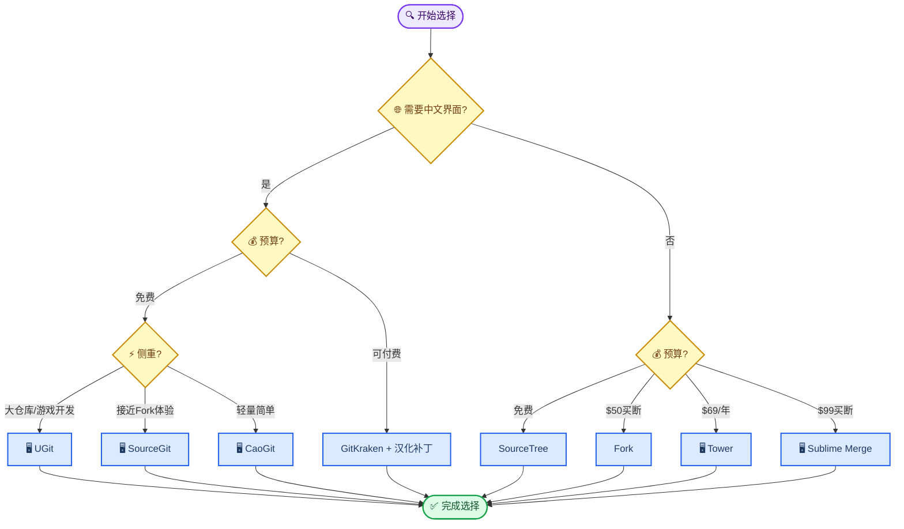
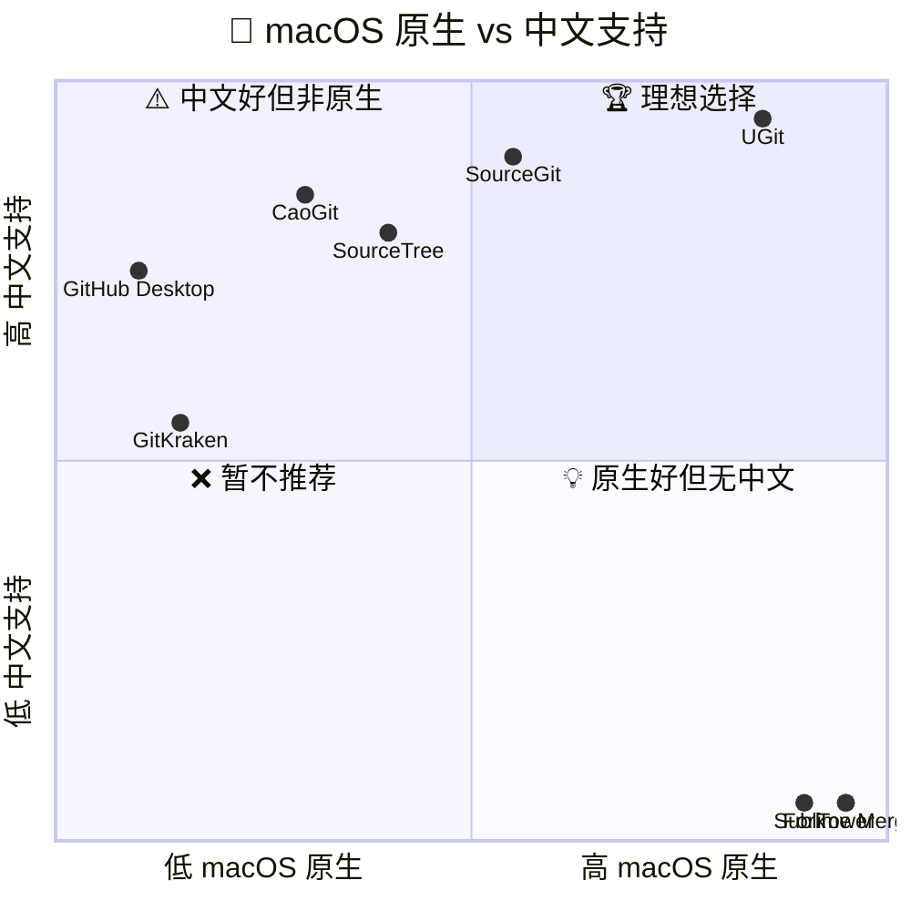
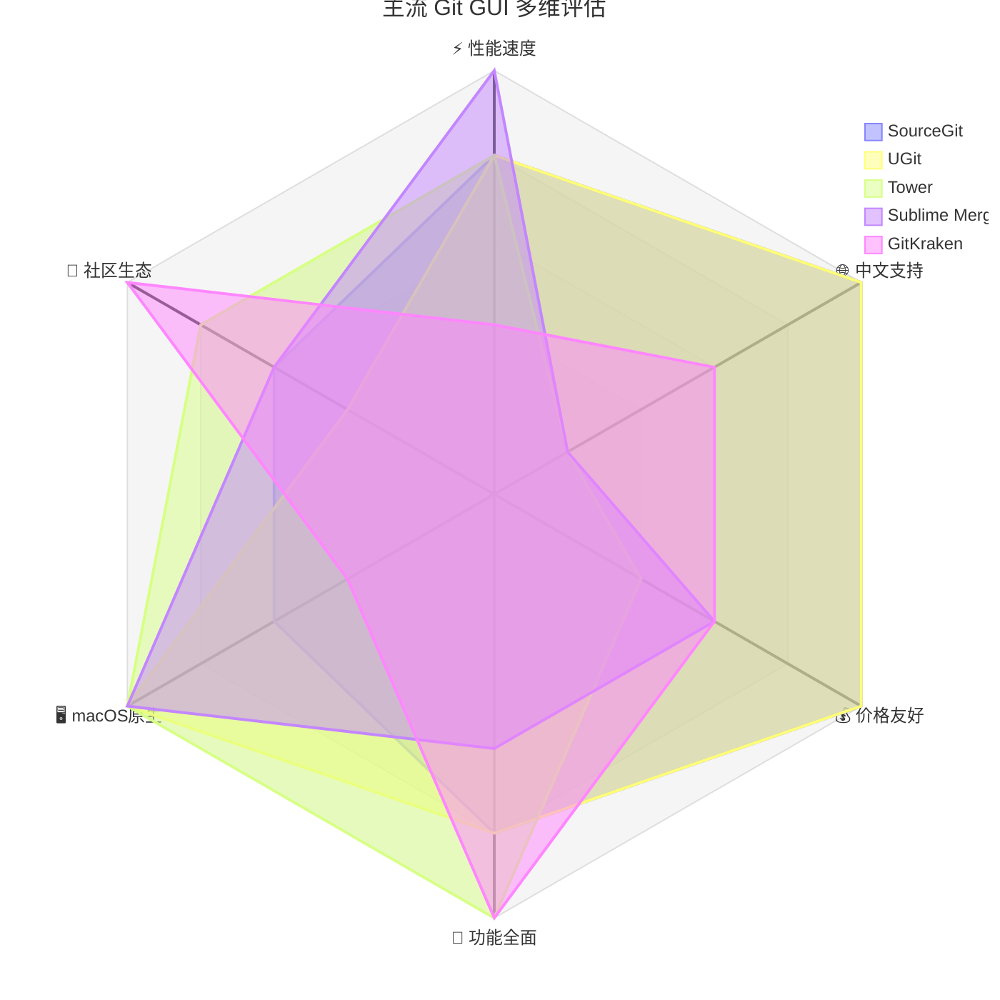

# macOS Git 可视化工具调研报告

_2025–2026 年主流 macOS Git GUI 客户端横评 · 面向中文开发者 · 最后验证：2026-07-21_

---

## 📋 摘要

本报告对 2025–2026 年 macOS 平台上 8 款主流 Git 可视化客户端进行系统性调研，重点关注 **macOS 原生体验**、**中文（汉化）支持** 和 **功能完整度** 三个维度。调研通过社区口碑聚合、官方文档交叉验证和功能矩阵对比的方式进行。核心结论：**SourceGit** 是与 Fork 最相似且原生支持中文的免费替代品；**UGit** 在中文体验和大文件场景有独特优势；**Tower** 和 **Sublime Merge** 在英文工具中分别代表了体验天花板和性能天花板。

**关键词：** Git GUI、macOS、中文汉化、Fork、SourceGit、UGit、Tower、Sublime Merge

---

## 📋 调研概览

### 问题背景

[Fork](https://git-fork.com/) 是 macOS 上口碑极佳的 Git GUI 客户端，以原生性能、简洁界面和流畅交互著称。但它有两个短板：**无中文支持**（仅有英文界面）和 **已转为收费模式**（约 $50 买断）。对于偏好中文界面或寻求免费替代方案的 macOS 开发者，需要系统性地评估市面上可用的替代工具。

### 调研范围

- **平台限定：** macOS（含 Apple Silicon 原生适配）
- **核心条件：** 具备中文界面（原生或补丁）、可视化 Git 操作
- **评估维度：** 中文支持质量、macOS 原生程度、性能表现、功能完整度、价格模式、社区生态

### 入选工具

| 工具 | 入选理由 |
|------|----------|
| **SourceGit** | Fork 最直接的开源替代品，原生中文 |
| **UGit** | 腾讯自研，Mac 原生适配，中文生态最完善 |
| **Tower** | macOS 原生体验天花板 |
| **Sublime Merge** | 性能最强的 Git GUI |
| **GitKraken** | 界面最精美，有社区汉化补丁 |
| **SourceTree** | 老牌免费工具，原生中文 |
| **CaoGit** | 2025 年新锐开源力量 |
| **GitHub Desktop 汉化版** | GitHub 重度用户首选 |

### 选型决策流程

---

## 📊 工具总览对比

### 核心指标一览

| 工具 | 中文支持 | 价格 | macOS 原生 | 架构 | 大仓库性能 | 推荐度 |
|------|:--:|------|:--:|------|:--:|:--:|
| **SourceGit** | ✅ 原生内置 | 免费开源 | ⚠️ .NET/Avalonia | C# | ⭐⭐⭐⭐ | ⭐⭐⭐⭐⭐ |
| **UGit** | ✅ 原生中文 | 免费 | ✅ 原生适配 M 芯片 | 自研 | ⭐⭐⭐⭐⭐ | ⭐⭐⭐⭐⭐ |
| **Tower** | ❌ 仅英文 | $69/年 | ✅ 纯原生 Cocoa | 原生 | ⭐⭐⭐⭐ | ⭐⭐⭐⭐ |
| **Sublime Merge** | ❌ 仅英文 | $99 买断 | ✅ 自研 C++ 引擎 | C++ | ⭐⭐⭐⭐⭐ | ⭐⭐⭐⭐ |
| **GitKraken** | ⚠️ 社区补丁 | 免费/订阅 | ❌ Electron | Electron | ⭐⭐ | ⭐⭐⭐ |
| **SourceTree** | ✅ 原生中文 | 免费 | ⚠️ 部分原生 | 混合 | ⭐⭐ | ⭐⭐⭐ |
| **CaoGit** | ✅ 原生切换 | 免费开源 | ⚠️ Tauri | Tauri | ⭐⭐⭐ | ⭐⭐⭐ |
| **GitHub Desktop 汉化版** | ✅ 深度汉化 | 免费 | ❌ Electron | Electron | ⭐⭐ | ⭐⭐⭐ |

### 双轴定位：macOS 原生 × 中文支持

_将 8 款工具按 macOS 原生程度（横轴）和中文支持质量（纵轴）进行二维定位。右上角（高原生 + 高中文）为理想区域：_

> 📌 **解读：** UGit 是目前唯一接近「高原生 + 高中文」理想区域的工具。SourceGit 紧随其后。Tower 和 Sublime Merge 在原生体验上无可挑剔但缺少中文。右侧英文工具若未来增加中文支持，将具备最强竞争力。

---

## 🔍 逐款详细分析

### SourceGit —— Fork 最佳平替

| 维度 | 说明 |
|------|------|
| **官网/仓库** | [github.com/sourcegit-scm/sourcegit](https://github.com/sourcegit-scm/sourcegit) |
| **中文** | ✅ 内置 16 种语言，原生简体中文 |
| **价格** | 完全免费，MIT 开源 |
| **安装** | `brew install --cask sourcegit` |

**优点：**

- 界面和交互逻辑与 Fork 高度相似，迁移成本极低
- 完全免费开源，社区活跃，迭代频率高
- 跨平台（macOS/Windows/Linux）
- 内置 GitFlow、Git LFS、交互式 rebase、AI 提交消息生成
- 支持深浅主题切换

**缺点：**

- 基于 .NET/Avalonia 而非纯 macOS 原生组件，部分交互细节（如动画、快捷键）不如 Fork 细腻
- 缺少 Fork 的 Lean Branching 等高级特性
- 相对年轻的项目（2023 年启动），生态和文档不如老牌工具完善

> 💡 **适合：** 想要 Fork 体验 + 中文界面 + 免费的用户，这是首选。

---

### UGit —— 腾讯出品，国产首选

| 维度 | 说明 |
|------|------|
| **官网** | [ugit.qq.com](https://ugit.qq.com/zh/index.html) |
| **中文** | ✅ 原生中文，本地化最彻底 |
| **价格** | 完全免费 |

**优点：**

- 原生中文体验最佳，界面、提示、文档均为中文，无任何语言障碍
- 对 Apple Silicon (M1/M2/M3/M4) 原生适配，非 Rosetta 转译
- **大文件管理（Git LFS）** 独有优化：超大文件（>4GB）无损下载，LFS 缓存清理
- **子目录检出**：大型仓库只需克隆所需子目录，显著节省时间和磁盘空间
- 快速提交算法：文件未被他人改动时可跳过更新直接提交
- **Excel Diff & Merge**：支持单元格内容与公式差异对比（策划/程序协作利器）
- 深度对接腾讯工蜂生态（MR/CR/Issue），一站式协作

**缺点：**

- 深度绑定工蜂生态，使用 GitHub/GitLab 时部分集成功能（内置 MR/CR 管理）无法发挥最大价值
- 无 Linux 版本
- 国际化社区生态不如 GitKraken/Fork 成熟
- 腾讯出品，对数据隐私敏感的用户可能有顾虑

> 💡 **适合：** macOS 中文开发者、游戏开发者（大文件场景）、工蜂用户、Git 新手。

---

### Tower —— macOS 最精致的 Git 客户端

| 维度 | 说明 |
|------|------|
| **官网** | [git-tower.com](https://www.git-tower.com/) |
| **中文** | ❌ 无中文，仅英文界面 |
| **价格** | $69/年 订阅制（30 天免费试用） |

**优点：**

- macOS 原生体验无可匹敌：完整遵循 Apple HIG 规范，支持 Touch Bar、Quick Look、Spotlight 集成
- Apple Silicon 原生性能比 Electron 类竞品快 3 倍以上
- **三路合并视图** + 行级冲突解决，合并冲突处理公认最佳
- **全面撤销系统**：几乎所有 Git 操作可撤销，支持 Reflog 拖拽恢复
- 拖拽式交互变基（Interactive Rebase），被评为「absolutely fabulous」
- 内置 GitHub/GitLab/Bitbucket/Azure DevOps PR 管理
- 1000+ 提交的大仓库依然流畅

**缺点：**

- **无中文**，这是中文开发者的最大硬伤
- $69/年订阅制，价格最高，且无买断选项
- 无 Linux 版本
- 无可扩展插件系统

> 💡 **适合：** 不介意英文、追求极致 macOS 原生体验、愿意为效率付费的专业开发者。

---

### Sublime Merge —— 性能之王

| 维度 | 说明 |
|------|------|
| **官网** | [sublimemerge.com](https://www.sublimemerge.com/) |
| **中文** | ❌ 无中文，仅英文 |
| **价格** | $99 买断（含 3 年更新），可无限期免费评估 |

**优点：**

- **性能最强**：自研 C++ Git 解析库直接读取 `.git` 原始数据，数十万提交的超大仓库（如 Linux 内核级）秒开
- 内存占用极低（50–150MB），远优于 Electron 类工具
- 行级/块级精细暂存（Line-by-line staging），精确控制每次提交
- 内建三向合并工具 + 40+ 语言语法高亮
- 与 Sublime Text 无缝集成，共享主题和快捷键
- 键盘驱动工作流，Command Palette 效率极高
- 闪电搜索：边输入边搜索，支持按作者、提交消息、文件内容

**缺点：**

- **无中文**
- $99 买断对个人开发者偏贵（但无限期免费评估可用）
- 功能集精简：无 PR 管理、无项目管理系统集成
- 面向个人开发者，缺少团队协作功能
- 对 Git 新手学习曲线较陡

> 💡 **适合：** Sublime Text 重度用户、处理超大仓库的开发者、偏好键盘驱动和极致性能的效率控。

---

### GitKraken + 社区汉化补丁

| 维度 | 说明 |
|------|------|
| **官网** | [gitkraken.com](https://www.gitkraken.com/) |
| **汉化补丁** | [github.com/YuanXiQWQ/gitkraken-chinese](https://github.com/YuanXiQWQ/gitkraken-chinese) |
| **价格** | 免费版功能受限，Pro $4.95/月 |

**优点：**

- 界面精美，视觉效果在同类工具中名列前茅
- 内置 GitHub/GitLab/Bitbucket PR 管理
- 交互式变基、冲突解决等核心功能完善
- 跨平台（macOS/Windows/Linux）
- 有活跃的汉化社区持续维护补丁

**缺点：**

- **Electron 架构**，非 macOS 原生，资源占用高，大仓库易卡顿
- 汉化依赖第三方补丁，每次官方更新可能失效
- 部分核心功能需付费订阅
- 启动速度慢，内存占用通常在 500MB+

> 💡 **适合：** 追求精美界面、愿意折腾汉化补丁、对性能要求不极端的用户。

---

### SourceTree —— 老牌免费工具

| 维度 | 说明 |
|------|------|
| **官网** | [sourcetreeapp.com](https://www.sourcetreeapp.com/) |
| **中文** | ✅ 原生支持简体中文 |
| **价格** | 完全免费（Atlassian 出品） |

**优点：**

- 老牌工具（2010 年起），历史悠久，社区资源丰富
- 免费且原生中文
- 界面直观，适合 Git 新手和非技术人员
- 内置 Git 教程
- 与 Bitbucket/Jira 集成良好

**缺点：**

- **macOS 版性能问题突出**：多位用户反馈「经常卡死」，大仓库体验差
- 界面略显过时，不如 Fork/Tower 现代
- Atlassian 投入精力有限，更新频率低

> 💡 **适合：** 预算有限、对性能要求不高、需要中文的 Git 新手。

---

### CaoGit —— 新锐开源力量

| 维度 | 说明 |
|------|------|
| **仓库** | [github.com/caogit/caogit](https://github.com/caogit/caogit) |
| **中文** | ✅ 内置中/英文切换 |
| **价格** | 完全免费，MIT 开源 |

**优点：**

- 基于 Tauri + Vue 3 构建，比 Electron 轻量许多
- Canvas 交互式分支可视化图，视觉效果新颖
- 三栏冲突编辑器
- AI 提交消息生成
- 界面现代化，颜值在线

**缺点：**

- 2025 年新项目，成熟度和稳定性待时间验证
- Tauri 非纯原生，macOS 体验不如 Tower/Sublime Merge
- 功能覆盖不如老牌工具全面
- 社区和文档还在建设中

> 💡 **适合：** 喜欢尝鲜、偏好轻量现代工具的开发者。

---

### GitHub Desktop 汉化版

| 维度 | 说明 |
|------|------|
| **汉化仓库** | [github.com/zetaloop/desktop](https://github.com/zetaloop/desktop) |
| **中文** | ✅ 社区深度汉化（包括日期、错误信息、右键菜单等） |
| **价格** | 免费 |

**优点：**

- 汉化程度极深：日期时间、报错内容、文档链接、图片素材、右键菜单、Git 命令行输出全部中文化
- 与 GitHub 无缝集成，GitHub Copilot 支持
- 操作极简，学习成本最低
- 模糊搜索历史提交

**缺点：**

- Electron 架构，性能上限低，大仓库慢
- 功能较简单：缺少交互式 rebase、高级冲突解决、GitFlow 等
- 仅支持 GitHub，不支持 GitLab/Bitbucket
- 汉化版非官方，macOS 需额外处理签名问题（`xattr -rd com.apple.quarantine`）

> 💡 **适合：** GitHub 重度用户、追求极简操作的开发者、刚接触 Git 的新手。

---

## 📈 多维雷达对比

_从性能速度、中文支持、价格友好度、功能全面度、macOS 原生体验、社区生态六个维度，对 5 款代表性工具进行综合评估（满分 5 分）：_

> 📌 **解读：** SourceGit 和 UGit 在中文和价格维度上全面领先。Sublime Merge 在性能上拔得头筹。Tower 在功能和原生体验上最为均衡（除中文外）。GitKraken 拥有最强的社区生态但性能垫底。

---

## 🎯 场景化推荐

### 按需求快速匹配

| 你的需求 | 推荐工具 | 核心理由 |
|----------|----------|----------|
| 最像 Fork + 中文 + 免费 | 🥇 **SourceGit** | 界面交互高度相似，原生中文，MIT 开源 |
| 中文体验最佳 + 大仓库/游戏开发 | 🥇 **UGit** | 原生中文最彻底，Git LFS 独有优化 |
| 不介意英文 + 追求极致原生体验 | 🥈 **Tower** | macOS 原生天花板，$69/年 |
| 不介意英文 + 追求极致性能 | 🥈 **Sublime Merge** | C++ 引擎速度无敌，$99 买断 |
| 预算有限 + 简单够用 | 🥉 **SourceTree** | 免费中文，新手友好 |
| 追求精美界面 + 愿意折腾 | **GitKraken + 汉化** | 视觉一流，社区补丁可用 |

### 最终建议

1. **首选试用 SourceGit 和 UGit** —— 两者都免费、原生中文、功能完善，足以覆盖 90% 日常 Git 操作。各花半小时体验，选更顺手的那款。

2. **如果英文不是障碍** —— Tower 提供 30 天免费试用，Sublime Merge 可无限期免费评估。两者都值得体验，尤其在处理复杂合并冲突和大型仓库时优势明显。

3. **团队协作场景** —— 若团队使用工蜂，UGit 是最佳选择；若使用 GitHub，GitHub Desktop 汉化版最简单；若使用 GitLab/Bitbucket，Tower 或 GitKraken 的内置 PR 管理能显著提升效率。

---

## 🔗 参考资料

- Fork. "A fast and friendly git client for Mac and Windows." <https://git-fork.com/>
- SourceGit. "Windows/macOS/Linux GUI client for GIT users." <https://github.com/sourcegit-scm/sourcegit>
- 腾讯. "UGit — 腾讯自研 Git 客户端." <https://ugit.qq.com/zh/index.html>
- Tower. "The most powerful Git client for Mac and Windows." <https://www.git-tower.com/>
- Sublime Merge. "A snappy UI, three-way merge tool, side-by-side diffs, syntax highlighting, and more." <https://www.sublimemerge.com/>
- GitKraken. "Legendary Git GUI for Windows, Mac, and Linux." <https://www.gitkraken.com/>
- Atlassian. "SourceTree — A free Git client for Windows and Mac." <https://www.sourcetreeapp.com/>
- CaoGit. "Cross-platform Git GUI client built with Tauri." <https://github.com/caogit/caogit>
- zetaloop. "GitHub Desktop 汉化版 — 专注要事，别和 Git 过不去." <https://github.com/zetaloop/desktop>

---

_最后验证：2026-07-21 · 工具版本与定价可能变动，以各官网为准_
