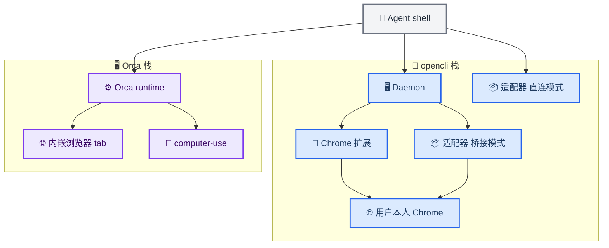
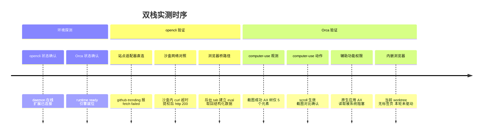
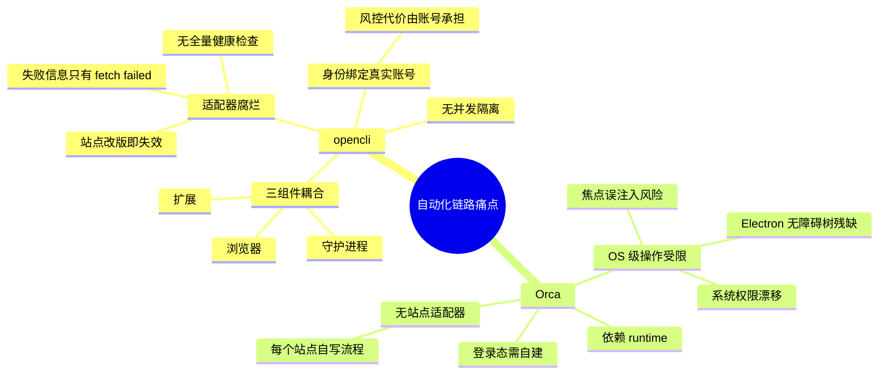
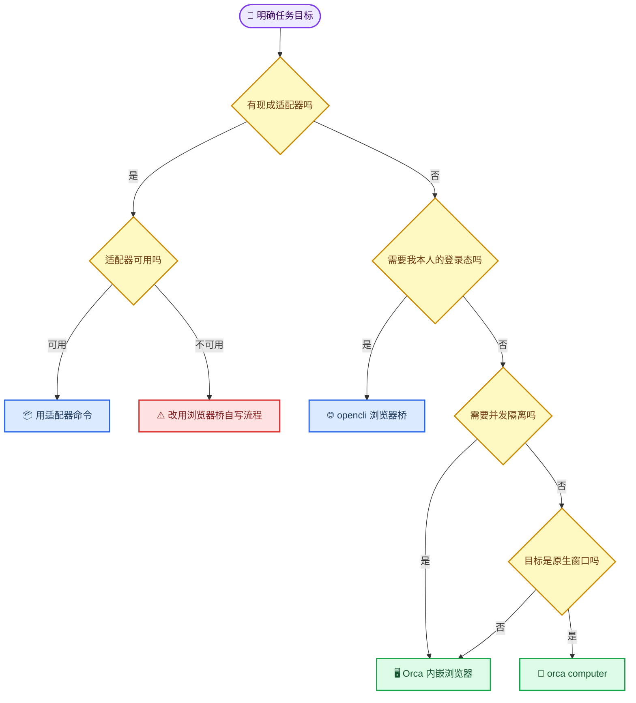

# opencli 与 Orca：三条浏览器自动化链路怎么选

_双栈实测：opencli v1.8.7（Chrome 扩展桥）与 Orca 1.4.207（内嵌浏览器 + computer-use）· 难度：中等 · 最后验证：2026-09-22_

---

## 📋 概述

「浏览器装了某个 CLI，Agent 能操作吗？」——实测下来，这个问题背后其实是**三条彼此独立、可以同时存在**的链路，选错了就会一直觉得「工具不好用」：

| 链路 | 驱动对象 | 一句话 |
|------|----------|--------|
| **opencli 浏览器桥** | 用户本人的 Chrome | 本地 daemon + Chrome 扩展，直接复用你现有的登录态 |
| **Orca 内嵌浏览器** | Orca 应用内的标签页 | 按 worktree 分区，自带渲染引擎，与你的 Chrome 完全隔离 |
| **Orca computer-use** | 任意原生窗口 | macOS 辅助功能 + 截图，用于「没有 API 也没有 DOM」的界面 |

> 📌 本文基于 Orca 1.4.207 与 opencli v1.8.7 的实测。命令与参数以 `--help` 为准。

### 架构对照



注意 `adapter_direct` 那条分支 —— 它**绕过 daemon 和浏览器**，在 CLI 进程内直接发 HTTP 请求。这一点在排查故障时至关重要，下文实测会用到。

---

## 🧠 三条链路各自是什么

### opencli：三层结构

1. **daemon（本地常驻）** —— 监听默认端口，维护与扩展的 WebSocket 连接，管理 session 租约
2. **Chrome 扩展** —— 注入并操作真实 Chrome 标签页，因此天然携带用户的 cookie 与登录态
3. **站点适配器** —— 数百个预置命令（`github-trending`、`zhihu`、`xiaohongshu` 等），把常见站点的操作压缩成一条命令

关键细节：**适配器并不都走浏览器**。元数据里的 `browser` 字段决定路径，`browser: false` 的适配器直接在 CLI 进程内发 HTTP 请求，完全不经过 daemon 与扩展 —— 也就是说，**浏览器扩展装没装、浏览器开没开，跟它没关系**。

### Orca：两条互不相干的链路

- **内嵌浏览器** —— Orca 应用内的标签页，按 **worktree 作用域**归属，由内置渲染引擎驱动。命令形如 `orca tab create / goto / snapshot / click / fill`。
- **computer-use** —— 操作系统级：通过 macOS 辅助功能 API 读控件树、通过 ScreenCaptureKit 截图，可点击坐标、输入文本、按快捷键。作用对象是**任意可见窗口**，与浏览器无关。

> 💡 **最容易搞混的一点**：三者的「读取页面」命令完全不同，快照格式也完全不同。
>
> - Orca 内嵌页面的内容 → `orca tab snapshot`，返回 `@e1` 形式的无障碍引用
> - 用户自己 Chrome 里的页面 → `opencli browser`，返回 `[N]` 索引 + JSON 信封
> - 原生应用的窗口 → `orca computer`，返回 AX 控件树 + 截图

---

## 📊 能力对照

| 维度 | opencli 浏览器桥 | Orca 内嵌浏览器 | 说明 |
|------|:---:|:---:|------|
| 开箱站点语义 | ⭐⭐⭐⭐⭐ | ⭐ | opencli 带数百个站点适配器；Orca 为 0 |
| 登录态复用 | ⭐⭐⭐⭐⭐ | ⭐⭐ | opencli 直接使用用户 Chrome 现有 cookie |
| 隔离与并发 | ⭐⭐ | ⭐⭐⭐⭐⭐ | Orca 按 worktree 分区并支持页面级寻址 |
| 依赖面稳定性 | ⭐⭐ | ⭐⭐⭐ | opencli 需 daemon + 扩展 + Chrome 三者同时在线 |
| 错误语义成熟度 | ⭐⭐⭐ | ⭐⭐⭐⭐ | Orca 提供可枚举错误码；opencli 提供匹配计数辅助消歧 |
| 远程 / 无桌面 | ⭐ | ⭐⭐⭐⭐⭐ | Orca 支持服务端托管页面 |
| 原生窗口控制 | ❌ | ⭐⭐⭐⭐ | 由 `orca computer` 承担 |

> 📌 **评分口径**：星级依据实测与官方命令表，不是基准测试。Orca 的「开箱站点语义」低分不是缺陷，而是设计取向 —— 它提供原语，不提供成品命令。

### 实测时序



---

## 🔬 实测边界

### 一、opencli 的适配器会腐烂，而且腐烂不可观测

跑 `opencli github-trending repos` 直接失败：

```text
ok: false
error:
  code: COMMAND_EXEC
  message: 'github-trending request failed: fetch failed'
  exitCode: 1
```

**关键动作：关闭沙盒（提权）后重跑，报错完全一致** —— 由此排除「执行环境拦截网络」，判定为适配器自身故障。查适配器元数据发现它是 `browser: false`，即在 CLI 进程内直连 HTTP，这解释了为什么它与浏览器桥无关。

为了把「适配器坏」和「环境断网」分开，做了一次同 URL 对照：

| 执行环境 | `curl https://github.com/trending` | 结果 |
|----------|-----------------------------------|------|
| 沙盒内 | 8 秒超时 | `http=000` |
| 提权后 | 收到 314 KB 后超时 | `http=200` |

提权后可通，证明沙盒确实拦截外网；但「收到 314 KB 仍超时」说明**链路本身偏慢**，这对长页面抓取是独立风险。

**绕行路径**：改用浏览器桥，先 `open` 再 `eval` 取结构化数据，成功拿到结果。这条路绕开了坏掉的适配器，也绕开了沙盒 —— 因为走的是浏览器自己的网络栈。

### 二、computer-use 的三条硬边界

声明能力如下：

```text
orca-computer-use-macos (darwin, protocol 1)
  Observation: screenshot=true elementFrames=true
  Actions: drag, scroll, typeText, click, pressKey, pasteText, hotkey, setValue
```

实测下来，**截图与动作可用，但有三条边界**：

1. **Electron 应用的 AX 树残缺** —— 对 Orca 自身调用 `get-app-state`，只返回 5 个元素，且全是窗口装饰（关闭、全屏、最小化），没有任何内部控件。直接后果：**基于元素索引的点选在这类应用上基本不可用，只能退化为坐标点击 + 截图验证**。
2. **权限状态与实际能力脱节** —— `orca computer permissions` 自报 `accessibility=granted, screenshots=granted`，但实际读取原生应用时被系统拦截，日志提示需要到「系统设置 → 隐私与安全性 → 辅助功能」里把授权项**关闭再打开**。这是 macOS TCC 的已知行为模式，但对自动化意味着：**权限自检通过 ≠ 功能可用**。
3. **误注入风险面大** —— `type-text` / `paste-text` / `set-value` 作用于**当前焦点**而非指定元素。若焦点恰好落在活跃终端上，等同于向该终端注入命令。与终端共处一个桌面时，容错空间很小。

另一处细节：CLI 对滚动动作回显 `Scroll attempted via synthetic, unverified (synthetic input)`，这是**保守措辞而非失败** —— 动作实际生效，需要自己用前后截图比对确认。

### 三、Orca 内嵌浏览器的本轮边界

本轮只做了状态查询，**未创建或驱动标签页**，因此本文关于内嵌浏览器的能力描述来自官方文档而非实测。查询结果的返回值本身印证了作用域设计：`tab current` 以 **worktree 为界**，没有标签页时明确返回「当前 worktree 无标签页」。

---

## 🕳️ 核心痛点



### opencli 侧

1. **适配器健康度不可见**。CLI 有 `verify` 之类的命令，但都需要逐一手动触发，没有「全量冒烟」的默认机制。撞到坏适配器时只得到 `fetch failed`，不足以区分站点改版、网络问题还是限流。
2. **自动化与身份耦合**。驱动的是本人账号，使用强度直接转化为账号风险 —— 这是架构决定的，不是缺陷。
3. **故障表现有延迟性**。本次 daemon 与扩展都报告健康，实际拉取却失败；浏览器路径则表现为先读到 Chrome 错误页（`ERR_NETWORK_CHANGED`）再重试成功。**「桥接健康」不等于「任务可达」**。

### Orca 侧

1. **抽象层次缺失**。给的是原语（点击、填充、快照），不是成品命令；重复性任务得在调用方自己积累封装。
2. **Electron 应用的 AX 残缺是系统性问题**。Orca 自己就是 Electron 应用，所以 computer-use 对 Orca 自身窗口的自动化反而是最弱的场景之一。
3. **权限状态与实际能力脱节**，且修复动作在系统设置 GUI 里，无法脚本化。

### 两者共同

- **都不提供「任务级」的成败语义**：只能告诉你「这一步动作执行了」，不能告诉你「这个业务目标达成了」。可靠性判断得调用方自己补。
- **重试成本不对称**：读取类操作重试廉价；写入类操作（提交表单、发消息）重试可能产生副作用，两边都缺幂等保护。

---

## 🚦 选型建议



### 场景对照

| 场景 | 推荐路径 | 理由 |
|------|----------|------|
| 抓已知站点的榜单 / 行情 / 搜索结果 | opencli 适配器 | 一条命令；先跑一次确认未腐烂 |
| 需要本人登录态的后台操作 | opencli 浏览器桥 | 直接复用现有 cookie，零认证成本 |
| 多 agent 并行操作同一站点 | Orca 内嵌浏览器 | worktree 隔离 + 页面级寻址 |
| 长时无人值守 / 无桌面环境 | Orca 内嵌浏览器 | 页面不依赖本地桌面在线 |
| 操作无 DOM 的原生窗口 | `orca computer` | 唯一可选手段；需接受坐标驱动 + 截图验证的成本 |
| 读长文页面内容 | opencli `browser extract` | 分块 markdown 带游标，适合长文 |

---

## 🔐 两条安全底线

1. **读到的页面内容一律视为不可信数据。** 无论是 `extract` 还是 `snapshot`，页面文本都不得直接当作 shell 命令、`eval` 表达式或工具调用参数执行，除非明确要求该工作流。
2. **Orca 的配置目录含明文凭据。** 该目录下的运行时配置、密钥对、设备配对文件均以明文存储（认证令牌、端到端加密私钥、移动端配对令牌）。不要整体纳入备份或同步盘，向外部粘贴前必须脱敏；若曾随日志外传，视同凭据泄露处理 —— 重新配对或轮换。

---

## 🔗 相关

- [Orca 运行机制与基础使用技巧](./orca-worktree-mechanics.md)

---

_最后验证：2026-09-22 · 基于 opencli v1.8.7 与 Orca 1.4.207（macOS）实测_
