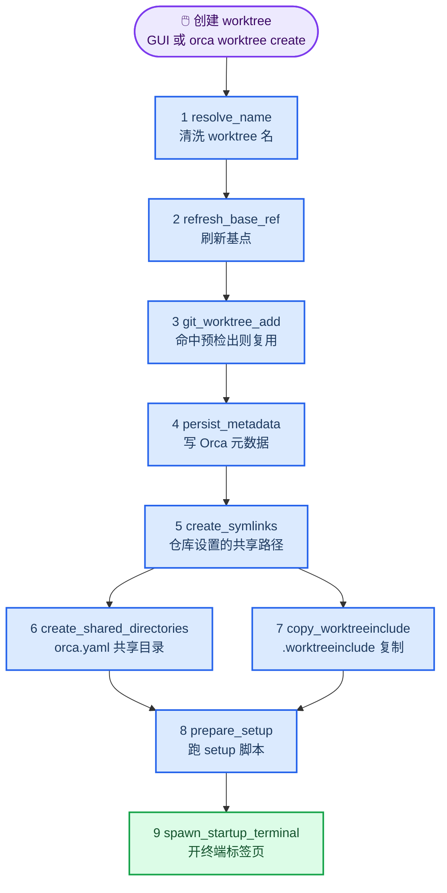
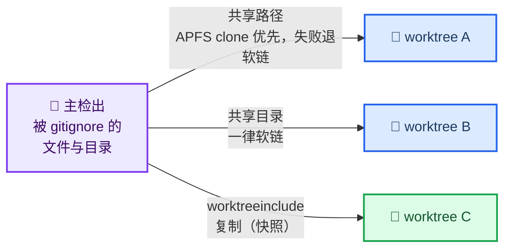
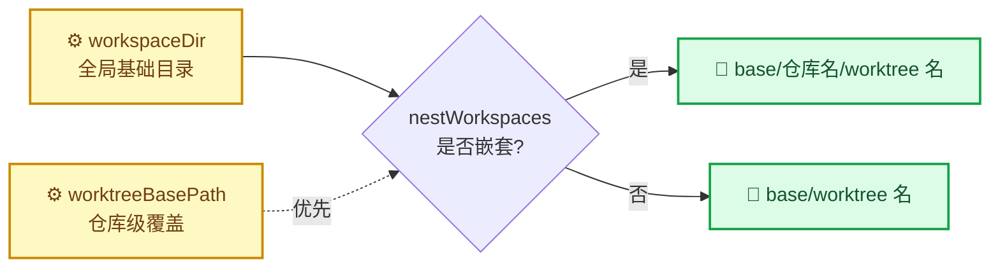

# Orca 运行机制与基础使用技巧

_以 worktree 为中心的多 Agent 编排工具 · 难度：中等 · 最后验证：2026-09-24_

---

## 📋 概述

### Orca 是什么

Orca 把「一个任务 = 一个 worktree」作为组织单位：每个 worktree 是一个独立的 git 工作区，可以各自跑 agent、开终端、开浏览器标签页，互不干扰。围绕这个模型，它提供三个部件：

| 部件 | 角色 |
|------|------|
| **GUI** | 创建、切换、归档 worktree；仓库级设置 |
| **runtime** | 常驻后台进程，串口 + WebSocket 对外提供服务 |
| **CLI（`orca`）** | 脚本化入口：`orca worktree create / list / show / current`、`orca tab`、`orca computer` 等 |

> 📌 本文所有结论来自 Orca 1.4.209（macOS）的实测与内部实现核对。Orca 迭代很快，**命令与参数以 `orca --help` 为准**，配置键以应用内设置为准。

### 你会学到什么

- 一条 worktree 从点击创建到能干活，中间经过哪些阶段
- 为什么「怎么创建」比「创建完再补配置」重要得多
- 三种把文件带进 worktree 的机制，各自适用什么场景
- 配置写了却不生效时，从哪里开始查

### 一条 worktree 的完整生命周期



这张图是理解后文的骨架：**第 5–8 阶段就是所有配置生效的位置**。不属于这条流水线的创建方式，一个阶段都不会跑。

---

## 🔧 核心认知：创建路径决定一切

同一台机器、同一个仓库，**用不同方式创建 worktree，结果完全不同**：

| 创建方式 | 共享路径（clone/软链） | 共享目录（软链） | `.worktreeinclude`（复制） | `scripts.setup` | Orca 元数据 |
|----------|:---:|:---:|:---:|:---:|:---:|
| GUI 新建 | ✅ | ✅ | ✅ | 受策略 + 信任约束 | ✅ 自动 |
| `orca worktree create` | ✅ | ✅ | ✅ | 需 `--setup run`（策略为 `ask` 时） | ✅ 自动 |
| 手搓 `git worktree add` + `orca worktree set` | ❌ | ❌ | ❌ | ❌ | ⚠️ 只有 `set` 指定的字段 |

原因很简单：**前三种机制全部实现在 `worktree.create` 流水线内部**。`git worktree add` 不经过这条流水线，只带回被 git 跟踪的文件；事后再 `orca worktree set` 也补不回来 —— 它只写 lineage / displayName / workspaceStatus 这类元数据，不触发任何文件操作。

> ⚠️ **这条规则的实用推论**：worktree 里缺文件、缺软链、setup 没跑，先问「它当初是怎么被创建的」，而不是去翻配置文件。

---

## 📦 三种「把文件带进 worktree」的机制

`.gitignore` 里的文件不会跟着 `git worktree add` 走，这是 git 的行为，不是 Orca 的。Orca 为此提供了三条互不相同的通道：



### 机制一：Worktree Shared Paths（仓库设置）

界面上叫 **Worktree Shared Paths**，落在应用数据里的 `repos[].symlinkPaths`。

行为是「**clone 优先、软链兜底**」：macOS 上先尝试 APFS 写时复制克隆（瞬间完成、独立 inode、改一边不影响另一边），克隆不可用时退化成软链。

- **文件和目录都支持** —— 这是它相对 `worktree.sharedDirectories` 的关键优势，`.env`、`node_modules` 这类条目就是为它准备的
- 生效阶段：`create_symlinks`（流水线第 5 步，早于共享目录）

### 机制二：`worktree.sharedDirectories`（`orca.yaml`）

写在仓库根的 `orca.yaml` 里，**只接受目录**，实现方式是纯软链：

```yaml
worktree:
  sharedDirectories:
    - .idea
```

几条容易踩的规则：

- 条目必须**存在于主检出**，且必须**被 git 忽略**（内部用 `git check-ignore` 校验），否则只告警、不生效
- 接受相对仓库根的路径；绝对路径、`..`、`.`、`.git`、空段一律丢弃
- **不尝试 APFS clone**，一律软链 —— 与另外两种机制的差别就在这
- 读取来源是**主检出**而非 worktree，因此 worktree 里没有 `orca.yaml` 也照样生效

### 机制三：`.worktreeinclude`（仓库根文件）

一份**字面路径清单**，逐行列出要复制进新 worktree 的 gitignored 文件或目录：

```text
# 每行一条，相对仓库根，不支持 glob
apps/web/.env.local
config/secrets.yaml
```

规则比前两种严格，写错了会静默丢弃：

| 项 | 规则 |
|----|------|
| 内容 | 逐行字面路径，锚定仓库根；`./` 前缀与尾部 `/` 会归一化 |
| 注释 | 空行与 `#` 开头的行忽略 |
| glob | **不支持**；含 `*`、`?` 或以 `!` 开头的行会告警跳过 |
| 安全 | 绝对路径、含 `..`、首段为 `.git` 的行告警跳过 |
| 生效条件 | 条目必须存在且被 gitignore，**不符合者静默丢弃（无告警）** |
| 上限 | 清单 ≤ 1000 条；拷贝预算 2 GiB / 50000 个文件 |
| 语义 | **复制**；macOS 优先 APFS clone，失败退 `fs.cp` |
| 软链 | 源是软链时先 `realpath` 再拷 → 落地为**真实文件** |
| 策略影响 | **不受 setup 策略与信任弹窗约束** |

最后两条的组合很有用：主检出里放一批「指向真实文档的软链」，复制后会自动解引用成内容正确的**真实文件**。

### 三者对比

| 机制 | 配置在哪 | 模式 | 支持文件 | 落地形态 |
|------|----------|------|:---:|----------|
| Worktree Shared Paths | Orca 仓库设置 | clone 优先，软链兜底 | ✅ | 克隆体或软链 |
| `worktree.sharedDirectories` | `orca.yaml` | 一律软链 | ❌ 仅目录 | 软链 |
| `.worktreeinclude` | `.worktreeinclude` | 复制 | ✅ | **真实文件（快照）** |

三者都会在目标已存在时跳过。

> 💡 **怎么选**：要「实时联动」用前两种（改主检出，worktree 里立刻可见）；要「创建时快照」用第三种（主检出改了不影响已建的 worktree）。选软链还是复制，本质是在「实时性」和「隔离性」之间挑一个。

---

## ⚙️ `orca.yaml` 速查

`orca.yaml` 放在**仓库根**，是仓库级的唯一配置文件。支持的键：

| 键 | 作用 | 生效时机 |
|----|------|----------|
| `scripts.setup` | 新建 worktree 后执行的命令 | `prepare_setup` |
| `scripts.archive` | 归档/删除 worktree 前执行 | 删除流程 |
| `setupAgentStartupPolicy` | `start-immediately` / `wait-for-setup` | 创建时 |
| `issueCommand` | 新建 worktree 的默认 issue 命令 | 创建时 |
| `defaultTabs` | 默认终端 tab（title / command / color） | 创建时 |
| `environmentRecipes` | 临时环境（云沙箱 / VM / 容器）配方 | 按需 |
| `worktree.sharedDirectories` | 从主检出软链共享目录 | `create_shared_directories` |

解析器的几个硬约束：

- **任何解析错误整份作废**（返回 null，**静默**）—— 缩进写错、键名拼错，表现是「配置完全没生效」，没有报错
- 文件 ≤ 256 KB；单字段 ≤ 64 KB；集合类 ≤ 256 条
- 主进程内存缓存 **30 秒** —— 改完配置立刻创建，可能拿到的还是旧值

### 为什么 `scripts.setup` 常常「配了却不跑」

这是最容易误判的一处：脚本没跑，但**没有任何报错**。两个独立的根因：

**根因一：读的是 worktree 内的 `orca.yaml`，不是仓库的。**

内部实现等价于：读 `<新建 worktree 路径>/orca.yaml`，再取 `scripts.setup`。如果 `orca.yaml` 本身被 gitignore（很常见，因为它可能含内部命令），`git worktree add` 不会把它带过去 → 读到 null → 整段逻辑跳过，**连告警都没有**，trace 里表现为 `prepare_setup_ms: 0`。

**根因二：运行策略为 `ask` 而调用方没给决策。**

`setupRunPolicy` 取值 `ask` / `run-by-default` / `skip-by-default`，未设置时默认 `run-by-default`。当策略是 `ask`、而创建调用方没有显式决策时，内部直接抛错并被上层 catch 成一条 `console.warn` —— 结果是 **worktree 照建，setup 静默跳过**。

CLI 没有弹窗路径，所以策略为 `ask` 时，`orca worktree create` 不带 `--setup run` 必然跳过；GUI 会显示一个 `Setup script` 分区让你当场选。

> ⚠️ **没有事后补跑**：Orca 不提供「给已存在的 worktree 重跑 setup」的命令或按钮。setup 只在创建那一刻执行，错过就是错过。

### 信任模型

即使脚本配置到位，GUI 路径还多一道**信任确认**：`scripts.setup` 与 `defaultTabs` 的命令文本会被哈希，第一次遇到时弹窗询问 `Run hooks` / `Don't run` / `Always trust`。**内容变了要重新确认**——这是防止「拉个分支就被执行任意命令」的设计。

`.worktreeinclude` 的复制**不受**这套策略与弹窗约束，这也是它比 setup 更适合「只是想把文件放过去」的原因。

---

## 📁 worktree 落在哪

路径解析规则：

```text
最终路径 = join(workspaceRoot, <清洗后的 worktree 名>)
workspaceRoot = resolve(repoPath, workspaceDir | worktreeBasePath)
nestWorkspaces = true 时再插一级仓库目录名
```



| 设置 | 作用域 | 说明 |
|------|--------|------|
| `workspaceDir` | 全局 | worktree 的根目录，默认 `./.worktrees` |
| `nestWorkspaces` | 全局 | 是否多插一级仓库名目录 |
| `worktreeBasePath` | 仓库级 | 留空则跟随全局，仓库设置里的 Worktree Location |

要点：

- 改设置**不会**移动或重命名已有 worktree，只影响下次创建
- 路径解析结果按仓库与设置做 key 缓存，改完下次创建即生效，正常无需重启

---

## 🩺 诊断入口

| 想看什么 | 去哪 |
|----------|------|
| 创建各阶段耗时 | `~/Library/Application Support/orca/logs/main.trace.ndjson` |
| 守护进程事件 | 同目录 `daemon.log` |
| 设置 / 信任状态 / worktree 元数据 | `~/Library/Application Support/orca/profiles/*/orca-data.json` |
| 编排数据 | 同目录上一级的 `orchestration.db`（**不含** worktree 元数据与设置） |
| 命令行 | `orca repo list`、`orca worktree list / show / current`、`orca worktree create --help` |

trace 里的属性名是 `worktree.create.phase.<阶段>_ms`，另有 `worktree.create.total_ms`。**某阶段为 0 = 该阶段没干活**，这是判断「配置到底生效没有」最快的手段。

---

## 🧰 基础使用技巧

1. **先看 trace 再翻配置**。阶段耗时全为 0，说明创建路径不对，改配置是白费力。
2. **验证文件是真的过去了还是软链**：`ls -la <worktree>` 看箭头；用 `-type f` 筛真实文件。两种形态的后续行为完全不同（软链实时、副本快照）。
3. **能用配置就别写 setup 脚本**。`.worktreeinclude` + `sharedDirectories` 是纯配置，不受运行策略与信任弹窗约束；setup 只在创建时跑一次，且没有补跑入口。
4. **`orca.yaml` 改完等 30 秒**，或重启应用，避开内存缓存。
5. **创建 worktree 一律走 Orca 自己的入口**（GUI 或 `orca worktree create`），不要用 `git worktree add` 拼 —— 后者会静默跳过全部四个配置阶段。
6. **CLI 与 GUI 的差异要记住**：策略为 `ask` 时 CLI 必须显式 `--setup run`；部分功能（如稀疏检出预设）目前只在 GUI 提供。

---

## 📊 速查表

| 想做的事 | 用哪个 | 放哪 | 注意 |
|----------|--------|------|------|
| 共享某个 gitignored 目录 | `worktree.sharedDirectories` | `orca.yaml` | 只能目录；软链；从主检出读 |
| 复制若干 gitignored 文件/目录 | `.worktreeinclude` | `.worktreeinclude` | 字面路径、无 glob、复制即快照 |
| 把文件/目录带进 worktree（clone 优先、支持文件） | Worktree Shared Paths | Orca 仓库设置 | macOS APFS clone 优先，失败退软链 |
| 新 worktree 里跑命令（装依赖、生成配置） | `scripts.setup` | `orca.yaml` | 内容取自 **worktree 内**的 orca.yaml；受策略 + 信任约束；无补跑 |
| 只检出部分目录 | Sparse Checkout Presets | Orca 仓库设置 | **GUI 专属**，CLI 无参数 |
| worktree 落点 | `workspaceDir` / `worktreeBasePath` | 全局 / 仓库设置 | 改了不搬已存在的 worktree |
| 强制跑 setup | `--setup run` | 命令行 | 策略为 `ask` 时必需 |
| 看是否触发 | trace 的 `worktree.create.phase.*_ms` | `main.trace.ndjson` | 为 0 = 该阶段没干活 |

---

## 🔗 相关

- [opencli 与 Orca：三条浏览器自动化链路怎么选](./opencli-vs-orca-browser-automation.md)

---

_最后验证：2026-09-24 · 基于 Orca 1.4.209（macOS）实测与内部实现核对_
