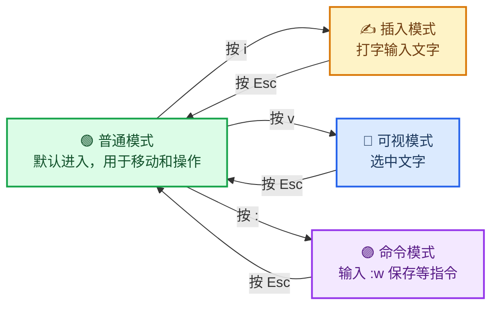

# Vim 操作手册

_面向新手的 Vim 入门：常见操作、常用命令、基础流程，照着做就行 · 难度：入门 · 最后验证：2026-08-07_

---

## 📋 概述

### 这是什么

**Vim**（以及它的兄弟 `vi`、`nvim`）是一个跑在终端里的文本编辑器，没有鼠标、没有菜单栏，全靠键盘操作。

难点在于：它**和普通编辑器的操作习惯完全不同**——打字之前要先按一个键「进入输入状态」，而且光标移动用的不是方向键，而是 `h j k l`。

但它的好处也很实在：

- 任何服务器上都有（`vim` / `vi`），SSH 到服务器改配置只能用它
- 纯键盘操作，改完一处不用摸鼠标
- 学会后编辑效率极高，且终生受用

> **给新手的话**：Vim 的入门曲线是「前三天痛苦，之后上瘾」。坚持照着下面的流程走完一次，就成功了一半。

---

## 🧠 核心概念：模式（新手第一个坎）

Vim 的所有怪癖都来自一个设计：**同一个按键在不同的「模式」下作用不同**。

只需要先记住 4 种模式：



| 模式 | 干什么 | 怎么进入 | 怎么退出 |
| ---- | ------ | -------- | -------- |
| 🟢 普通模式 | 移动光标、删除、复制、粘贴 | **打开 Vim 默认就是** | 按 `Esc` |
| ✍️ 插入模式 | 打字输入文字 | 普通模式按 `i` | 按 `Esc` |
| 🔵 可视模式 | 选中一段文字，再复制/删除 | 普通模式按 `v` | 按 `Esc` |
| 🟣 命令模式 | 保存、退出、查找、设置 | 普通模式按 `:` | 按 `Esc` |

**一句话记忆：平时在普通模式操作文字，按 `i` 才能打字，打完按 `Esc` 回到普通模式。**

> ⚠️ 新手最常见的困惑：「我明明在打字，怎么按出来的都是命令？」——因为你还在普通模式，先按 `i`。

---

## 🚀 第一次上手：5 分钟走通流程

跟着做一遍，完成「打开 → 编辑 → 保存 → 退出」的完整闭环：

### 第 1 步：打开文件

```bash
vim hello.txt        # 打开（不存在则新建）hello.txt
```

### 第 2 步：进入插入模式并输入

1. 按 `i` —— 屏幕左下角出现 `-- 插入 --` 提示，现在可以打字了
2. 输入一行文字，比如 `hello vim`

### 第 3 步：保存

1. 按 `Esc` 回到普通模式（左下角提示消失）
2. 输入 `:w` 后按**回车** —— `:w` 就是「写入保存」（`w` = write）

### 第 4 步：退出

输入 `:q` 后按**回车** —— 退回到终端（`q` = quit）

> **如果第 3 步忘保存直接 `:q`**，Vim 会拒绝退出并提示：
>
> ```text
> E37: No write since last change
> ```
>
> 意思是「改动了但没保存」。这时输入 `:wq`（保存并退出）即可。

### 命令速查

| 命令 | 含义 | 新手必背 |
| ---- | ---- | -------- |
| `:w` | 保存 | ✅ |
| `:q` | 退出 | ✅ |
| `:wq` | 保存并退出 | ✅ |
| `:q!` | 不保存强制退出 | ✅ |
| `:x` | 等同于 `:wq`（有改动才写） | |
| `ZZ` | 普通模式下保存并退出（不用按 `:`） | |

> ⚠️ 按 `:` 之后，输入的命令会在**屏幕左下角**显示，按回车执行、按 `Esc` 取消。
> ⚠️ 忘记自己按了啥，连按几次 `Esc` 一定能回普通模式。

---

## 🖱️ 光标移动（普通模式）

打开 Vim 默认就在普通模式。移动光标用的是 `h j k l`，不是方向键：

| 按键 | 作用 |
| ---- | ---- |
| `h` `j` `k` `l` | 左 下 上 右（方向键也能用，但记住 hjkl 到服务器上才不慌） |
| `w` | 跳到下一个单词开头 |
| `b` | 跳回上一个单词开头 |
| `e` | 跳到单词结尾 |
| `0` | 跳到行首 |
| `$` | 跳到行尾 |
| `gg` | 跳到文件第一行 |
| `G` | 跳到文件最后一行 |
| `:42` | 跳到第 42 行（命令模式） |
| `Ctrl+d` / `Ctrl+u` | 向下/向上翻半页 |
| `Ctrl+f` / `Ctrl+b` | 向下/向上翻一页 |

---

## ✂️ 编辑操作（普通模式）

### 删除

| 按键 | 作用 |
| ---- | ---- |
| `x` | 删除光标所在字符（相当于删一个字母） |
| `dd` | 删除光标所在**整行** |
| `d` + 移动命令 | 删除到移动目标处，如 `dw` = 删到下一个单词开头 |
| `D` | 删除光标到行尾 |
| `u` | **撤销**（最重要的救命键！） |
| `Ctrl+r` | 重做（反撤销） |

> 💡 先按数字可以重复：`3dd` = 删 3 行，`5x` = 删 5 个字符。**数字 + 操作 = 重复多少次**，这是 Vim 的核心套路，后面到处用。

### 复制与粘贴

| 按键 | 作用 |
| ---- | ---- |
| `yy` | 复制光标所在整行（常配 `3yy` = 复制 3 行） |
| `y` + 移动命令 | 复制到移动目标处，如 `yw` = 复制一个单词 |
| `p` | 在**光标后面**粘贴 |
| `P` | 在**光标前面**粘贴 |
| `dd` 后 `p` | 剪切：删掉的行会进剪贴板，再粘到别处 |

### 插入的几种姿势

| 按键 | 作用 |
| ---- | ---- |
| `i` | 在光标**前**插入（最常用） |
| `a` | 在光标**后**插入 |
| `A` | 在**行尾**插入 |
| `o` | 在下方**新开一行**并插入 |
| `O` | 在上方新开一行并插入 |
| `r` + 字母 | 替换光标处的一个字符（不用进插入模式） |
| `R` | 连续替换模式 |

---

## 🔍 查找与替换

### 查找

| 按键 | 作用 |
| ---- | ---- |
| `/关键词` | 向下查找关键词，回车后按 `n` 找下一个、`N` 找上一个 |
| `?关键词` | 向上查找 |
| `*` | 查找光标下的单词（光标放词上直接按，很方便） |

### 替换（命令模式）

```vim
:s/旧/新/          " 替换当前行第一个匹配
:s/旧/新/g         " 替换当前行所有匹配（g = global）
:%s/旧/新/g        " 替换整个文件所有匹配（最常用）
:%s/旧/新/gc       " 同上，但每个匹配都问你是否替换（c = confirm）
```

> 💡 `:%s/旧/新/g` 是日常用得最多的一个命令，值得练熟。

---

## ⚙️ 常用设置命令（命令模式）

| 命令 | 作用 |
| ---- | ---- |
| `:set number` | 显示行号（新手强烈建议开） |
| `:set nonumber` | 取消行号 |
| `:set relativenumber` | 显示相对行号 |
| `:set hlsearch` | 高亮搜索到的关键词 |
| `:set nohlsearch` | 取消高亮 |
| `:set paste` | 粘贴模式（粘贴大量内容时不乱缩进） |
| `:set mouse=a` | 启用鼠标 |

> 💡 这些设置只在本次会话有效。想永久生效，写入配置文件 `~/.vimrc`（见文末）。

---

## 📂 多文件与分屏

| 命令 | 作用 |
| ---- | ---- |
| `:e 文件名` | 打开另一个文件 |
| `:vsp 文件名` | 左右分屏打开文件 |
| `:sp 文件名` | 上下分屏打开文件 |
| `Ctrl+w` 后按方向键 | 在分屏之间切换光标 |
| `Ctrl+w w` | 在分屏之间循环切换 |
| `:bn` / `:bp` | 跳到下一个/上一个已打开的文件 |

---

## 🧰 进阶技巧（会了上面的再来看）

| 操作 | 按键 | 说明 |
| ---- | ---- | ---- |
| 组合操作 | `ciw` | 光标在词上时，**改整个单词**（c=change，i=inside，w=word），删掉并进入插入模式，超实用 |
| 组合操作 | `di(` | 删除括号里的内容，光标在括号内任意位置即可 |
| 组合操作 | `c$` / `C` | 删到行尾并进入插入模式 |
| 缩进 | `>>` / `<<` | 整行向右/向左缩进 |
| 可视块 | `Ctrl+v` | 列块选择（选中多行的同一列），常用来批量加注释 |
| 批量加注释 | `Ctrl+v` 选列 → `I` → 输入 `#` → `Esc` | 给多行同时加 `#` 注释 |
| 宏录制 | `q` + 字母开始录制，`q` 结束，`@字母` 播放 | 录一组操作批量重复，如 `qa` 开始，操作完 `q`，然后 `@a` 重放 |
| 自动补全 | `Ctrl+n` / `Ctrl+p` | 插入模式下的单词补全 |
| 重复上一次操作 | `.` | 普通模式下重复上次编辑，配合宏思路一致 |
| 撤销树 | `:earlier 5m` / `:later 5m` | 回到 5 分钟前的状态（比普通撤销更强大） |

---

## 🆘 新手救急手册（卡住了怎么办）

| 情况 | 解法 |
| ---- | ---- |
| 打不出字，按什么都是命令 | 你还在普通模式，按 `i` 再打字 |
| 按了一堆乱命令，不知道自己在哪 | 连按 `Esc`，回到普通模式 |
| 屏幕上全是乱码/终端乱了 | 按 `Esc` 然后 `:q!` 退出重来（未保存内容会丢，但环境能救回来） |
| 想退出但提示有未保存修改 | 确认不要了就 `:q!`，要保存就 `:wq` |
| 按错删了重要内容 | 立刻按 `u` 撤销 |
| 不小心按了 `Ctrl+z` 退到终端 | 输入 `fg` 回车回到 Vim（文件还开着） |
| 搜索后屏幕上满是高亮 | `:set nohlsearch` |
| 粘贴的代码缩进全乱了 | 先 `:set paste`，粘完 `:set nopaste` |
| 提示 `E37` / `E45` 错误 | 都是「没保存就退出」的报错，用 `:wq` 或 `:q!` 解决 |

---

## 🏁 学习路线（一周就能上手）

1. **第 1 天**：在终端输入 `vimtutor` 并完成（它是个交互式教程，自带，跟着敲 20 分钟）——这是全世界最标准的 Vim 入门方式
2. **第 2 天**：把本文「第一次上手」流程 + 移动/删除/复制粘贴练熟，日常小事都用 Vim 做
3. **第 3 天**：练查找替换 `:%s/旧/新/g`，学 `:set number`
4. **第 4~5 天**：用真实文件练手（改服务器配置、写笔记），卡住就查本文救急手册
5. **之后**：`ciw`、`Ctrl+v` 加注释、宏录制，逐个解锁

### 配置文件的第一个建议

把常用设置写进 `~/.vimrc`，每次打开都生效：

```vim
set number          " 显示行号
set hlsearch        " 搜索高亮
set mouse=a         " 启用鼠标
set tabstop=4       " Tab 显示为 4 个空格宽
set shiftwidth=4    " 缩进 4 格
```

---

## 📚 常用命令速查表（一页版）

| 场景 | 按键/命令 |
| ---- | --------- |
| 保存 | `:w` |
| 退出 | `:q` |
| 保存并退出 | `:wq` 或 `ZZ` |
| 不保存退出 | `:q!` |
| 撤销 / 重做 | `u` / `Ctrl+r` |
| 进入插入模式 | `i` |
| 回到普通模式 | `Esc` |
| 删除一行 / 三行 | `dd` / `3dd` |
| 复制一行 | `yy` |
| 粘贴 | `p` |
| 跳文件头 / 尾 | `gg` / `G` |
| 查找 | `/关键词` + `n` |
| 全局替换 | `:%s/旧/新/g` |
| 跳到第 42 行 | `:42` |
| 行号 | `:set number` |
| 改一个单词 | `ciw` |
| 重复上次操作 | `.` |

---

## ℹ️ 附：本文常见术语

| 术语 | 含义 |
| ---- | ---- |
| 普通模式 | Vim 默认模式，按字母执行操作而非输入文字 |
| 插入模式 | 打字模式，按 `i` 进入 |
| 命令模式 | 按 `:` 进入，输入 `w`/`q` 等指令 |
| 行号 | 用 `:set number` 显示，新手强烈建议开 |
| `.vimrc` | Vim 的配置文件，放 `~/.vimrc`，写设置让它永久生效 |
| vimtutor | Vim 自带交互式教程，终端输入 `vimtutor` 启动 |

---

## 🔗 相关

- [lazygit 操作手册](./lazygit.md) —— 提交信息卡在 Vim 编辑器时，回来看这篇

---

_最后验证：2026-08-07 · 适用于 Vim / Neovim 通用操作_
