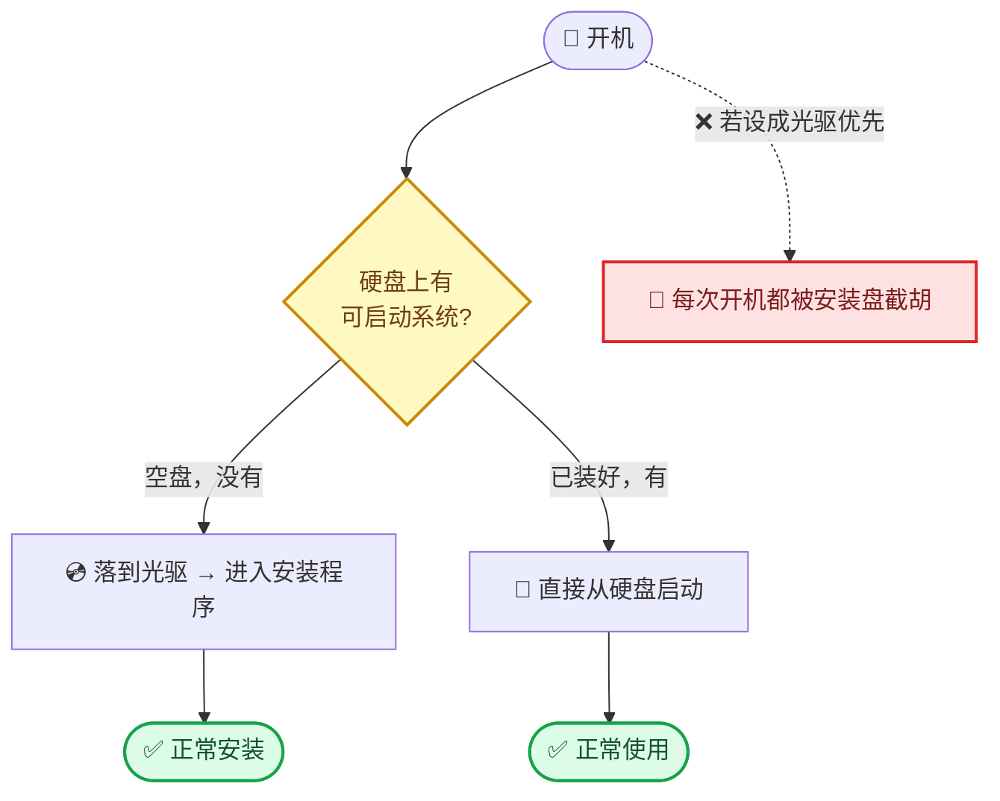

# Omarchy 虚拟机安装记录

> **文档用途**：记录在本机（Ubuntu + KVM）安装 Omarchy 虚拟机的完整过程、配置决策、以及踩过的坑。
>
> **相关阅读**：[Ubuntu 上安装虚拟机（KVM/QEMU）完整流程](./ubuntu-kvm.md) —— KVM 虚拟化的通用流程与坑。本文则是 Omarchy 专属：它的特殊要求、专属坑、配置决策。
>
> **安装时间**：2026-09-26
> **参考**：<https://omarchy.org/manual/> · <https://omarchy.org/manual/omarchy-on/> · <https://omarchy.org/manual/unattended-installs/>

---

## 1. Omarchy 是什么 / 为什么选它

[Omarchy](https://omarchy.org/) 是 DHH（David Heinemeier Hansson，37signals）做的 **Arch Linux 发行版**，主打"开箱即用的漂亮现代桌面"。

**技术栈**：

| 组件 | 说明 |
|---|---|
| 基础 | **Arch Linux** |
| 窗口管理器 | **Hyprland** —— 平铺式 Wayland 合成器 |
| 桌面壳 | Quickshell |
| 预装 | Neovim、Chromium、Obsidian、LibreOffice、Kdenlive、OBS Studio、主题系统等 |

### ⚠️ 最关键的认知：它不是"装上就能用"的普通桌面

**Hyprland 硬性要求 GPU 加速（OpenGL）**。这意味着：

| 影响 | 说明 |
|---|---|
| **虚拟机必须开 3D 加速** | 不然 Hyprland **根本起不来** |
| **不能和 Windows 虚拟机用同一套显卡配置** | Windows 客户机用 QXL 没问题，Omarchy **必须用 Virtio GPU + GL** |
| **安装和运行都依赖 GL** | 安装程序本身也是 Hyprland 环境里跑的 |

这一条是后面一连串坑的总根源。

---

## 2. 官方虚拟机规格

官方手册的 [unattended-installs](https://omarchy.org/manual/unattended-installs/) 页给了一份 **Proxmox（即 KVM）完整示例**：

```bash
qm create 101 --name my-omarchy \
  --bios ovmf --machine q35 --cpu host --cores 4 --memory 8192 \
  --ostype l26 --scsihw virtio-scsi-single \
  --efidisk0 local-lvm:0,efitype=4m,pre-enrolled-keys=0 \
  --scsi0 local-lvm:40,discard=on,iothread=1 \
  --net0 virtio,bridge=vmbr0 --vga virtio --serial0 socket \
  --ide2 local:iso/omarchy.iso,media=cdrom \
  --boot order='scsi0;ide2'
```

| 项目 | 官方值 | 关键注解 |
|---|---|---|
| 内存 | **8192 MB** | |
| CPU | **4 核** | `--cpu host` 直通 CPU 特性 |
| 磁盘 | **40 GB** | |
| 固件 | OVMF (UEFI) | |
| **Secure Boot** | **关闭** | `pre-enrolled-keys=0` |
| **显卡** | **virtio** | **不是 QXL** |
| 磁盘控制器 | virtio-scsi-single | |
| 网卡 | virtio | |
| **启动顺序** | **`scsi0;ide2`** —— **磁盘在前，光驱在后** | ⚠️ 见 [坑 5](#坑-5-启动顺序设成「光驱优先」→-每次重启都进安装程序) |

### 官方对虚拟机的态度

`/manual/omarchy-on/` 页面**只列了 VirtualBox 和 VMware**，还吐槽 VirtualBox「performance probably won't be great」。**没有提 KVM/QEMU** —— 但 Proxmox 示例证明 **KVM 是官方验证过的路径**。

---

## 3. 本机配置决策

对照官方规格，结合本机资源（15 GiB 内存 / 12 线程 / 359 GB 可用）做的取舍：

| 项目 | 官方 | **本机采用** | 决策理由 |
|---|---|---|---|
| 内存 | 8192 MB | **4096 MB** | 本机只有 15 GiB，还要留给宿主和 win11 虚拟机。官方说 2 GB 裸机都能跑，4 GB 是虚拟机的舒适值。**不够可随时加**（关机状态下改） |
| CPU | 4 核 | **4 核** | 照抄官方 |
| 磁盘 | 40 GB | **40 GB** | 照抄官方。qcow2 稀疏，**实测装完占用 6.3 GiB** |
| 固件 | OVMF | UEFI | |
| Secure Boot | 关闭 | **关闭** | 官方硬性要求 |
| TPM | 未添加 | **不添加** | 同上 |
| 显卡 | virtio | **Virtio GPU + 3D 加速** | Hyprland 要求 |
| 磁盘控制器 | virtio-scsi | **virtio-blk**（`vda`） | virt-manager 给 Linux 客户机的默认值，够用 |
| 网卡 | virtio | **virtio** | 正确，无需改 |
| 机器类型 | q35 | Q35 | |

### 内存分配参考

```
只开 Omarchy：        4 GB（宿主剩 11 GB，舒服）
Omarchy + win11 同开： 4 + 6 = 10 GB（宿主剩 5 GB，偏紧）
```

---

## 4. 创建步骤

### 4.1 准备

| 项目 | 本机实际 |
|---|---|
| ISO | `/home/<你的用户名>/IOS/omarchy-4.0.4.iso`（5.8 GB） |
| ISO 版本 | `OMARCHY_202609`（卷标） |
| 备用副本 | Ventoy U 盘 `/media/<你的用户名>/Ventoy/ISO/omarchy-4.0.4.iso` |

### 4.2 virt-manager 向导（5 步）

| 步骤 | 操作 | ⚠️ 注意 |
|---|---|---|
| **1/5** | 选「本地安装介质」 | |
| **2/5** | 填 ISO 路径 | **手动选 `Arch Linux`**，见 [坑 1](#坑-1-virt-manager-不认识-omarchy) |
| **3/5** | 内存 4096、CPU 4 | |
| **4/5** | 磁盘 40 GB | |
| **5/5** | 起名 `archlinux`，**勾选「在安装前自定义配置」** | |

### 4.3 自定义配置窗口（关键）

点「完成」后会弹出配置窗口，**必须改这 4 处**：

| 位置 | 改成 | 不改的后果 |
|---|---|---|
| **显卡** | 型号 `Virtio` + ☑ **3D 加速** | Hyprland 起不来 |
| **概况 → 固件** | ☐ **取消 Secure Boot** | 装不上（官方硬性要求） |
| **启动选项** | **硬盘优先**，光驱在后 | 每次重启都进安装程序，见 [坑 5](#坑-5-启动顺序设成「光驱优先」→-每次重启都进安装程序) |
| **光驱** | 确认路径是 **ISO 文件**，不是 `.qcow2` | 光驱读不到东西，见 [坑 2](#坑-2-virt-manager-把光驱配成了系统盘自己) |
| **TPM** | 不要添加 | 装不上 |

### 4.4 宿主侧前置改动（3D 加速必需）

**这些是虚拟机之外的系统改动**，不做的话 3D 加速起不来：

```bash
# ① 让虚拟机的运行账号能访问 GPU 渲染节点
sudo usermod -aG render libvirt-qemu
sudo systemctl restart libvirtd
```

**② XML 里三项显示配置**（见 [坑 4](#坑-4-3d-加速起不来-三层原因)）：

```xml
<graphics type='spice'>
  <listen type='socket'/>                                    <!-- 必须 socket，不能是 TCP -->
  <gl enable='yes' rendernode='/dev/dri/renderD128'/>        <!-- 明确指定 Intel 核显 -->
</graphics>

<video>
  <model type='virtio' heads='1' primary='yes'>
    <acceleration accel3d='yes'/>
  </model>
</video>
```

---

## 5. ⚠️ 踩坑记录（重点）

> 这次安装一共踩了 **6 个坑**，其中 [坑 4](#坑-4-3d-加速起不来-三层原因) 是三层叠加。按遇到的顺序排列。

### 坑 1：virt-manager 不认识 Omarchy

**症状**

向导第 2 步，操作系统那一栏显示：

```
请选择要安装的操作系统(H):
  [ 等待安装介质/源 ]        ← 空的，Forward 按钮灰着点不动
```

**原因**

libosinfo 的发行版数据库里**没有 Omarchy** 这个条目。它是基于 Arch 的小众新发行版，virt-manager 的自动检测认不出来。

**解决**

1. **取消勾选**底部的「☑ 自动从安装介质/源检测(U)」
2. 搜索框变成可编辑后，输入 `Arch`
3. 选 **`Arch Linux`**
4. `Forward` 按钮就亮了

---

### 坑 2：virt-manager 把光驱配成了系统盘自己

**症状**

虚拟机启动后**卡在 UEFI 兜底菜单**：

```
Ubuntu 24.04 PC (Q35 + ICH9, 2009)      2.00 GHz
pc-q35-noble                             4096 MB RAM
2024.02-2ubuntu0.9

Select Language    <Standard English>
► Device Manager
► Boot Manager
► Boot Maintenance Manager
  Continue
  Reset
```

这个界面**不是引导菜单**，是固件在说"我试遍了所有设备，没有能启动的东西"。

**诊断**

```bash
virsh -c qemu:///system domblklist <vm>
```

会看到光驱的 Source 是空的：

```
 Target   Source
--------------------------------------
 vda      /var/lib/libvirt/images/archlinux.qcow2
 sda      -                                      ← 光驱里没东西
```

再深挖一层：

```bash
virsh -c qemu:///system dumpxml <vm> --inactive | sed -n '/device=.cdrom/,/<\/disk>/p'
```

**真相**：

```xml
<disk type='file' device='cdrom'>
  <driver name='qemu' type='qcow2'/>                          ← 格式错：光驱不该是 qcow2
  <source file='/var/lib/libvirt/images/archlinux.qcow2'/>    ← 路径错：指向了系统盘自己！
  <target dev='sda' bus='sata'/>
```

**光驱指向了虚拟机自己的系统盘镜像**。

**原因**：virt-manager 创建虚拟机时的 bug（在"自定义配置"环节丢失了 ISO 路径，回退到了 images 目录里的第一个 .qcow2）。

**解决**：把 source 改成 ISO 路径，driver type 从 `qcow2` 改成 `raw`。

```bash
virsh -c qemu:///system dumpxml <vm> --inactive > /tmp/vm.xml
# 编辑 /tmp/vm.xml，修正 cdrom 的 driver 和 source
virsh -c qemu:///system define /tmp/vm.xml
```

**✅ 验证**

```bash
virsh -c qemu:///system domblkinfo <vm> sda
```

`Capacity` 应该等于 ISO 文件的确切字节数（本例 **6185304064**）。

---

### 坑 3：Secure Boot 必须关闭

**官方原文**

> You **must turn off Secure Boot and/or TPM** in the BIOS. You have to turn these off to be able to install Omarchy. They're Microsoft security schemes meant for Windows and Microsoft-affiliated Linux distributions.

**为什么**

Omarchy/Arch 的引导程序**没有微软签名**，Secure Boot 会直接拒绝加载。

**本机情况**：virt-manager 选了 UEFI 后**默认会开 Secure Boot**，必须手动关。

**解决**

XML 里把两个 feature 都设为 `no`：

```xml
<firmware>
  <feature enabled='no' name='enrolled-keys'/>
  <feature enabled='no' name='secure-boot'/>
</firmware>
```

libvirt 会**自动换成非 Secure Boot 的固件文件**：

```
改前：/usr/share/OVMF/OVMF_CODE_4M.ms.fd      ← .ms = 预置微软密钥
改后：/usr/share/OVMF/OVMF_CODE_4M.fd         ← 普通版本
```

> 💡 这是**每台虚拟机独立**的设置。给 Omarchy 关掉 Secure Boot，**完全不影响 win11 虚拟机**（那台仍然开着）。

---

### 坑 4：3D 加速起不来（三层原因）

**这是最难的一个坑** —— 三个独立问题叠在一起，少修任何一层都起不来。

#### 层 1：`libvirt-qemu` 没有 GPU 权限

**症状**

```bash
virsh -c qemu:///system start archlinux
error: internal error: process exited while connecting to monitor:
qemu-system-x86_64: -device {"driver":"virtio-vga-gl",...}: opengl is not available
```

**诊断**

```bash
# 虚拟机的实际运行身份
id libvirt-qemu
#   → 组=993(kvm),64055(libvirt-qemu)     ← 没有 render！

# GPU 渲染节点
ls -l /dev/dri/renderD*
#   → crw-rw----+ root render  226,128
getent group render
#   → render:x:992:                        ← 组里一个成员都没有
```

**原因**：虚拟机不是以你的身份运行的，而是系统账号 `libvirt-qemu`。它不在 `render` 组，**打不开 GPU 渲染节点** → 拿不到 GL 上下文。

**解决**

```bash
sudo usermod -aG render libvirt-qemu
sudo systemctl restart libvirtd
```

**✅ 验证**

```bash
id libvirt-qemu      # 应看到 992(render)
```

> **安全说明**：`render` 组只授予 GPU **渲染节点**访问权，不含显示设备（`/dev/dri/card*`）和其他权限。

---

#### 层 2：缺 `<gl enable='yes'/>`

**症状**：修完层 1 后，**仍然报同样的错**。

**诊断**

```bash
virsh -c qemu:///system dumpxml <vm> --inactive | sed -n '/<graphics/,/<\/graphics>/p'
```

```xml
<graphics type='spice' autoport='yes'>
  <listen type='address'/>
  <image compression='off'/>
</graphics>
```

**`<graphics>` 里没有 `<gl enable='yes'/>`** —— 这是 3D 加速的必要条件，`<video>` 里的 `accel3d='yes'` 只是另一半。

> virt-manager 勾「3D 加速」时**本应同时加上这个**，但本例中只加上了 video 那半。

**为什么不用 NVIDIA 而是 Intel**

宿主没设 `nvidia-drm.modeset=1`（在内核命令行里查），**NVIDIA 无法做无显示的 GBM 渲染**。而 Intel 核显的 Mesa GBM 无需 modeset 就能工作。

**解决**：显式指定 Intel 核显的渲染节点。

```xml
<gl enable='yes' rendernode='/dev/dri/renderD128'/>
```

| 渲染节点 | 对应硬件 | 无显示 GL 是否可用 |
|---|---|---|
| `/dev/dri/renderD128` | **Intel UHD 630** | ✅ 可用（Mesa GBM） |
| `/dev/dri/renderD129` | NVIDIA GTX 1650 | ❌ 需要 `nvidia-drm.modeset=1` |

---

#### 层 3：SPICE 的 GL 只支持 Unix socket

**症状**：修完前两层后，**错误变了** —— 这是好迹象：

```
qemu-system-x86_64: SPICE GL support is local-only for now
                    and incompatible with -spice port/tls-port
```

**原因**：QEMU/SPICE 的**已知限制** —— GL 加速的显示只支持**本地 Unix socket**，不支持 TCP 端口。而 `<listen type='address'/>` 会分配 TCP 端口（5900）。

**解决**：把监听方式改成 socket。

```xml
<listen type='socket'/>
```

libvirt 会自动生成 socket 路径：

```
/var/lib/libvirt/qemu/domain-N-<vmname>/spice.sock
```

> ⚠️ 改成 socket 后，virt-manager 里**原来开着的控制台窗口要关掉重开**才能连上。

---

#### 层 4（非坑，但要知道）：Hyprland 起得来 ≠ 跑得流畅

即使 GL 全部配好，虚拟机里仍然是 **virgl 渲染**（宿主 GPU 代理渲染），性能远不如裸机。**能用，但别期待丝滑**。

#### ✅ 最终验证

三条命令确认 3D 加速真的生效：

```bash
# ① QEMU 启动参数里有 gl=on
ps -ef | grep '[q]emu-system' | grep archlinux | tr ' ' '\n' | grep -o 'gl=on,rendernode=[^,]*'
# 期望：gl=on,rendernode=/dev/dri/renderD128

# ② 光驱被大量读取（证明系统在加载）
virsh -c qemu:///system domblkstat archlinux sda | grep rd_bytes
# 期望：远大于 0（本例读到 1 GB）

# ③ 最直观的证明：能看到 Omarchy 的图形安装界面
# 说明 Hyprland 已经在虚拟机里跑起来了
```

---

### 坑 5：启动顺序设成「光驱优先」→ 每次重启都进安装程序

**症状**

安装完成、重启后，**又进了安装程序**，反复循环。

**原因**

启动顺序被设成了：

```xml
<boot dev='cdrom'/>     ← 光驱优先
<boot dev='hd'/>
```

**直觉是错的** —— 看起来"光驱优先保证能装上"，实际是**每次开机都被安装盘截胡**。

**正确做法**（官方示例就是这么写的）：

```xml
<boot dev='hd'/>        ← 硬盘优先
<boot dev='cdrom'/>     ← 光驱兜底
```

**这个顺序是自适应的**——固件会从第一项开始挨个试，试不通才落到下一项：



**解决**：交换两个 `<boot>` 的顺序。**虚拟机运行中也能改**（`--config` 只改持久配置，下次启动生效）。

**✅ 验证**

```bash
virsh -c qemu:///system dumpxml <vm> --inactive | grep '<boot'
```

---

### 坑 6：加密密码输入时屏幕毫无反应

**症状**

开机出现：

```
A password is required to access the root volume:
```

然后**打字没有任何显示** —— 没有星号、没有圆点、光标不动。**以为键盘坏了。**

**真相**

这是**全盘加密密码输入的正常行为** —— 不回显任何字符（不泄露密码长度）。盲打进去按回车即可。

**如果密码想不起来了**

加密密码**没有后门**，忘了就只能重装。虚拟机里没有数据，重装成本很低。

**重装时建议关掉加密**（虚拟机里不需要）：

> 官方提示：在**磁盘格式化确认界面**按 `Ctrl+C` 可切换到**不加密安装**。

好处：开机直接进系统、不用每次输密码、快照回滚更干净。

---

## 6. 最终配置

### 6.1 虚拟机 `archlinux`

| 项目 | 值 |
|---|---|
| 名称 | `archlinux` |
| UUID | `26c638e8-2ad3-49a8-b3d2-4b711e9628c1` |
| 内存 | **4096 MiB** |
| vCPU | **4** |
| 芯片组 | `pc-q35-noble`（Q35） |
| 固件 | UEFI，**Secure Boot 关闭** |
| TPM | 无 |
| 系统盘 | `/var/lib/libvirt/images/archlinux.qcow2` → `vda`，**virtio**，40 GiB |
| 光驱 | `/home/<你的用户名>/IOS/omarchy-4.0.4.iso` → `sda`，SATA |
| 网卡 | **virtio** |
| 启动顺序 | **hd → cdrom** |
| 显示 | SPICE，**Unix socket 监听，GL 开启**（Intel renderD128） |
| 显卡 | **Virtio GPU + 3D 加速** |

**磁盘实际占用**：6.3 GiB / 40 GiB（稀疏）

### 6.2 宿主侧为它做的改动

| 改动 | 内容 | 撤销方法 |
|---|---|---|
| **用户组** | `libvirt-qemu` 加入 `render` 组 | `sudo gpasswd -d libvirt-qemu render` |
| 家目录 ACL | `setfacl -m u:libvirt-qemu:x "$HOME"` | `sudo setfacl -x u:libvirt-qemu "$HOME"` |

### 6.3 XML 关键片段（可直接参考）

```xml
<os firmware='efi'>
  <type arch='x86_64' machine='pc-q35-noble'>hvm</type>
  <firmware>
    <feature enabled='no' name='enrolled-keys'/>
    <feature enabled='no' name='secure-boot'/>
  </firmware>
  <boot dev='hd'/>
  <boot dev='cdrom'/>
</os>

<disk type='file' device='disk'>
  <driver name='qemu' type='qcow2' discard='unmap'/>
  <source file='/var/lib/libvirt/images/archlinux.qcow2'/>
  <target dev='vda' bus='virtio'/>
</disk>

<disk type='file' device='cdrom'>
  <driver name='qemu' type='raw'/>
  <source file='/home/<你的用户名>/IOS/omarchy-4.0.4.iso'/>
  <target dev='sda' bus='sata'/>
  <readonly/>
</disk>

<graphics type='spice'>
  <listen type='socket'/>
  <gl enable='yes' rendernode='/dev/dri/renderD128'/>
</graphics>

<video>
  <model type='virtio' heads='1' primary='yes'>
    <acceleration accel3d='yes'/>
  </model>
</video>
```

---

## 7. 验收清单

### 创建阶段

- [ ] 向导第 2 步能选到 `Arch Linux`（不是"等待安装介质/源"）
- [ ] `virsh domblkinfo <vm> sda` 的 Capacity = ISO 文件字节数
- [ ] `virsh dumpxml | grep feature` 显示 `secure-boot enabled='no'`
- [ ] `virsh dumpxml | grep boot` 显示 **hd 在前**
- [ ] 显卡是 `virtio` 且有 `<acceleration accel3d='yes'/>`
- [ ] `<graphics>` 有 `<gl enable='yes' rendernode='/dev/dri/renderD128'/>`
- [ ] `<listen type='socket'/>`（不是 address）
- [ ] `id libvirt-qemu` 含 `render`

### 启动阶段

- [ ] `virsh start` 成功，不报 `opengl is not available`
- [ ] `ps -ef | grep qemu` 能看到 `gl=on,rendernode=/dev/dri/renderD128`
- [ ] 控制台能看到 Omarchy 的**图形安装界面**（证明 Hyprland 跑起来了）
- [ ] 安装过程中 `domblkstat sda` 的 `rd_bytes` 持续增长（几百 MB 以上）

### 安装后

- [ ] 重启后**从硬盘启动**，不再进安装程序
- [ ] 跳过（或正确输入）加密密码
- [ ] 进入 Hyprland 桌面
- [ ] 建好快照（见下方）

---

## 8. 使用入门

Omarchy 装完是 **Hyprland 桌面** —— 平铺式窗口管理器，**没有传统任务栏和开始菜单**，第一次用会不知所措。

| 快捷键 | 作用 |
|---|---|
| `Super + K` | **显示所有快捷键**（最该先按的） |
| `Super + Space` | 应用启动器 |
| `Super + Enter` | 打开终端 |
| `Super + Q` | 关闭当前窗口 |
| `Super + 方向键` | 切换窗口焦点 |

> 第一次进去**先按 `Super + K`**，把所有快捷键过一遍，比瞎点有用得多。

---

## 9. 日常运维

```bash
# 启停
virsh -c qemu:///system start   archlinux
virsh -c qemu:///system shutdown archlinux      # 优雅关机
virsh -c qemu:///system destroy  archlinux      # 强制断电

# 查看
virsh -c qemu:///system list --all
virsh -c qemu:///system dumpxml archlinux
virsh -c qemu:///system domblkstat archlinux sda   # 光驱是否在被读

# 3D 加速是否生效（最有用的一条）
ps -ef | grep '[q]emu-system' | grep archlinux | tr ' ' '\n' | grep 'gl='
#   期望：unix=on,...,gl=on,rendernode=/dev/dri/renderD128

# 快照
virsh -c qemu:///system snapshot-create-as archlinux 01-fresh "刚装完的 Omarchy"
virsh -c qemu:///system snapshot-list archlinux
virsh -c qemu:///system snapshot-revert archlinux 01-fresh
```

### 建议：装完就打个快照

环境配好（能进桌面、快捷键熟悉了）之后立刻打一个：

```bash
# 先关机
virsh -c qemu:///system snapshot-create-as archlinux 01-fresh \
  "Omarchy 4.0.4 刚装完 + 3D加速正常 + 未加密/已加密"
```

---

## 附录：官方参考链接

| 页面 | 内容 |
|---|---|
| <https://omarchy.org/manual/> | 手册首页 |
| <https://omarchy.org/manual/getting-started/> | 安装步骤、**Secure Boot 必须关闭**的原文 |
| <https://omarchy.org/manual/omarchy-on/> | 各平台安装（**含虚拟机章节**） |
| <https://omarchy.org/manual/unattended-installs/> | **Proxmox/KVM 完整示例命令** |
| <https://omarchy.org/manual/troubleshooting/> | 故障排查 |
| <https://omarchy.org/potato/> | 官方"低配硬件"演示（2 GB 内存的 X220） |

---

*本文档记录于 2026-09-26。通用 KVM 流程与坑见 [Ubuntu 上安装虚拟机（KVM/QEMU）完整流程](./ubuntu-kvm.md)。*
