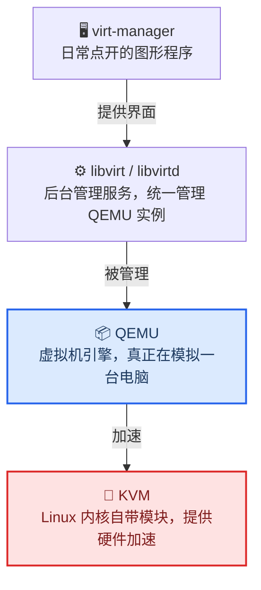
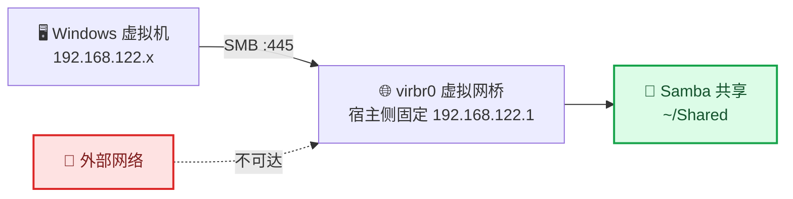
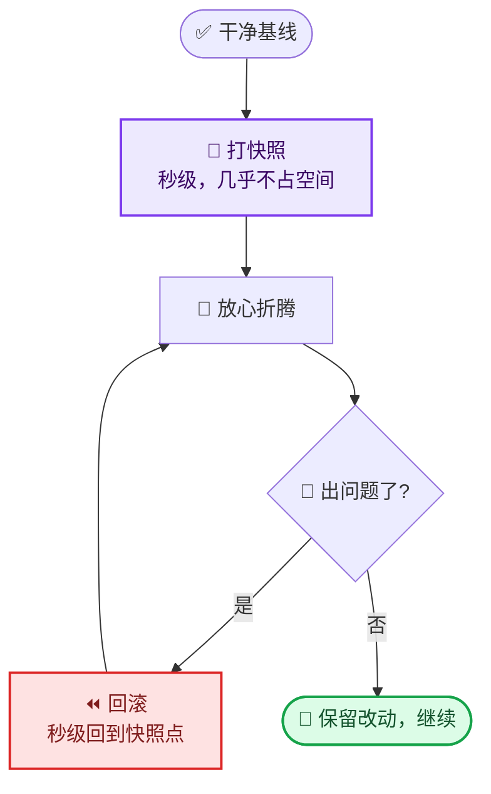
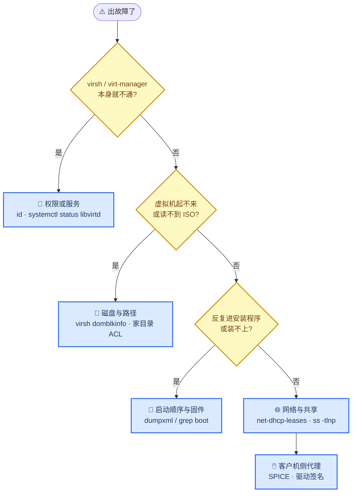

# Ubuntu 上安装虚拟机（KVM/QEMU）完整流程

> **文档用途**：在 Ubuntu 宿主机上搭建 KVM 虚拟化环境、安装 Windows 11 虚拟机的完整可复现流程。
> 既面向新手（每一步都说明"为什么"和"应该看到什么"），也面向 Agent（含精确命令、路径、预期输出，可直接引用）。
>
> **验证环境**：Ubuntu 24.04.4 LTS / 内核 7.0.0-34-generic / 2026-09 实测通过
> **最后更新**：2026-09-26

---

## 0. 快速开始

```bash
# 1) 装依赖
sudo apt update
sudo apt install -y qemu-system-x86 qemu-utils libvirt-daemon-system libvirt-clients \
    virtinst virt-manager ovmf swtpm swtpm-tools cpu-checker

# 2) 起服务 + 加组
sudo systemctl enable --now libvirtd
sudo usermod -aG libvirt,kvm $USER

# 3) ★★★ 注销并重新登录（不重登组权限不生效，这是第一大坑）

# 4) 验证
kvm-ok && virsh -c qemu:///system version && virsh -c qemu:///system net-list --all

# 5) 打开图形界面
# 应用菜单搜索「虚拟系统管理器」（英文名 virt-manager）
```

---

## 1. 前置检查

**目的**：在装任何东西之前，先确认硬件支持虚拟化。**如果硬件不支持，后面全是白费功夫。**

### 1.1 检查 CPU 虚拟化

```bash
# Intel 看 vmx，AMD 看 svm；有输出即支持
grep -oE 'vmx|svm' /proc/cpuinfo | sort -u

# KVM 设备节点是否存在
ls -l /dev/kvm
```

**✅ 预期结果**

```
vmx                              ← Intel 平台；AMD 会显示 svm
crw-rw----+ 1 root kvm 10, 232 ... /dev/kvm
```

**❌ 没有输出 / `/dev/kvm` 不存在**

说明 BIOS 里虚拟化没开。重启进 BIOS（华硕笔记本是 `F2`），找 `Intel Virtualization Technology` / `VT-x` / `SVM Mode` 打开。

> 注：`/dev/kvm` 由 `kvm` 内核模块提供。如果模块没加载，先 `sudo modprobe kvm_intel`（AMD 用 `kvm_amd`）试试。

### 1.2 检查磁盘空间

```bash
df -h /                                    # 根分区余量
lsblk -o NAME,SIZE,TYPE,FSTYPE,MOUNTPOINTS  # 磁盘布局
```

**经验值**：每个 Linux 虚拟机预留 20–30 GB，Windows 11 至少 64 GB（推荐 80 GB）。
**注意**：qcow2 是**稀疏格式**，分配 80 GB 不等于真占 80 GB（实测装完 Win11 后实际占用约 **17.6 GB**）。

### 1.3 检查内存

```bash
free -h
```

**分配原则**：宿主内存 − 4 GB（留给系统） = 可分配给虚拟机的总量。
本机 15 GiB → 单台 Windows 虚拟机给 **6 GB** 比较平衡（微软最低 4 GB，但 4 GB 会卡）。

### 1.4 （可选）检查 IOMMU —— 只有做 GPU 直通才需要

```bash
virt-host-validate qemu 2>&1 | grep -i iommu
ls /sys/kernel/iommu_groups/ | head
```

不做 GPU 直通的话**完全不用管这一项**。笔记本（尤其 Optimus 双显卡机型）的 IOMMU group 通常拆不干净，直通成功率低。

---

## 2. 安装虚拟化环境

### 2.1 理解分层结构（重要，后面排查问题全靠它）

从你点开的图形程序，到内核里的加速模块，中间隔着三层。每一层都有自己的职责和日志：



搞不清这四层，出错时就不知道看哪个日志。**记住：VM 实际是 `libvirt-qemu` 用户在跑，不是你自己。**

### 2.2 软件包清单

```bash
sudo apt update
sudo apt install -y \
    qemu-system-x86 qemu-utils \
    libvirt-daemon-system libvirt-clients \
    virtinst virt-manager \
    ovmf swtpm swtpm-tools cpu-checker
```

| 包名 | 作用 | 必需性 |
|---|---|---|
| `qemu-system-x86` | 虚拟机引擎本体 | ✅ 必需 |
| `qemu-utils` | `qemu-img` 等磁盘镜像工具 | ✅ 必需 |
| `libvirt-daemon-system` | 后台管理服务 | ✅ 必需 |
| `libvirt-clients` | `virsh` 命令行工具 | ✅ 必需 |
| `virtinst` | `virt-install`，命令行建虚拟机 | ✅ 必需 |
| `virt-manager` | **图形界面（日常用的就是它）** | ✅ 必需 |
| `ovmf` | UEFI 固件，让虚拟机以 UEFI 启动 | ✅ 强烈建议 |
| `swtpm` / `swtpm-tools` | 虚拟 TPM 2.0 芯片 | ⭕ 只有装 Windows 11 才需要 |
| `cpu-checker` | 提供 `kvm-ok` 验证命令 | ⭕ 可选 |

**本机实测版本（Ubuntu 24.04 仓库）**

```
qemu-system-x86          1:8.2.2+ds-0ubuntu1.16
qemu-utils               1:8.2.2+ds-0ubuntu1.16
libvirt-daemon-system    10.0.0-2ubuntu8.16
libvirt-clients          10.0.0-2ubuntu8.16
virtinst                 1:4.1.0-3
virt-manager             1:4.1.0-3
ovmf                     2024.02-2ubuntu0.7
swtpm / swtpm-tools      0.7.3-0ubuntu5
cpu-checker              0.7-1.3build2
```

> 💡 **virt-manager 没有 snap 版**。Snap Store 上搜不到，只能用 apt。网上老教程提到的 snap 安装方式已失效。

### 2.3 启动服务、配置用户组

```bash
# 启动 libvirt 守护进程并设为开机自启
sudo systemctl enable --now libvirtd

# ★ 把自己加入 libvirt 和 kvm 两个组
sudo usermod -aG libvirt,kvm $USER

# ★★★ 注销并重新登录（或执行 newgrp libvirt）
```

**为什么必须加组**：`/dev/kvm` 权限是 `root:kvm`，libvirt 的 socket 是 `root:libvirt`。不加组，普通用户既开不了虚拟机也连不上 libvirt。

**为什么必须重新登录**：Linux 的附加组（supplementary groups）是在**登录时**确定的进程属性。`usermod` 只改了 `/etc/group`，**已经运行的会话不会更新**。这是新手最容易卡住的地方——命令都执行成功了，但就是报权限错误。

---

## 3. 验证安装（关键预期结果）

**逐条执行，对照"预期结果"。全部通过再往下走。**

### 3.1 组权限是否生效

```bash
id
```

**✅ 预期**（注意末尾要有 `129(libvirt)` 和 `993(kvm)`）

```
uid=1000(<你的用户名>) gid=1000(<你的用户名>) 组=...,129(libvirt),993(kvm)
```

**❌ 没有这两个组** → 你没重新登录，或没重启终端/应用。

### 3.2 硬件加速

```bash
kvm-ok
```

**✅ 预期**

```
INFO: /dev/kvm exists
KVM acceleration can be used
```

### 3.3 宿主环境全面体检

```bash
virt-host-validate qemu
```

**✅ 预期**：**全部 PASS**，只允许两个无害 WARN：

```
QEMU: Checking for hardware virtualization          : PASS
QEMU: Checking if device /dev/kvm exists            : PASS
QEMU: Checking if device /dev/kvm is accessible     : PASS
QEMU: Checking for device assignment IOMMU support  : PASS
QEMU: Checking for cgroup 'devices' controller      : WARN   ← 无害
QEMU: Checking for secure guest support             : WARN   ← 无害
```

| WARN | 含义 | 要不要管 |
|---|---|---|
| `cgroup 'devices'` | Ubuntu 用 eBPF 实现，探测不到 | ❌ 不用管 |
| `secure guest support` | AMD SEV / Intel TDX，消费级硬件不支持 | ❌ 不用管 |

**❌ 出现 FAIL** → 通常是虚拟化没在 BIOS 开启，或内核模块没加载。

### 3.4 libvirt 连接

```bash
virsh -c qemu:///system version
virsh -c qemu:///system list --all
virsh -c qemu:///system nodeinfo
```

**✅ 预期**

```
Running hypervisor: QEMU 8.2.2          ← 版本号可能不同，有输出即成功

 Id   Name   State
--------------------                    ← 空列表正常（还没建虚拟机）

CPU(s):              12
Memory size:         16217092 KiB
```

### 3.5 默认网络

```bash
virsh -c qemu:///system net-list --all
```

**✅ 预期**（`default` 网络开箱即用，不用手动配）

```
 Name      State    Autostart   Persistent
--------------------------------------------
 default   active   yes         yes
```

### 3.6 图形界面可用

```bash
virt-manager --version
ls /usr/share/applications/ | grep virt-manager
```

**✅ 预期**

```
4.1.0
virt-manager.desktop
```

> 💡 **中文系统的坑**：应用菜单里的 virt-manager 显示为 **「虚拟系统管理器」**，图标是个带 VMM 字样的紫色方块。搜英文名可能搜不到，别以为没装上。

---

## 4. 创建 Windows 11 虚拟机

### 4.1 Windows 11 的硬性要求

| 要求 | 怎么满足 |
|---|---|
| **TPM 2.0** | 用 `swtpm` 提供虚拟 TPM（已在 2.2 装好） |
| **UEFI 固件** | 用 `ovmf` 提供（已在 2.2 装好） |
| **Secure Boot** | OVMF 的 `.ms.fd` 固件自带微软签名密钥 |
| 内存 ≥ 4 GB | 本方案给 6 GB |
| 磁盘 ≥ 64 GB | 本方案给 80 GB |

### 4.2 推荐参数

| 项目 | 推荐值 | 说明 |
|---|---|---|
| **内存** | **6144 MB** | 虚拟机**关机状态下**可随时调整 |
| **CPU** | **4 核** | 留 8 线程给宿主 |
| **磁盘** | **80 GB** | qcow2 稀疏格式，实测装完占 ~17.6 GB |
| **芯片组** | Q35 | 现代芯片组 |
| **固件** | UEFI (OVMF) + **勾选 Secure Boot** | Win11 要求 |
| **TPM** | **勾选，版本 2.0** | Win11 要求 |
| **网络** | `default` (NAT) | 开箱即用 |
| **光驱总线** | SATA | 默认即可 |

### 4.3 向导 5 步详解

打开「虚拟系统管理器」→ 左上角 **「新建虚拟机」**（或 `文件 → 新建虚拟机`）。

| 步骤 | 操作 | 预期结果 |
|---|---|---|
| **1/5** | 选「本地安装介质 (ISO)」→ 浏览选择 Win11 ISO | 若弹出**「搜索权限」警告**，见 [坑 4](#坑-4-iso-放在家目录导致-libvirt-qemu-读不到) |
| **2/5** | 填内存 6144、CPU 4 | 勾选「自动从安装介质/源检测」，它会自动认成 Windows 11 |
| **3/5** | 磁盘填 80 GB | 保持默认的 qcow2 格式 |
| **4/5** | 给虚拟机起名（如 `win11`） | 勾选「在安装前自定义配置」 |
| **5/5** | 自定义确认页 | **必须确认这些**：芯片组 = Q35；固件 = UEFI + Secure Boot；**TPM 已添加** |

**第 5 步是最容易漏的**：如果 TPM 没加上，Windows 11 安装程序会直接拒绝，提示"这台电脑不满足最低系统要求"。

**验证 TPM 是否已添加**：

```bash
virsh -c qemu:///system dumpxml win11 | grep -A3 '<tpm'
```

**✅ 预期**

```xml
<tpm model='tpm-crb'>
  <backend type='emulator' version='2.0'/>
</tpm>
```

### 4.4 建好后的实际配置（本机实测，可作参考）

```xml
<memory unit='KiB'>6291456</memory>          <!-- 6 GiB -->
<vcpu placement='static'>4</vcpu>            <!-- 4 核 -->
<type arch='x86_64' machine='pc-q35-noble'>  <!-- Q35 芯片组 -->
<firmware>
  <feature enabled='yes' name='enrolled-keys'/>
  <feature enabled='yes' name='secure-boot'/>
</firmware>
<disk> win11.qcow2  → sda, bus='sata'   <!-- 80 GiB 虚拟硬盘 -->
<disk> Win11 ISO    → sdb, bus='sata'   <!-- 光驱 -->
<interface> network='default'            <!-- NAT 网络 -->
<tpm model='tpm-crb'> version='2.0'      <!-- 虚拟 TPM -->
```

---

## 5. 安装 Windows 11

### 5.1 首次启动

点「运行」后，**立刻用鼠标点一下虚拟机窗口内部**（关键！确保键盘焦点在虚拟机里，否则你按的键全被宿主接收了）。

**✅ 预期**：先出现 OVMF 的 Boot Manager 菜单，或直接开始引导。

```
Boot Manager
[UEFI QEMU DVD-ROM QM00003]     ← 光驱，选这个
 UEFI QEMU HARDDISK QM00001     ← 空硬盘
 UEFI PXEv4 / PXEv6             ← 网卡启动，用不上
 UEFI HTTPv4 / HTTPv6
```

### 5.2 「按任意键」—— 第一个大坑

选光驱后会出现：

```
Press any key to boot from CD or DVD...
```

**⚠️ 这个提示只等约 5 秒，超时就自动退出、弹回 Boot Manager。**

**正确做法**：点进窗口后**连按几秒空格键**，直到出现 Windows 安装界面。

**为什么会弹回去**（诊断方法）：说明引导程序跑过了但你没按键。可以用这个命令确认光驱确实被读取过：

```bash
virsh -c qemu:///system domblkinfo win11 sdb    # 应显示 ISO 的精确字节数
virsh -c qemu:///system domblkstat win11 sdb    # rd_bytes 不为 0 说明读过
```

**✅ 预期**

```
Capacity:  8543608832          ← 与 ISO 文件大小一致
sdb rd_req 3223
sdb rd_bytes 6600704           ← 读到了数据
```

如果 `Capacity` 是 0 或报错，那才是真问题（见 [坑 4](#坑-4-iso-放在家目录导致-libvirt-qemu-读不到)）。

### 5.3 安装选项页

```
选择安装选项
  ◉ 安装 Windows 11
  ○ 修复个人电脑
  ☐ 我同意将删除所有内容，包括文件、应用和设置(A)
```

**必须勾选那个复选框**，否则「下一步」是灰的。

> **这个"删除所有内容"删的是虚拟机内部的虚拟硬盘**（`win11.qcow2`，一块全新空盘），**完全不影响宿主 Ubuntu**。宿主和虚拟机是硬隔离的，虚拟机看不到宿主任何文件。

### 5.4 分区选择

选 **「驱动器 0 的未分配空间」**（约 80 GB）→ 下一步。

Windows 会自动创建它需要的全部分区（恢复分区 / EFI / MSR / C 盘）。

> 虚拟机只有一个空硬盘，**不会**出现双系统那种"该选哪个分区"的纠结。
>
> ⚠️ 如果宿主是**双系统**环境，切记不要在这里误选宿主的分区 —— 但虚拟机里根本看不到宿主分区，所以虚拟机反而是最安全的练习环境。

### 5.5 安装 + 首次启动

安装过程会重启几次，中间有一次会看到：

```
BdsDxe: loading Boot0001 "Windows Boot Manager" from HD(1,GPT,...)/\EFI\Microsoft\Boot\bootmgfw.efi
BdsDxe: starting Boot0001 "Windows Boot Manager" from ...
[ TianoCore logo ]
```

**✅ 这是好消息**：说明固件在虚拟硬盘上找到了 Windows 引导程序，安装成功，正在首次启动。

**接下来**：黑屏/logo 停留几十秒到 2 分钟 → "准备就绪"转圈 → 进入 OOBE 设置向导。

### 5.6 跳过微软账户（强烈建议）

Windows 11 强制要求登录微软账户，对测试环境很麻烦。在 OOBE 的**"让我们为你连接网络"**或**"登录微软账户"**页面：

```
按 Shift + F10  →  弹出命令行  →  输入：

start ms-cxh:localonly
```

会直接弹出**创建本地账户**的对话框，填用户名密码即可，**无需联网、无需微软账户**。

> 备用方案：`Shift+F10` 后输入 `ipconfig /release` 断网，也能跳过网络步骤走到本地账户选项。

---

## 6. 宿主机 ↔ 虚拟机 共享文件夹

### 6.1 方案对比

| 方案 | Windows 端要装什么 | 性能 | 复杂度 | 推荐 |
|---|---|---|---|---|
| **SMB (Samba)** | **什么都不用装** | 好 | 宿主配一次 | ⭐ **首选** |
| SFTP / WinSCP | 要装客户端 | 好 | 宿主零配置 | 偶尔传文件可用 |
| virtiofs | 要装 WinFsp + 驱动 | 最好 | 复杂 | 追求性能时 |
| SPICE WebDAV | 要装客户端 | 一般 | 中等 | 不推荐 |

**选 SMB 的理由**：Windows 原生支持，虚拟机里零安装，读写体验和本地盘一样。

### 6.2 网络前提

虚拟机通过 libvirt 的 default 网络与宿主通信，宿主的共享服务只绑在这张虚拟网桥上：



**该网段下的所有虚拟机都能访问宿主的共享**，不限系统（Windows / Linux / BSD 都行）。

### 6.3 宿主侧配置

```bash
# 1) 装 samba
sudo apt install -y samba

# 2) 建共享目录
mkdir -p ~/Shared

# 3) 备份默认配置
sudo cp /etc/samba/smb.conf /etc/samba/smb.conf.orig-$(date +%F)

# 4) 写入精简配置（★ 关键：只监听回环和 virbr0，不对外网暴露）
sudo tee /etc/samba/smb.conf > /dev/null <<'EOF'
[global]
   interfaces = lo virbr0
   bind interfaces only = yes
   workgroup = WORKGROUP
   server string = Ubuntu Host
   map to guest = never
   restrict anonymous = 2

[Shared]
   path = /home/<你的用户名>/Shared
   comment = Shared with VMs
   browseable = yes
   read only = no
   guest ok = no
   valid users = <你的用户名>
   create mask = 0664
   directory mask = 0775
EOF

# 5) 让 smbd 等 libvirtd 建好 virbr0 再启动（避免开机竞态导致启动失败）
sudo mkdir -p /etc/systemd/system/smbd.service.d
sudo tee /etc/systemd/system/smbd.service.d/libvirt-order.conf > /dev/null <<'EOF'
[Unit]
After=libvirtd.service
Wants=libvirtd.service
EOF
sudo systemctl daemon-reload

# 6) 设置 Samba 专用密码（与登录密码无关，会提示输入两次）
sudo smbpasswd -a <你的用户名>

# 7) 启动服务
sudo systemctl restart smbd

# 8) 防火墙：只对虚拟网桥放行
sudo ufw allow in on virbr0 to any port 445 proto tcp
sudo ufw allow in on virbr0 to any port 139 proto tcp
```

**🔒 安全说明**

`smb.conf` 里的两行是关键：

```ini
interfaces = lo virbr0
bind interfaces only = yes
```

**效果**：smbd 只监听本地回环 + libvirt 虚拟网桥，**从 WiFi / 网线等外部网络完全不可见**。否则笔记本连公共 WiFi 时，别人可能摸到你的共享目录。

> `smbpasswd` 的密码**不要复用登录密码**，SMB 协议凭据传输方式比 SSH 弱。

### 6.4 验证（关键预期结果）

```bash
echo "=== 配置自检 ==="
testparm -s 2>&1 | grep -E 'interfaces|bind interfaces|path|valid users'

echo; echo "=== 服务状态 ==="
systemctl is-active smbd

echo; echo "=== 监听地址（★ 最关键）==="
sudo ss -tlnp | grep -E ':445|:139'
```

**✅ 预期结果**

```
bind interfaces only = Yes
interfaces = lo virbr0
path = /home/<你的用户名>/Shared
valid users = <你的用户名>

active

LISTEN 0 50    127.0.0.1:445        ← 本地回环
LISTEN 0 50    127.0.0.1:139
LISTEN 0 50  192.168.122.1:445      ← 虚拟网桥
LISTEN 0 50  192.168.122.1:139
```

**🚨 绝对不应该出现 `0.0.0.0:445`** —— 出现就说明绑定了所有网卡，对外网暴露了。

**连通性测试**（可选，需装客户端工具）：

```bash
sudo apt install -y smbclient
smbclient -L localhost -U <你的用户名>    # 会提示输密码
```

**✅ 预期**：输出里列出 `Shared` 共享名。

### 6.5 虚拟机侧连接

**Windows**：文件资源管理器地址栏输入（**注意是反斜杠**）

```
\\192.168.122.1\Shared
```

弹窗填用户名 `<你的用户名>` + Samba 密码 → 勾选「记住我的凭据」。

**想更顺手**：「此电脑」右键 → **映射网络驱动器** → 盘符 `Z:` → 完成。之后像本地磁盘一样用，重启后依然在。

**Linux 客户机**：

```bash
# 图形界面文件管理器地址栏
smb://192.168.122.1/Shared

# 命令行挂载
sudo mount -t cifs //192.168.122.1/Shared /mnt/share -o username=<你的用户名>
```

### 6.6 多虚拟机共享 & 测试工作流注意事项

| 特性 | 说明 |
|---|---|
| **多虚拟机共用** | ✅ 同网段下所有虚拟机都能访问同一个共享 |
| **凭据** | 所有虚拟机共用一套（`<你的用户名>` + Samba 密码） |
| **文件属主** | 虚拟机里写入的文件，在宿主上属主都是 `<你的用户名>` |
| **快照回滚** | ⚠️ **不影响共享目录**（实体在宿主 `~/Shared`，不在虚拟盘里） |

**⚠️ 重要提醒**：因为共享目录在宿主上，**回滚虚拟机快照不会撤销写入共享目录的数据**。

> **推荐做法**：共享目录只用来"投喂"输入文件（安装包、样本），测试产生的垃圾数据写在虚拟机自己的 C 盘里，这样回滚才能干净清场。

### 6.7 扩展：只读共享

如果只想让虚拟机**读取**宿主文件（防止测试过程中误改），加一个只读共享：

```ini
# 追加到 /etc/samba/smb.conf
[ReadOnly]
   path = /home/<你的用户名>/IOS
   comment = Read-only for VMs
   browseable = yes
   read only = yes
   guest ok = no
   valid users = <你的用户名>
```

```bash
sudo systemctl restart smbd
```

---

## 7. 剪贴板共享（复制粘贴）

> **和共享文件夹是两回事**：共享文件夹传**文件**，剪贴板传**文字**。两者独立配置，互不依赖。

### 7.1 原理

SPICE 剪贴板**不是宿主单向推送**，而是**双向协商** —— 宿主和客户机里各有一个代理程序，互相交换剪贴板内容：

```
宿主 (virt-manager)  ←── SPICE 通道 ──→  客户机（需要安装代理）
     ✅ 默认就绪                            ❌ 裸装 Windows 没有
```

- **Linux 客户机**：仓库自带 `spice-vdagent` 包，`sudo apt install spice-vdagent` 即可
- **Windows 客户机**：**没有内置对应组件**，必须手动安装 ← 本篇重点

**宿主侧无需任何配置**。virt-manager 里**根本没有"共享剪贴板"开关**（所有 gsettings 项里都没有这个键），只要客户机代理跑起来就自动生效。

### 7.2 第一步：确认当前状态

```bash
virsh -c qemu:///system dumpxml win11 | grep -o "com.redhat.spice.0' state='[a-z]*'"
```

| 输出 | 含义 | 下一步 |
|---|---|---|
| `state='connected'` | ✅ 代理已连上，剪贴板可用 | 直接实测粘贴 |
| `state='disconnected'` | ❌ 客户机里没有代理在跑 | 往下走 7.3；排查见 [坑 10](#坑-10-spice-剪贴板不通-错误码-52) |

> ⚠️ **这条命令只在虚拟机运行时准确**。虚拟机关机时查出来的 `state` 没有意义。

### 7.3 第二步：安装（Windows 客户机）

> ⚠️ **不要只装 `spice-guest-tools`** —— 它在**开启了 Secure Boot 的 Windows 11 上会因驱动签名被拒而失败**（详见 [坑 10](#坑-10-spice-剪贴板不通-错误码-52)）。推荐一步到位装 Red Hat 官方的 virtio-win 驱动包，驱动是 **WHQL 签名**的，专为 Secure Boot 环境准备。

**下载**

方式 A — 在 Windows 里直接下载（虚拟机有网）：

```
https://fedorapeople.org/groups/virt/virtio-win/direct-downloads/stable-virtio/virtio-win.iso
```

方式 B — 通过共享文件夹传（需先配好[第 6 章](#_6-宿主机-↔-虚拟机-共享文件夹)）：

```bash
# 宿主终端
curl -fLo ~/Shared/virtio-win.iso \
  https://fedorapeople.org/groups/virt/virtio-win/direct-downloads/stable-virtio/virtio-win.iso
```

然后在 Windows 里从 `\\192.168.122.1\Shared\virtio-win.iso` 拷出来。

**安装**

1. 双击 `virtio-win.iso` **挂载**（Windows 11 原生支持 ISO 挂载）
2. **右键 `virtio-win-guest-tools.exe` → 以管理员身份运行**
3. 一路「下一步」→ 装完 **重启虚拟机**

### 7.4 第三步：验证（三层，从里到外）

**① Windows 侧** —— 设备管理器 → 展开 **「系统设备」** → 确认这几项**没有黄色感叹号**：

```
VirtIO Serial Driver      ← 剪贴板通道，必须有
VirtIO Balloon Driver     ← 内存气球（顺带修好）
```

**② 宿主侧**

```bash
virsh -c qemu:///system dumpxml win11 | grep -o "com.redhat.spice.0' state='[a-z]*'"
```

**✅ 预期**：`com.redhat.spice.0' state='connected'`

**③ 实测** —— 宿主选中文字 `Ctrl+C` → 客户机 `Ctrl+V`；反向同理。

### 7.5 装完顺带获得的能力

| 功能 | 说明 |
|---|---|
| ✅ **文字剪贴板双向** | 主要目标 |
| ✅ **分辨率自适应** | 拖大 virt-manager 窗口，客户机分辨率自动跟随 |
| ✅ **鼠标无缝移动** | 不用再按 `Ctrl+Alt` 把鼠标从窗口里"解放"出来 |
| ✅ **内存气球驱动** | 客户机按需把内存还给宿主，宿主内存压力更小 |
| ⭕ 文件拖放 | 支持但不稳定，大文件别指望 |

### 7.6 注意事项

| # | 注意 | 说明 |
|---|---|---|
| 1 | **虚拟机关机时 `state` 无意义** | 必须先确认虚拟机在运行再查 |
| 2 | **装完必须重启客户机** | 代理服务在开机时加载 |
| 3 | **有时需要重开控制台** | 若重启后仍不通，关掉 virt-manager 的虚拟机窗口再双击打开，强制 SPICE 重连 |
| 4 | **剪贴板只适合文字** | 传安装包、样本数据走共享文件夹更快更稳 |
| 5 | **装完记得打快照** | 否则回滚后要重装一遍 |
| 6 | **Secure Boot 环境下必须用 WHQL 签名驱动** | 这是坑 10 的根因，别用"关 Secure Boot"绕过 |
| 7 | **Linux 客户机做法不同** | `sudo apt install spice-vdagent` 即可，不用走这套 |

---

## 8. 快照：测试环境的时光机

### 8.1 作用与目的

**一句话**：把"不可逆的操作"变成"可逆的"。

虚拟机里最怕的是**折腾坏了要重装**。有了快照就可以放心折腾 —— 反正 10 秒就能回到折腾之前。

**三个具体目的**：

| 目的 | 说明 | 场景举例 |
|---|---|---|
| **① 测试隔离** | 每轮测试都从**同一个干净状态**开始，排除"上一轮留下的垃圾"干扰 | 测 agent 前先回滚，保证每轮初始条件完全一致，结果才可复现 |
| **② 风险隔离** | 做有风险的改动前先打快照，出事就回滚 | 装不明来源的软件、改注册表、装驱动、复现用户报的"奇怪问题" |
| **③ 环境复用** | 一份基线多轮复用；不同版本并存随时切换 | Win10 基线 + Win11 基线各一套，按用户环境选着测 |

> **和"克隆"的区别**：快照是"**同一台机器**回到过去"，克隆是"**变成两台机器**"。两者都会用到，见 [8.8](#_8-8-快照-vs-克隆)。

### 8.2 工作原理

**写时复制（COW）** —— 快照**不复制数据**，只是把当前状态"**标记**"下来。

qcow2 默认创建的是**内部快照**，全部保存在**同一个磁盘文件**里（不是外部的分层文件）：

```
打快照前：
  win11.qcow2  [████████ 数据 ████████]                  17.8 GiB

打快照后（瞬间完成）：
  win11.qcow2  [████████ 数据 ████████]                  17.8 GiB  ← 大小几乎不变
                 ↑ 这些数据块被标记为"属于这个快照"

之后产生新写入：
  win11.qcow2  [████████ 数据 ████████][███ 新数据 ███]   20.8 GiB
                 ↑ 旧块保留给快照          ↑ 新块属于当前状态
```

**回滚 = 丢弃"当前状态"的块，回到快照标记的那些块** —— 所以是**秒级**的，不是"还原一份拷贝"那种慢操作。

正因为创建和回滚都是秒级的，它可以被当成一个**随手就用的循环**，而不是"重要操作才做一次"：



### 8.3 占用多少存储

**创建的那一刻：几乎为 0** —— 只多了一张几十 KB 级别的索引表，**不复制任何数据**。

**之后按"你改了多少"增长**：

| 场景 | 文件增长 |
|---|---|
| 刚打完快照 | **≈ 0** |
| 跑几轮测试、装点软件 | + 1 ~ 3 GiB |
| Windows 做一次累积更新 | + 5 ~ 15 GiB（大更新很能写） |
| 极端情况（把整个 C 盘重写一遍） | 最多 + 磁盘总大小（封顶） |

**一句话：写多少，涨多少。**

**多个快照会叠加** —— 每个快照都要保留它那一刻的数据。所以**别贪多，同一台虚拟机留 2–3 个足够**，用完及时删。

**怎么查实际占用**：

```bash
virsh -c qemu:///system domblkinfo win11 sda
```

| 字段 | 含义 |
|---|---|
| `Allocation` | **实际占用**（会随改动增长） |
| `Capacity` | 逻辑容量（固定不变，就是你建虚拟机时设的磁盘大小） |

**本机实测参考**：

| 项目 | 值 |
|---|---|
| 逻辑容量 | 80.0 GiB |
| 实际占用（装完 Win11 + virtio 驱动后） | 约 17.8 GiB |
| 宿主磁盘余量 | 366 GB |

> **结论**：正常使用是**几个 GB** 的量级，完全不用担心。唯一要避免的是"往 C 盘写了几十 GB 数据后还留着旧快照"——那时候增量会真实吃空间。

### 8.4 操作

**图形界面**

```
① 先关机（菜单「虚拟机(M) → 关机」），等状态变成「已关闭」
② 菜单「查看(V) → 快照(P)」
   （或：双击虚拟机 → 详情窗口 → 左侧「快照」）
③ 点左下角「+」新建快照
④ 填「名称」+「描述」→ 点「完成(F)」
```

**✅ 预期**：对话框关闭 → 快照列表出现一行 → 虚拟机状态不受影响，可正常开机。

> ⚠️ **要关机时打，不要运行时打。** 运行时打会尝试把内存状态也存进去，而 **UEFI + Secure Boot + TPM 的虚拟机内存快照支持不完整，容易失败**。日常的"干净基线"用关机状态打就对了。

**命令行**

```bash
# 建快照（虚拟机需先关机）
virsh -c qemu:///system snapshot-create-as win11 02-ready "Win11 + 驱动 + 工具"

# 列出
virsh -c qemu:///system snapshot-list win11

# 看单个快照详情
virsh -c qemu:///system snapshot-info win11 02-ready

# 回滚（★ 虚拟机必须先关机）
virsh -c qemu:///system snapshot-revert win11 02-ready

# 删除
virsh -c qemu:///system snapshot-delete win11 02-ready
```

**✅ 预期输出**

```
 Name         Creation Time               State
-----------------------------------------------------
 02-ready     2026-09-26 23:58:12 +0800   shutoff
```

| `State` 值 | 含义 |
|---|---|
| `shutoff` | 关机时打的磁盘快照（**推荐**，回滚后冷启动） |
| `running` | 带内存的检查点（回滚后恢复原画面，含开着的程序） |

### 8.5 命名规范

**名称加序号前缀**（列表才排得整齐）；**描述写清楚"里面有什么"**。

> 三个月后你只看到 `02-ready` 这个名字，是**记不住**里面装了什么、配到哪一步的。

| 名称 | 描述 |
|---|---|
| `01-clean-windows` | 刚装完 Win11，OOBE 完成，未装任何软件 |
| `02-virtio-ready` | 已装 virtio-win 驱动 + SPICE 代理，剪贴板可用 |
| `03-test-ready` | **日常回滚点**：+ 测试环境 + 常用工具 + Z: 盘映射 |

### 8.6 推荐工作流

```
1. 装好干净的 Win11                    → 打快照 01-clean-windows
2. 装好驱动、工具、测试环境             → 打快照 03-test-ready
3. 跑测试 A（把系统搞乱）
4. 关机 → 回滚到 03-test-ready          ← 约 10 秒
5. 跑测试 B
6. 关机 → 回滚 ...
```

多基线分支：

```
01-clean-windows   干净 Win11
02-virtio-ready    + 驱动
03-test-ready      + 测试环境          ← 每轮测试都回到这里
04-win10-base      另一条线：Win10 环境
```

### 8.7 注意事项

**🔴 回滚相关**

| # | 注意 | 说明 |
|---|---|---|
| 1 | **回滚会丢弃一切** | 快照之后在虚拟机里的所有改动、下载、安装**全部消失**。这是它的目的，但下手前要清楚 |
| 2 | **回滚前必须关机** | 开机状态不能 revert |
| 3 | **回滚后是冷启动** | 用磁盘快照回滚，系统会重新走一遍开机流程，不是"恢复到当时那个画面" |

**🟡 存储相关**

| # | 注意 | 说明 |
|---|---|---|
| 4 | **创建时几乎不占空间** | 占空间的是**打快照之后的改动**，写多少涨多少 |
| 5 | **多个快照会叠加** | 同一台机别超过 2–3 个，用完及时删 |
| 6 | **大写入前先清理旧快照** | 准备往 C 盘写几十 GB 之前，先删掉不需要的快照 |

**🔴 认知误区（最容易踩）**

| # | 注意 | 说明 |
|---|---|---|
| 7 | **快照不是备份** | 快照和虚拟磁盘在**同一个物理盘**上（`/var/lib/libvirt/images/win11.qcow2`）。盘坏了、文件误删了，**快照和虚拟机一起没**。真备份要导出到外接硬盘 |
| 8 | **回滚不影响共享文件夹** | `~/Shared` 在**宿主硬盘**上，不在快照范围内。测 agent 时它往共享目录写的数据，回滚**不会撤销** → 所以测试产生的垃圾数据要写在虚拟机 **C 盘**里，别写共享目录 |
| 9 | **快照不包含外部状态** | 虚拟机的网络配置、宿主的 Samba 配置、共享目录内容，都**不在**快照里 |

**🟢 操作建议**

| # | 注意 | 说明 |
|---|---|---|
| 10 | **关机时打，不要运行时打** | UEFI + TPM 虚拟机的内存快照容易失败 |
| 11 | **打完先验证一次回滚** | 建完基线后故意改点东西 → 回滚 → 确认改动消失。**别等到真出事了才发现快照是坏的** |
| 12 | **关键节点就补一个快照** | 快照链越长越乱，但"装完重要东西"这一刻必须有 |

### 8.8 快照 vs 克隆

| | 快照 | 克隆 |
|---|---|---|
| **用途** | 同一台虚拟机**回到过去** | 变成**两台独立虚拟机** |
| **空间** | 只存增量（初始 ≈ 0） | 完整复制一份 |
| **典型场景** | 测完回滚、反复用同一台 | Win10 / Win11 并存对比、做"模板机" |
| **影响范围** | 只影响这一台 | 各自独立，互不影响 |

**配合用法**：先配好一台"模板机"（干净系统 + 常用工具 + 驱动 + 共享配置），**克隆**出多台做不同用途；每台再用**快照**做日常回滚。

---

## 9. 踩坑记录

> 按"踩坑概率 × 排查难度"排序。每条都给出：**症状 → 原因 → 解决**。

### 坑 1：加了组但权限还是不生效

**症状**：`sudo usermod -aG libvirt,kvm $USER` 执行成功，但 `virsh` 报 `权限不够` 或 virt-manager 连不上。

```
error: Failed to connect socket to '/var/run/libvirt/libvirt-sock': 权限不够
```

**原因**：Linux 附加组在**登录时**确定，已运行的会话不会更新。`usermod` 只改了 `/etc/group`。

**解决**：**注销并重新登录**（或 `newgrp libvirt`，但只对当前终端有效）。如果 GUI 程序还开着，也要重启它。

**验证**：

```bash
id    # 必须看到 129(libvirt) 和 993(kvm)
```

---

### 坑 2：找不到 virt-manager

**症状**：应用菜单里搜 "virt-manager" 或 "Virtual Machine Manager" 搜不到。

**原因**：中文语言环境下显示为中文译名 —— **「虚拟系统管理器」**，图标是带 VMM 字样的紫色方块。

**解决**：直接找中文名，或从终端启动 `virt-manager`。

---

### 坑 3：virt-manager 没有 snap 版

**症状**：照老教程 `snap install virt-manager` 失败。

**原因**：Snap Store 上该包已下架（API 返回 `No snap named 'virt-manager' found`）。

**解决**：只用 apt 安装。

---

### 坑 4：ISO 放在家目录导致 libvirt-qemu 读不到

**症状**：新建虚拟机向导第 2 步弹出警告：

```
模拟程序可能没有对路径"/home/xxx/IOS/xxx.iso"的搜索权限。要现在改正吗？
```

或者虚拟机启动后光驱是空的、引导失败。

**原因**：虚拟机以系统账号 **`libvirt-qemu`** 运行，**不是你的账号**。Ubuntu 的家目录默认是 `750`（`drwxr-x---`），`other` 无权限，所以 `libvirt-qemu` **走不进你的家目录**。

```
/                     drwxr-xr-x   → other 可穿越 ✅
/home                 drwxr-xr-x   → other 可穿越 ✅
/home/xxx             drwxr-x---   → other 无权限 ❌ ← 断在这里
/home/xxx/IOS         drwxrwxr-x   → other 可穿越 ✅
/home/xxx/IOS/a.iso   -rwxr-xr-x   → other 可读   ✅
```

**解决（最小改动，只补断掉的那一级）**：

```bash
sudo setfacl -m u:libvirt-qemu:x /home/xxx
```

**只加 `x`（穿越）不加 `r`（列目录）** —— `libvirt-qemu` 能走过家目录到达已知路径，但无法列出你家有什么文件。

撤销：

```bash
sudo setfacl -x u:libvirt-qemu /home/xxx
```

**替代方案**：把 ISO 移到 `/var/lib/libvirt/images/`（该目录归 root 管，管理不便）。

**诊断命令**：

```bash
getfacl /home/xxx                                    # 看 ACL 是否生效
virsh -c qemu:///system domblkinfo <vm> sdb          # 光驱容量是否为 ISO 大小
virsh -c qemu:///system domblkstat <vm> sdb          # rd_bytes 是否为 0
```

---

### 坑 5：选了光驱却弹回 Boot Manager

**症状**：OVMF Boot Manager 里选 `UEFI QEMU DVD-ROM`，屏幕闪一下又回到菜单。

**原因（按概率排序）**：

1. **错过了「Press any key to boot from CD or DVD...」提示**（只等 5 秒）
2. **键盘焦点不在虚拟机窗口里**，你按的键被宿主接走了
3. ISO 读取权限问题（见坑 4）

**解决**：

1. 用鼠标**点一下虚拟机窗口内部**，确保标题栏高亮（有焦点）
2. **连按几秒空格键**，不要只按一下
3. 因为光驱的 `bootindex=1`，开机会**自动优先尝试光驱**，不需要手动去 Boot Manager 里选

**诊断（确认不是权限问题）**：

```bash
virsh -c qemu:///system domblkinfo win11 sdb
```

**✅ 预期**：`Capacity` 等于 ISO 文件的确切字节数。

```bash
virsh -c qemu:///system domblkstat win11 sdb
```

**✅ 预期**：`rd_bytes` 不为 0（比如 `6600704`），说明引导程序确实读到了数据 —— 那么问题就是没按键，而不是权限。

---

### 坑 6：Windows 11 报"这台电脑不满足最低系统要求"

**原因**：虚拟机缺 **TPM 2.0** 或 **UEFI/Secure Boot**。

**解决**：虚拟机详情 → 添加硬件 → TPM → 选 2.0；固件改为 UEFI 并勾选 Secure Boot。

**验证**：

```bash
virsh -c qemu:///system dumpxml win11 | grep -A3 '<tpm'
```

---

### 坑 7：Windows 11 强制微软账户

**症状**：OOBE 卡在"登录微软账户"，不登录没法继续。

**解决**：在该页面按 `Shift + F10` 打开命令行，输入：

```
start ms-cxh:localonly
```

弹出创建本地账户对话框，填完即可（无需联网）。

---

### 坑 8："我同意将删除所有内容"会不会删掉宿主机的东西

**不会。**

这句话指的是删除**虚拟机内部虚拟硬盘**（`win11.qcow2`）的内容。虚拟机与宿主是**硬隔离**的，虚拟机看不到宿主任何文件（除非专门配置了共享文件夹）。

---

### 坑 9：多台虚拟机重复配置浪费磁盘

**建议**：先配好一台"模板机"（干净系统 + 常用工具 + 共享文件夹配置），然后用**克隆**功能复制。比从零装 N 遍快得多。

---

### 坑 10：SPICE 剪贴板不通（错误码 52）

> 这是**装 Windows 虚拟机几乎必踩**的坑，排查路径很不直观，建议完整读完。

#### 症状

宿主和 Windows 虚拟机之间 `Ctrl+C` / `Ctrl+V` **完全无效**，一个字都传不过去。共享文件夹却是好的（两者互不相干）。

#### 根本原因

SPICE 剪贴板的通信走 **virtio-serial**（虚拟串口）通道。这个通道在 Windows 里需要 **`vioserial` 驱动**，而 **Windows 不自带**。

**常见误区**：装了 `spice-guest-tools` 以为就完事了。

问题在于：该安装包打包的 vioserial 驱动**没有微软 WHQL 签名**。而**开启了 Secure Boot 的 Windows 11 会强制要求驱动必须有 WHQL 签名**，于是驱动被拒绝加载：

```
Windows 无法验证此设备所需的驱动程序的数字签名，某软件或硬件最近有所更改，
可能安装了签名错误或损毁的文件，或者安装的文件可能是来路不明的恶意软件。(代码 52)
```

**因果链**：

```
Secure Boot 开启
   → Windows 11 强制 WHQL 驱动签名
      → spice-guest-tools 里的 vioserial 驱动签名不合规
         → 驱动被拒绝加载（代码 52）
            → virtio-serial 通道断开
               → vdagent 连不上宿主
                  → 剪贴板不通
```

#### 三层诊断法（按顺序走，不要跳）

**第 1 层 · 宿主侧看通道状态**

```bash
# 先确认虚拟机在运行！
virsh -c qemu:///system list --all
virsh -c qemu:///system dumpxml win11 | grep -o "com.redhat.spice.0' state='[a-z]*'"
```

| 结果 | 含义 | 下一步 |
|---|---|---|
| `connected` | 代理正常 | 问题在别处（试重开控制台） |
| `disconnected` | 客户机没有代理在跑 | 走第 2 层 |

**第 2 层 · Windows 设备管理器找异常设备**

> 🚨 **关键：必须展开「系统设备」分类。** 不要只看顶层，也不要只找「其他设备」。

```
设备管理器 → 系统设备
├── VirtIO Balloon Driver    ⚠️   ← 黄色感叹号
└── VirtIO Serial Driver     ⚠️   ← 黄色感叹号，就是它
```

**为什么会误判**：这些设备**有名字**（Windows 认得硬件 ID `VEN_1AF4`），所以**不会归到「其他设备」里**，一眼看上去"驱动都正常"。**只有展开「系统设备」才看得到感叹号。**

**第 3 层 · 看具体错误码**

右键 `VirtIO Serial Driver` → **属性** → **「常规」**标签 → 设备状态

| 错误码 | 含义 | 处理 |
|---|---|---|
| **52** | **驱动数字签名验证失败** | ✅ 装 WHQL 签名的 virtio-win（本坑方案） |
| 10 | 设备无法启动 | 先重装驱动；不行则查驱动版本是否匹配系统 |
| 28 | 驱动未安装 | 手动指定驱动路径安装 |

#### 解决方案

装 Red Hat 官方维护的 **virtio-win** 驱动包（WHQL 签名，专为 Secure Boot 环境准备）：

```
https://fedorapeople.org/groups/virt/virtio-win/direct-downloads/stable-virtio/virtio-win.iso
```

挂载 ISO → **右键以管理员身份运行** `virtio-win-guest-tools.exe` → **重启虚拟机**。

#### 备用方案：手动指定驱动路径

如果安装器没修好，手动指定最稳：

1. 设备管理器 → 右键 `VirtIO Serial Driver` → **更新驱动程序**
2. 选 **「浏览我的电脑以查找驱动程序」**
3. 指向 ISO 里的 `vioserial\w11\amd64\`（没有 `w11` 目录就用 `w10\amd64\`）
4. 勾选 **「包括子文件夹」** → 下一步 → 它会找到 WHQL 签名的驱动装上

`VirtIO Balloon Driver` 同理，目录是 `Balloon\w11\amd64\`

#### 验证

1. Windows 设备管理器中黄色感叹号消失
2. 宿主执行验证命令 → `state='connected'`
3. 实测剪贴板双向可用

#### ⚠️ 注意事项

| # | 注意 | 说明 |
|---|---|---|
| 1 | **不要用"关掉虚拟机 Secure Boot"来绕过** | 旧驱动确实能加载了，但 Win11 官方要求 Secure Boot，关掉会引入其他问题。**正确做法是换合规驱动** |
| 2 | **别只装 `spice-guest-tools`** | 它的 vioserial 驱动过不了 Secure Boot 签名关。直接装 virtio-win 一步到位 |
| 3 | **感叹号在「系统设备」下，不在「其他设备」** | 这是最容易误判的地方 |
| 4 | **必须"以管理员身份运行"安装器** | 普通双击有时装不全 |
| 5 | **装完必须重启** | 驱动和代理服务都在开机时加载 |
| 6 | **virtio-win.iso 留着别删** | 里面 `vioserial\` `Balloon\` `NetKVM\` `viostor\` 等目录以后可单独手动装驱动 |

#### 连带收获

修好这个坑后，你的虚拟机里就有了**全套 WHQL 版 virtio 驱动**。以后若想把网卡从 `e1000e` 换成 `virtio-net`（性能明显更好），或把磁盘从 SATA 换成 `virtio-blk`，就具备条件了。

> ⚠️ 但**不要同时改** —— 一次只改一件事，改完验证通过再动下一项。

---

## 10. 日常运维命令速查

```bash
# ── 虚拟机生命周期 ─────────────────────────────
virsh -c qemu:///system list --all              # 列出全部虚拟机
virsh -c qemu:///system start   <vm>            # 启动
virsh -c qemu:///system shutdown <vm>           # 优雅关机（需客户机支持 ACPI）
virsh -c qemu:///system destroy  <vm>           # 强制断电（相当于拔电源）
virsh -c qemu:///system reboot   <vm>           # 重启
virsh -c qemu:///system autostart <vm>          # 设开机自启
virsh -c qemu:///system undefine <vm>           # 删除虚拟机定义（不动磁盘文件）

# ── 查看信息 ───────────────────────────────────
virsh -c qemu:///system dumpxml <vm>            # 完整配置
virsh -c qemu:///system domblklist <vm>         # 磁盘/光驱列表
virsh -c qemu:///system domblkinfo <vm> <dev>   # 某设备容量
virsh -c qemu:///system domblkstat <vm> <dev>   # 某设备 IO 统计（诊断神器）
virsh -c qemu:///system domiflist <vm>          # 网络接口
virsh -c qemu:///system domstats <vm>           # 资源占用

# ── 网络 ───────────────────────────────────────
virsh -c qemu:///system net-list --all
virsh -c qemu:///system net-dhcp-leases default # 看虚拟机拿到的 IP

# ── 快照 ───────────────────────────────────────
virsh -c qemu:///system snapshot-create-as <vm> <名称> "<描述>"
virsh -c qemu:///system snapshot-list <vm>
virsh -c qemu:///system snapshot-revert <vm> <名称>
virsh -c qemu:///system snapshot-delete <vm> <名称>

# ── 修改配置（建议关机后用 virt-manager 图形界面改）──
virsh -c qemu:///system edit <vm>               # 注意：语法错误会导致虚拟机无法启动

# ── 宿主环境检查 ───────────────────────────────
kvm-ok
virt-host-validate qemu
systemctl status libvirtd
```

**服务管理**：

```bash
sudo systemctl status  libvirtd
sudo systemctl restart libvirtd
systemctl list-units --type=service,socket | grep -iE 'libvirt|virtlogd|virtlockd'
```

---

## 11. 故障排查表

出问题时，先按下面这棵树定位到**该查哪一层**，再用后面的表找具体命令：



| 症状 | 最可能原因 | 排查命令 |
|---|---|---|
| `virsh` 报"权限不够" | 没重新登录 / 不在 libvirt 组 | `id` |
| virt-manager 连不上 | libvirtd 没启动 | `systemctl status libvirtd` |
| 虚拟机启动失败 | 磁盘/ISO 路径不可读 | `virsh domblklist <vm>` |
| 光驱读不到 ISO | 家目录 ACL 问题（坑 4） | `virsh domblkinfo <vm> sdb` |
| 选了光驱弹回菜单 | 没按任意键 / 无键盘焦点（坑 5） | `virsh domblkstat <vm> sdb` |
| Win11 装不上 | 缺 TPM / Secure Boot | `virsh dumpxml <vm> \| grep tpm` |
| 虚拟机没网 | default 网络未激活 | `virsh net-list --all` |
| 虚拟机拿不到 IP | DHCP 未工作 | `virsh net-dhcp-leases default` |
| SMB 连不上 | ufw 未放行 / smbd 未起 | `sudo ss -tlnp \| grep 445` |
| SMB 提示网络路径找不到 | 虚拟机网络不通 | 虚拟机内 `ping 192.168.122.1` |
| **剪贴板复制粘贴无效** | 客户机缺 SPICE 代理（坑 10） | `virsh dumpxml <vm> \| grep -o "state='[a-z]*'"` |
| **设备管理器有黄色感叹号** | 驱动签名被拒（代码 52）/ 未装 | 展开**「系统设备」**看错误码 |
| 鼠标要按 `Ctrl+Alt` 才能移出窗口 | SPICE 代理没跑 | 同坑 10 |
| 拖大窗口但客户机分辨率不变 | SPICE 代理没跑 | 同坑 10 |

**日志位置**：

```bash
sudo tail -100 /var/log/libvirt/qemu/<vm>.log    # 虚拟机 QEMU 日志（最有用）
journalctl -u libvirtd -n 100                    # libvirtd 服务日志
sudo dmesg | grep -iE 'kvm|libvirt'              # 内核层面
```

> `dmesg` 需要 root。Ubuntu 默认 `kernel.dmesg_restrict=1`，普通用户读不了内核缓冲区。

---

## 附录 A：宿主环境问题（本次过程中一并修复）

> 这两个问题**和虚拟机无关**，但是在同一次操作中发现并修复的，记录下来避免重复踩。

### A.1 NVIDIA 驱动在宿主内核升级后失效

**症状**：

```
$ nvidia-smi
NVIDIA-SMI has failed because it couldn't communicate with the NVIDIA driver.

$ modprobe nvidia
modprobe: FATAL: Module nvidia not found in directory /lib/modules/7.0.0-34-generic
```

**原因**：内核升级到新版本，但对应的 NVIDIA 内核模块包没跟上。Ubuntu 把驱动拆成"用户态库 + 每个内核一份的模块包"，内核更新后需要配套的 `linux-modules-nvidia-*-<内核版本>` 包。

**排查**：

```bash
uname -r                                                        # 当前内核
dpkg -l | grep linux-modules-nvidia                             # 已装哪些内核的模块
apt-cache policy linux-modules-nvidia-*open-$(uname -r)         # 当前内核的模块包是否有
```

**解决**：

```bash
sudo apt update
sudo apt install -y linux-modules-nvidia-<版本>-open-$(uname -r)
```

**关于加载**：装完后模块不会自动加载（运行中的内核不会回头去找新文件）。

```bash
sudo modprobe nvidia && sleep 2 && nvidia-smi
```

> ⚠️ `modprobe` 后**不要立刻**跑 `nvidia-smi` —— udev 还在创建设备节点（`/dev/nvidiactl` 等），会误报失败。加个 `sleep 2`，或直接重启。

**验证**：

```bash
cat /proc/driver/nvidia/version      # 内核模块版本
dpkg-query -W -f='${Version}\n' nvidia-driver-<版本>-open   # 用户态库版本
```

**两个版本号必须一致**，不一致就是失败原因。

---

### A.2 apt 源缺 `noble-updates` 导致收不到常规更新

**症状**：某些依赖永远无法满足；系统长期收不到 bug 修复。

```
下列软件包有未满足的依赖关系：
 linux-modules-nvidia-595-open-7.0.0-34-generic :
   依赖: nvidia-kernel-common-595 (>= 595.91.07) 但是 595.84 正要被安装
```

**原因**：`/etc/apt/sources.list.d/ubuntu.sources` 的 `Suites` 被改成了只有 `noble`（应该是 `noble noble-updates noble-backports`）。

```
Suites: noble                                    ← ❌ 缺 noble-updates
Suites: noble noble-updates noble-backports      ← ✅ 正确
```

**后果**：只收安全更新，**完全收不到常规更新**。新版包在 `noble-updates` 里，永远拉不到。

**排查**：

```bash
cat /etc/apt/sources.list.d/ubuntu.sources
cat /etc/apt/sources.list.d/ubuntu.sources.curtin.orig   # 对比安装时的原始配置
apt list --upgradable | wc -l                            # 可升级包数量
```

**修复**：

```bash
sudo cp /etc/apt/sources.list.d/ubuntu.sources /etc/apt/sources.list.d/ubuntu.sources.bak-$(date +%F)
sudo sed -i 's|^Suites: noble$|Suites: noble noble-updates noble-backports|' \
    /etc/apt/sources.list.d/ubuntu.sources
cat /etc/apt/sources.list.d/ubuntu.sources    # 确认改动
sudo apt update
```

**预期**：`apt update` 会下载 `noble-updates` / `noble-backports` 的索引，"可升级的包"数量显著增加（本机从 1 变成 **187**）。**这是正常的**，说明之前一直没收到这些更新。

> ⚠️ 修好后不要立刻 `apt full-upgrade` —— 187 个包（含 GNOME 全套）是大动作。建议在系统空闲时单独安排。
>
> 💡 备份文件扩展名 apt 不认，会警告 `鉴于它的文件扩展名无效`。把它移出该目录即可：
> `sudo mv /etc/apt/sources.list.d/ubuntu.sources.bak-* /root/`

---

## 附录 B：关键文件与路径

| 路径 | 内容 |
|---|---|
| `/var/lib/libvirt/images/` | 虚拟机磁盘镜像（qcow2），**root 所有，普通用户 ls 不了** |
| `/var/lib/libvirt/qemu/nvram/` | UEFI 变量存储（每台虚拟机一个 `.fd`） |
| `/var/lib/libvirt/qemu/domain-*/` | 运行时状态（monitor socket 等） |
| `/etc/libvirt/qemu/` | 虚拟机 XML 定义 |
| `/etc/libvirt/storage/` | 存储池定义 |
| `/var/log/libvirt/qemu/<vm>.log` | **虚拟机日志（排错首选）** |
| `/etc/apparmor.d/libvirt/libvirt-<uuid>.files` | libvirt 生成的 AppArmor 白名单（**可读，排权限问题很有用**） |
| `/etc/samba/smb.conf` | Samba 共享配置 |
| `~/.local/share/libvirt/images/` | 用户会话模式（qemu:///session）的镜像目录 |
| `/usr/share/OVMF/` | UEFI 固件文件 |

**常用查询**：

```bash
virsh -c qemu:///system dumpxml <vm> | grep -E 'source file|uuid'
```

---

## 附录 C：验收清单

**每完成一个阶段，对照打勾。全部通过才算环境可用。**

### 阶段 1：虚拟化环境

- [ ] `grep -oE 'vmx|svm' /proc/cpuinfo` 有输出
- [ ] `ls /dev/kvm` 存在
- [ ] `id` 输出含 `libvirt` 和 `kvm` 两个组
- [ ] `kvm-ok` 输出 `KVM acceleration can be used`
- [ ] `virt-host-validate qemu` 无 FAIL
- [ ] `virsh -c qemu:///system version` 有 `Running hypervisor: QEMU x.x.x`
- [ ] `virsh -c qemu:///system net-list --all` 显示 `default  active  yes  yes`
- [ ] 应用菜单能找到「虚拟系统管理器」

### 阶段 2：Windows 虚拟机

- [ ] `virsh dumpxml win11 | grep -A3 tpm` 显示 `tpm-crb` + `version='2.0'`
- [ ] 固件包含 `secure-boot` 和 `enrolled-keys`
- [ ] Windows 安装完成，能进入桌面
- [ ] 虚拟机拿到 IP：`virsh net-dhcp-leases default` 有记录
- [ ] 虚拟机内能上网
- [ ] 设备管理器**展开「系统设备」**检查，无黄色感叹号（见坑 10）

### 阶段 3：共享文件夹

- [ ] `systemctl is-active smbd` → `active`
- [ ] `sudo ss -tlnp | grep 445` → **只有** `127.0.0.1:445` 和 `192.168.122.1:445`
- [ ] 虚拟机内 `\\192.168.122.1\Shared` 能打开
- [ ] 能新建文件，宿主 `~/Shared` 里能看到

### 阶段 4：剪贴板共享

- [ ] Windows 设备管理器**展开「系统设备」**，`VirtIO Serial Driver` **无黄色感叹号**
- [ ] `virsh dumpxml win11 | grep -o "state='[a-z]*'"` → `state='connected'`
- [ ] 宿主选中文字 `Ctrl+C` → 虚拟机 `Ctrl+V` 成功
- [ ] 虚拟机复制 → 宿主粘贴 成功
- [ ] 鼠标不需要按 `Ctrl+Alt` 就能移出虚拟机窗口
- [ ] 拖大虚拟机窗口，客户机分辨率自动跟随

### 阶段 5：测试工作流

- [ ] 装好测试环境后打了第一个快照（**关机状态**打的，`State` = `shutoff`）
- [ ] **验证过快照回滚可用**：故意改点东西 → 关机 → 回滚 → 确认改动消失
- [ ] 知道怎么查快照占用：`virsh domblkinfo win11 sda` 看 `Allocation`
- [ ] 理解三条铁律：
  - **回滚会丢弃一切**（快照之后的改动全没）
  - **快照不是备份**（和虚拟磁盘在同一物理盘，盘坏一起没）
  - **回滚不影响共享目录**（`~/Shared` 在宿主上，测试垃圾要写在虚拟机 C 盘）

---

## 附：凭据安全约定

> ⚠️ **本文档不记录任何密码。** 请同样遵守：

- ❌ **不要**把 Samba 密码、账户密码写进任何 `.md` / 脚本 / 配置文件
- ✅ 密码用密码管理器保存，或记在只有自己知道的地方
- ✅ 需要重新设置时：`sudo smbpasswd -a <你的用户名>`
- ✅ 需要撤销某个用户的 Samba 访问：`sudo smbpasswd -x <你的用户名>`
- ⚠️ Samba 密码**不要复用系统登录密码**（SMB 凭据传输比 SSH 弱）
- ⚠️ 如果密码曾经写进文件，**改掉它**，而不只是删掉那行——文件可能已被备份/同步

---

*本文档基于 2026-09-26 的实测过程整理。如环境有变更（内核升级、Ubuntu 版本升级），请对照"附录 A"检查依赖是否仍然完整。*
